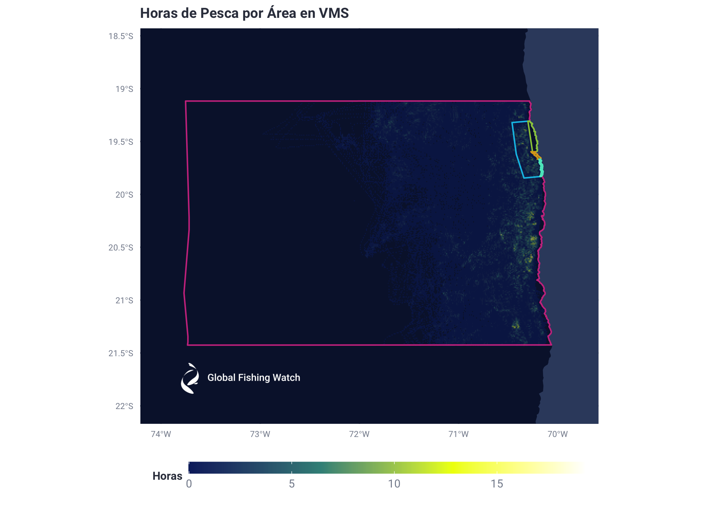
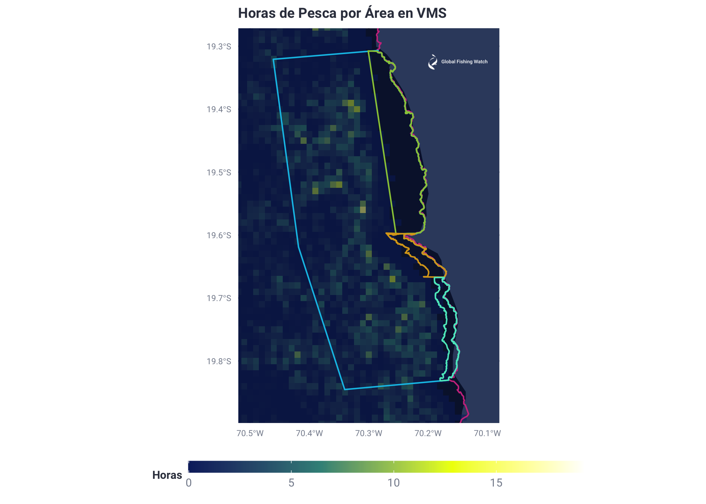
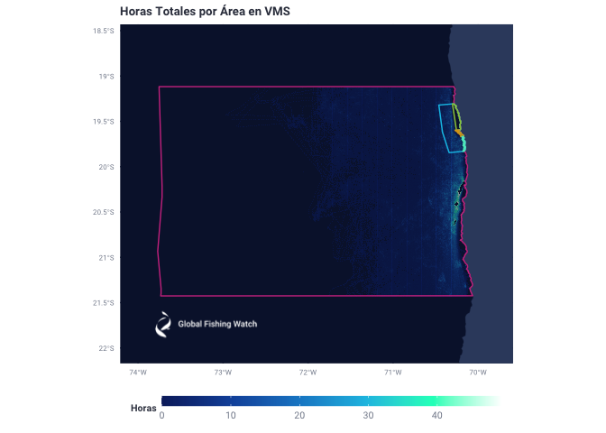
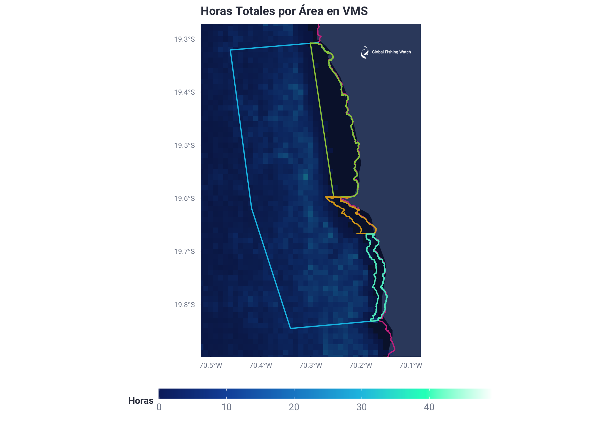

Reporte VMS Preliminar Oceana Chile AMP Pisagua
================
Esteban Arenas
6/15/2020

Nada del código corre dentro de este Rmarkdown pero lo incluyo nada más
para que se pueda evaluar la metodología. Este es un reporte preliminar
que solo muestra el código usado y los resultados obtenidos. Podremos ir
modificándolo para llegar a la versión final.

``` r
Chile_VMS <- read.csv ("/Users/Esteban/Documents/Jobs/GFW/Proyectos/Chile/Chile_Oceana/Data/Chile_VMS.csv", header = TRUE)
RPI_PDF <- read.csv ("/Users/Esteban/Documents/Jobs/GFW/Proyectos/Chile/Chile_Oceana/Data/RPI.csv", header = TRUE)

#We check to see which vessels in the PDF document they gave us are 
#present in our VMS Chile data
tmp <- RPI_PDF$RPI %in% Chile_VMS$RPI
RPI_PDF$VMS_PRESENT <- tmp
```

Notamos que la embarcación **“Emilia”** con **RPI:32036** no está
presente en nuestros datos VMS de Chile La embarcación pesca:
Cerco\_Anchoveta, Cerco\_langostino Enano, Cerco\_Medusa, Cerco\_Caballa

|   RPI | VMS\_PRESENT |
| ----: | :----------- |
|  1960 | TRUE         |
|   951 | TRUE         |
|   903 | TRUE         |
|   591 | TRUE         |
|  1989 | TRUE         |
|  1951 | TRUE         |
|   752 | TRUE         |
|   409 | TRUE         |
|    57 | TRUE         |
|   287 | TRUE         |
|  1961 | TRUE         |
|  1961 | TRUE         |
|   390 | TRUE         |
|  2501 | TRUE         |
|   281 | TRUE         |
|  1133 | TRUE         |
|   752 | TRUE         |
|   504 | TRUE         |
|   405 | TRUE         |
|   598 | TRUE         |
|  1758 | TRUE         |
|    24 | TRUE         |
|   600 | TRUE         |
|   348 | TRUE         |
|  2535 | TRUE         |
|  1083 | TRUE         |
|  1867 | TRUE         |
|   191 | TRUE         |
|   337 | TRUE         |
|   417 | TRUE         |
|  1216 | TRUE         |
|   102 | TRUE         |
|   404 | TRUE         |
|    42 | TRUE         |
|   158 | TRUE         |
|  1703 | TRUE         |
|  1758 | TRUE         |
|   281 | TRUE         |
|  1021 | TRUE         |
|    24 | TRUE         |
|   504 | TRUE         |
|  2501 | TRUE         |
|   449 | TRUE         |
|   405 | TRUE         |
|   437 | TRUE         |
|   614 | TRUE         |
|   614 | TRUE         |
|   436 | TRUE         |
|   436 | TRUE         |
|    82 | TRUE         |
|  1989 | TRUE         |
|   636 | TRUE         |
|   437 | TRUE         |
|  1021 | TRUE         |
|   404 | TRUE         |
|  2535 | TRUE         |
|  1703 | TRUE         |
|  1960 | TRUE         |
|  1960 | TRUE         |
|   636 | TRUE         |
|   102 | TRUE         |
|   409 | TRUE         |
|    24 | TRUE         |
|   287 | TRUE         |
|   764 | TRUE         |
|  1216 | TRUE         |
|    82 | TRUE         |
|   409 | TRUE         |
|   574 | TRUE         |
|  1992 | TRUE         |
|   600 | TRUE         |
|  1703 | TRUE         |
|  1083 | TRUE         |
|  1021 | TRUE         |
|   437 | TRUE         |
|   597 | TRUE         |
|  1992 | TRUE         |
|   574 | TRUE         |
|    57 | TRUE         |
|   597 | TRUE         |
|   348 | TRUE         |
|    24 | TRUE         |
|   348 | TRUE         |
|   348 | TRUE         |
|   404 | TRUE         |
|  1758 | TRUE         |
|  1758 | TRUE         |
|    78 | TRUE         |
|    78 | TRUE         |
|   504 | TRUE         |
|   390 | TRUE         |
|   636 | TRUE         |
|  1133 | TRUE         |
|   348 | TRUE         |
|   337 | TRUE         |
|   337 | TRUE         |
|   752 | TRUE         |
|  1867 | TRUE         |
|    24 | TRUE         |
|   417 | TRUE         |
|   903 | TRUE         |
|   504 | TRUE         |
|   951 | TRUE         |
|   597 | TRUE         |
|   191 | TRUE         |
|  1960 | TRUE         |
|   903 | TRUE         |
|   288 | TRUE         |
|  1083 | TRUE         |
|   436 | TRUE         |
|   158 | TRUE         |
|  2501 | TRUE         |
|    82 | TRUE         |
|  1867 | TRUE         |
|   449 | TRUE         |
|   277 | TRUE         |
|   277 | TRUE         |
|   277 | TRUE         |
|   277 | TRUE         |
| 21138 | TRUE         |
| 21138 | TRUE         |
|   405 | TRUE         |
|    78 | TRUE         |
|   277 | TRUE         |
| 32036 | FALSE        |
|   574 | TRUE         |
|   598 | TRUE         |
|   591 | TRUE         |
|  1758 | TRUE         |
|  1989 | TRUE         |
| 32025 | TRUE         |
| 32025 | TRUE         |
|   745 | TRUE         |
|   191 | TRUE         |
|   449 | TRUE         |
|   449 | TRUE         |
|   288 | TRUE         |
|   102 | TRUE         |
|  1021 | TRUE         |
|   436 | TRUE         |
|   436 | TRUE         |
|  1992 | TRUE         |
|  1951 | TRUE         |
|   597 | TRUE         |
|    42 | TRUE         |
|  2501 | TRUE         |
|   158 | TRUE         |
|   597 | TRUE         |
|   574 | TRUE         |
|   405 | TRUE         |
|   598 | TRUE         |
|  1083 | TRUE         |
|   437 | TRUE         |
|   600 | TRUE         |
| 32036 | FALSE        |
| 32036 | FALSE        |
|   405 | TRUE         |
|   436 | TRUE         |
|   437 | TRUE         |
|  1021 | TRUE         |
|   597 | TRUE         |
|   614 | TRUE         |
|  1216 | TRUE         |
|  2535 | TRUE         |
|   281 | TRUE         |
|    78 | TRUE         |
|   191 | TRUE         |
| 32036 | FALSE        |
|   287 | TRUE         |
|    82 | TRUE         |
|  1989 | TRUE         |
|   591 | TRUE         |
|   951 | TRUE         |
|   745 | TRUE         |
|    24 | TRUE         |
|   417 | TRUE         |
|  1951 | TRUE         |
|  2501 | TRUE         |
|  1992 | TRUE         |
|   158 | TRUE         |
|    42 | TRUE         |
|  1758 | TRUE         |
|   449 | TRUE         |
|   348 | TRUE         |
|  1960 | TRUE         |
|   598 | TRUE         |
|   591 | TRUE         |
|   337 | TRUE         |
|   752 | TRUE         |
|  1961 | TRUE         |
|  2535 | TRUE         |
|  1989 | TRUE         |
|   288 | TRUE         |
|   288 | TRUE         |
|    82 | TRUE         |
|  1133 | TRUE         |
|    57 | TRUE         |
|   404 | TRUE         |
|   636 | TRUE         |
|   903 | TRUE         |
|   390 | TRUE         |
|  1083 | TRUE         |
|  1216 | TRUE         |
|   287 | TRUE         |
|  1896 | TRUE         |
|  1896 | TRUE         |
|   409 | TRUE         |
|   409 | TRUE         |
| 21138 | TRUE         |
|   417 | TRUE         |
|   417 | TRUE         |
|   102 | TRUE         |
|  1867 | TRUE         |
|  1867 | TRUE         |
|   951 | TRUE         |
|   951 | TRUE         |
|    78 | TRUE         |
|  1951 | TRUE         |
|   281 | TRUE         |
|   600 | TRUE         |
|  1703 | TRUE         |
|   191 | TRUE         |
|   158 | TRUE         |
|   404 | TRUE         |
|  1133 | TRUE         |
|   614 | TRUE         |
|   614 | TRUE         |
|   288 | TRUE         |
|  1896 | TRUE         |
|    42 | TRUE         |
|   281 | TRUE         |
|   390 | TRUE         |
|    57 | TRUE         |
|   951 | TRUE         |
|  1896 | TRUE         |
|  2501 | TRUE         |

Luego seleccionamos únicamente las embarcaciones listadas en el PDF de
la base de datos VMS

``` r
#We check to see which vessels in our VMS data are represented in the PDF document they gave us
tmp2 <- Chile_VMS$RPI %in% RPI_PDF$RPI
Chile_VMS$VMS_PRESENT <- tmp2
```

| Nave                     |   RPI | VMS\_PRESENT |
| :----------------------- | ----: | :----------- |
| AUDAZ                    |    24 | TRUE         |
| COCHA                    |    25 | FALSE        |
| ALBIMER                  |    42 | TRUE         |
| AMANCAY I                |    48 | FALSE        |
| CAMIÑA                   |    57 | TRUE         |
| INTRÉPIDO                |    78 | TRUE         |
| BARRACUDA IV             |    82 | TRUE         |
| ISLA ORCAS               |    85 | FALSE        |
| BLANQUILLO               |   102 | TRUE         |
| CLAUDIA ALEJANDRA        |   158 | TRUE         |
| PACHICA                  |   171 | FALSE        |
| PATILLOS                 |   180 | FALSE        |
| AVENTURERO               |   191 | TRUE         |
| TAMBO                    |   226 | FALSE        |
| ELENA S                  |   277 | TRUE         |
| ALERCE                   |   281 | TRUE         |
| BANDURRIA                |   287 | TRUE         |
| COSTA GRANDE 1           |   288 | TRUE         |
| COSTA GRANDE 4           |   318 | FALSE        |
| CORMORAN                 |   321 | FALSE        |
| GAVILAN                  |   326 | FALSE        |
| EPERVA 61                |   337 | TRUE         |
| EPERVA 61                |   337 | TRUE         |
| EPERVA 62                |   348 | TRUE         |
| EPERVA 49                |   390 | TRUE         |
| EPERVA 50                |   400 | FALSE        |
| EPERVA 56                |   404 | TRUE         |
| EPERVA 51                |   405 | TRUE         |
| HALCON                   |   409 | TRUE         |
| HALCON                   |   409 | TRUE         |
| EPERVA 57                |   411 | FALSE        |
| HURACAN                  |   417 | TRUE         |
| LIVILCAR                 |   431 | FALSE        |
| LOA 1                    |   436 | TRUE         |
| LOA 2                    |   437 | TRUE         |
| LOA 5                    |   439 | FALSE        |
| LOA 4                    |   447 | FALSE        |
| LOA 7                    |   449 | TRUE         |
| MANUEL ROJAS             |   477 | FALSE        |
| RAULI                    |   501 | FALSE        |
| PARINA I                 |   504 | TRUE         |
| REÑACA                   |   516 | FALSE        |
| LONQUIMAY                |   543 | FALSE        |
| ANGAMOS 4                |   574 | TRUE         |
| ANGAMOS 3                |   591 | TRUE         |
| ANGAMOS 1                |   597 | TRUE         |
| ANGAMOS 2                |   598 | TRUE         |
| PUCARA                   |   600 | TRUE         |
| ATACAMA IV               |   614 | TRUE         |
| DON ERNESTO AYALA MARFIL |   636 | TRUE         |
| DON ENRIQUE              |   705 | FALSE        |
| DON ENRIQUE              |   705 | FALSE        |
| GRINGO                   |   745 | TRUE         |
| MERO                     |   752 | TRUE         |
| POLUX                    |   764 | TRUE         |
| CACHAGUA I               |   780 | FALSE        |
| JONATAN                  |   802 | FALSE        |
| NISSHIN MARU 3           |   865 | FALSE        |
| RELAMPAGO                |   903 | TRUE         |
| MAORI                    |   930 | FALSE        |
| MAORI                    |   930 | FALSE        |
| SALMON                   |   951 | TRUE         |
| ANTARES                  |   980 | FALSE        |
| BERTA                    |  1015 | FALSE        |
| COLLEN                   |  1021 | TRUE         |
| ELDOM                    |  1045 | FALSE        |
| FOCHE                    |  1065 | FALSE        |
| ICALMA                   |  1083 | TRUE         |
| TRUENO I                 |  1133 | TRUE         |
| VAMA II                  |  1184 | FALSE        |
| ALTAIR 1                 |  1206 | FALSE        |
| SAN JORGE I              |  1216 | TRUE         |
| N.S. DE LA TIRANA II     |  1217 | FALSE        |
| SUNNAN II                |  1250 | FALSE        |
| SUNNAN II                |  1250 | FALSE        |
| SURMAR I                 |  1381 | FALSE        |
| SURMAR I                 |  1381 | FALSE        |
| SURMAR I                 |  1381 | FALSE        |
| ISLA PICTON              |  1496 | FALSE        |
| ISLA PICTON              |  1496 | FALSE        |
| GUALLATIRE               |  1692 | FALSE        |
| LICANTEN                 |  1703 | TRUE         |
| ANGAMOS 9                |  1758 | TRUE         |
| PELAGOS II               |  1828 | FALSE        |
| PANILONCO                |  1835 | FALSE        |
| CORAL I                  |  1845 | FALSE        |
| MALLECO                  |  1853 | FALSE        |
| TERRANOVA                |  1854 | FALSE        |
| TERRANOVA                |  1854 | FALSE        |
| EPERVA 64                |  1867 | TRUE         |
| FRANCISCO                |  1895 | FALSE        |
| ATACAMA V                |  1896 | TRUE         |
| JAVIER                   |  1897 | FALSE        |
| DUQUECO                  |  1907 | FALSE        |
| BONN                     |  1917 | FALSE        |
| BONN                     |  1917 | FALSE        |
| QUERELEMA                |  1921 | FALSE        |
| DON TITO                 |  1938 | FALSE        |
| DON TITO                 |  1938 | FALSE        |
| BIOMAR IV                |  1940 | FALSE        |
| BIOMAR IV                |  1940 | FALSE        |
| YELCHO I                 |  1942 | FALSE        |
| FRIOSUR VIII             |  1943 | FALSE        |
| FRIOSUR VIII             |  1943 | FALSE        |
| DON JULIO                |  1945 | FALSE        |
| PEHUENCO                 |  1946 | FALSE        |
| EPERVA 65                |  1951 | TRUE         |
| RAPANUI                  |  1954 | FALSE        |
| RAPANUI                  |  1954 | FALSE        |
| FRIOSUR IX               |  1956 | FALSE        |
| FRIOSUR IX               |  1956 | FALSE        |
| TORNADO                  |  1960 | TRUE         |
| DON GINO                 |  1961 | TRUE         |
| SANTA MARIA II           |  1962 | FALSE        |
| VENTISQUERO              |  1964 | FALSE        |
| ELBE                     |  1965 | FALSE        |
| DON BORIS                |  1966 | FALSE        |
| DON MANUEL               |  1968 | FALSE        |
| CORSARIO I               |  1969 | FALSE        |
| MARIA JOSE               |  1971 | FALSE        |
| BUCANERO I               |  1972 | FALSE        |
| LONCO                    |  1974 | FALSE        |
| COBRA                    |  1975 | FALSE        |
| LIDER                    |  1976 | FALSE        |
| DON EDMUNDO              |  1977 | FALSE        |
| AQUILES PANCHO           |  1981 | FALSE        |
| AQUILES PANCHO           |  1981 | FALSE        |
| MARIA EMPERATRIZ III     |  1982 | FALSE        |
| MARIA EMPERATRIZ III     |  1982 | FALSE        |
| TIO GRINGO               |  1983 | FALSE        |
| TIO GRINGO               |  1983 | FALSE        |
| VICHUQUEN II             |  1984 | FALSE        |
| DON CHELO I              |  1985 | FALSE        |
| MARLIN                   |  1989 | TRUE         |
| EPERVA 66                |  1992 | TRUE         |
| POLARIS II               |  1993 | FALSE        |
| POLARIS II               |  1993 | FALSE        |
| DON STEFAN               |  1995 | FALSE        |
| DON STEFAN               |  1995 | FALSE        |
| FRIOSUR X                |  1997 | FALSE        |
| FRIOSUR X                |  1997 | FALSE        |
| CORPESCA 1               |  2501 | TRUE         |
| LEOPARDO                 |  2512 | FALSE        |
| LEOPARDO                 |  2512 | FALSE        |
| LEOPARDO                 |  2512 | FALSE        |
| RAUTEN                   |  2513 | FALSE        |
| CAZADOR                  |  2520 | FALSE        |
| SAN JOSÉ                 |  2521 | FALSE        |
| VESTERVEG                |  2525 | FALSE        |
| ARAUCO II                |  2527 | FALSE        |
| PELICANO                 |  2529 | FALSE        |
| DON ALFONSO              |  2530 | FALSE        |
| CORPESCA 2               |  2535 | TRUE         |
| NAVE DE PRUEBA           | 15222 | FALSE        |
| CONY I                   | 21138 | TRUE         |
| CONY I                   | 21138 | TRUE         |
| TOME                     | 32000 | FALSE        |
| caducado - SKORPION      | 32002 | FALSE        |
| CRUSOE I                 | 32003 | FALSE        |
| SKORPION                 | 32004 | FALSE        |
| DON LINO                 | 32011 | FALSE        |
| JANUS                    | 32012 | FALSE        |
| JANUS                    | 32012 | FALSE        |
| DON FELIX III            | 32017 | FALSE        |
| ALTAIR I                 | 32018 | FALSE        |
| DON ALFREDO              | 32019 | FALSE        |
| FOCHE                    | 32025 | TRUE         |
| STA. ISABEL III          | 32026 | FALSE        |
| RUTH                     | 32034 | FALSE        |

``` r
#Escoger solo embarcaciones dentro del PDF que enviaron
Tmp <- copy(Chile_VMS)
Tmp <- Tmp[Tmp$VMS_PRESENT == "TRUE",]
#Select only these vessels in Big Query
Tmp$Nave <- gsub( " ", "", Tmp$Nave)
#write.csv(Tmp, file = "Chile_Desired_Ind_Vessels.csv")
```

El archivo que se ve abajo es exportado y manualmente se le quitan las
“Ñ” y acentos.

|     | Nave                  |   RPI | VMS\_PRESENT |
| --- | :-------------------- | ----: | :----------- |
| 1   | AUDAZ                 |    24 | TRUE         |
| 3   | ALBIMER               |    42 | TRUE         |
| 5   | CAMIÑA                |    57 | TRUE         |
| 6   | INTRÉPIDO             |    78 | TRUE         |
| 7   | BARRACUDAIV           |    82 | TRUE         |
| 9   | BLANQUILLO            |   102 | TRUE         |
| 10  | CLAUDIAALEJANDRA      |   158 | TRUE         |
| 13  | AVENTURERO            |   191 | TRUE         |
| 15  | ELENAS                |   277 | TRUE         |
| 16  | ALERCE                |   281 | TRUE         |
| 17  | BANDURRIA             |   287 | TRUE         |
| 18  | COSTAGRANDE1          |   288 | TRUE         |
| 22  | EPERVA61              |   337 | TRUE         |
| 23  | EPERVA61              |   337 | TRUE         |
| 24  | EPERVA62              |   348 | TRUE         |
| 25  | EPERVA49              |   390 | TRUE         |
| 27  | EPERVA56              |   404 | TRUE         |
| 28  | EPERVA51              |   405 | TRUE         |
| 29  | HALCON                |   409 | TRUE         |
| 30  | HALCON                |   409 | TRUE         |
| 32  | HURACAN               |   417 | TRUE         |
| 34  | LOA1                  |   436 | TRUE         |
| 35  | LOA2                  |   437 | TRUE         |
| 38  | LOA7                  |   449 | TRUE         |
| 41  | PARINAI               |   504 | TRUE         |
| 44  | ANGAMOS4              |   574 | TRUE         |
| 45  | ANGAMOS3              |   591 | TRUE         |
| 46  | ANGAMOS1              |   597 | TRUE         |
| 47  | ANGAMOS2              |   598 | TRUE         |
| 48  | PUCARA                |   600 | TRUE         |
| 49  | ATACAMAIV             |   614 | TRUE         |
| 50  | DONERNESTOAYALAMARFIL |   636 | TRUE         |
| 53  | GRINGO                |   745 | TRUE         |
| 54  | MERO                  |   752 | TRUE         |
| 55  | POLUX                 |   764 | TRUE         |
| 59  | RELAMPAGO             |   903 | TRUE         |
| 62  | SALMON                |   951 | TRUE         |
| 65  | COLLEN                |  1021 | TRUE         |
| 68  | ICALMA                |  1083 | TRUE         |
| 69  | TRUENOI               |  1133 | TRUE         |
| 72  | SANJORGEI             |  1216 | TRUE         |
| 82  | LICANTEN              |  1703 | TRUE         |
| 83  | ANGAMOS9              |  1758 | TRUE         |
| 90  | EPERVA64              |  1867 | TRUE         |
| 92  | ATACAMAV              |  1896 | TRUE         |
| 107 | EPERVA65              |  1951 | TRUE         |
| 112 | TORNADO               |  1960 | TRUE         |
| 113 | DONGINO               |  1961 | TRUE         |
| 134 | MARLIN                |  1989 | TRUE         |
| 135 | EPERVA66              |  1992 | TRUE         |
| 142 | CORPESCA1             |  2501 | TRUE         |
| 153 | CORPESCA2             |  2535 | TRUE         |
| 155 | CONYI                 | 21138 | TRUE         |
| 156 | CONYI                 | 21138 | TRUE         |
| 167 | FOCHE                 | 32025 | TRUE         |

La base de arriba después se sube a Big Query y es una de las bases que
corre el query de abajo para dar todas las embarcaciones VMS Chile que
estén dentro del PDF que nos dio Oceana Chile

``` sql
WITH
JOINED AS (
SELECT seg_id,shipname,timestamp,lat,lon,speed,ssvid,callsign,source,n_shipname,nnet_score
FROM `world-fishing-827.pipe_chile_production_v20200331.messages_scored_*`
INNER JOIN `world-fishing-827.scratch_Esteban.Chile_Desired_Ind_Vessels`
  ON `world-fishing-827.pipe_chile_production_v20200331.messages_scored_*`.n_shipname = `world-fishing-827.scratch_Esteban.Chile_Desired_Ind_Vessels`.Nave
)
SELECT *
FROM JOINED
WHERE lat > -22 and lat < -18.6 and lon > -74 and lon < -69.8
```

PDF\_Vessels\_2020 es la base de datos que se obtiene del query y el
resto del proceso se explica en los comentarios del código

``` r
PDF_Vessels_Total <- copy(PDF_Vessels_2020)
#Order by n_shipname and then timestamp
PDF_Vessels_Total <- PDF_Vessels_Total[with(PDF_Vessels_Total, order(n_shipname, timestamp)),]
#Calculate time in between timestamps
#Convert timestamp to epoch seconds
PDF_Vessels_Total$EpochSec <- as.integer(as.POSIXct(PDF_Vessels_Total$timestamp))
#Converting back to date to make sure epoch is correct
#as_datetime(PDF_Vessels_Total$EpochSec[2])
#Adding phased Epoch second vectors to calculate hours between consecutive rows
EpochA <- PDF_Vessels_Total$EpochSec[1:nrow(PDF_Vessels_Total)-1]
EpochB <- PDF_Vessels_Total$EpochSec[2:nrow(PDF_Vessels_Total)]
#Adding column with hours between consecutive rows
Tmp <- (EpochB-EpochA)/3600
Tmp <- append(Tmp,0)
PDF_Vessels_Total$Hrs_Diff <- Tmp

#Create a mask to mark as 0 all Hrs_Diff that are not
#between consecutive rows of the same segment ID
segA <- PDF_Vessels_Total$seg_id[1:nrow(PDF_Vessels_Total)-1]
segB <- PDF_Vessels_Total$seg_id[2:nrow(PDF_Vessels_Total)]
#Mask Hours in between same segments
MaskSameSegId <- segA == segB
MaskSameSegId <- append(MaskSameSegId,FALSE)
Tmp[!MaskSameSegId] <- 0
PDF_Vessels_Total$Hrs_Diff <- Tmp

#Creating a Mask and column for fishing hours
NetScoreA <- PDF_Vessels_Total$nnet_score[1:nrow(PDF_Vessels_Total)-1]
NetScoreB <- PDF_Vessels_Total$nnet_score[2:nrow(PDF_Vessels_Total)]
#Mask Fishing Hours
#Net Scores of NA are treated as scores of 0
MaskFishingHours <- NetScoreA == 1 & NetScoreB == 1
MaskFishingHours <- append(MaskFishingHours,FALSE)
MaskFishingHours[is.na(MaskFishingHours)] <- FALSE
Tmp <- copy(PDF_Vessels_Total$Hrs_Diff)
Tmp[!MaskFishingHours] <- 0
PDF_Vessels_Total$FishingHours <- Tmp

#Resulting file is exported, clipped in QGIS according to each region,
#This file includes fishing hours for all VMS Chile vessels. Around 8 million rows
#write.csv(PDF_Vessels_Total, file = "VMS_Data.csv")
############################################ START - "VMS_Data.csv" saved used for cropping
#VMS_Data <- read.csv ("/Users/Esteban/Documents/Jobs/GFW/Proyectos/Chile/Chile_Oceana/Final_Report/Tables/FullData/VMS_Data.csv", header = TRUE)
```

**“VMS\_Data.csv”** is exported and clipped in QGIS according to each
region. This file includes fishing hours for all VMS Chile vessels.
Around 3 million rows

Clipped versions of the file, according to polygons of interest, are
then imported below: Tarapacá, Pisagua, Ventana 5, 6 y 7

``` r
#And then imported once again as the files below
##### 1.) TARAPACA
Vessels_Clip_Tarapaca <- read.csv ("/Users/Esteban/Documents/Jobs/GFW/Proyectos/Chile/Chile_Oceana/Final_Report/Tables/FullData/Vessels_Clip_Tarapaca.csv", header = TRUE)

#Aggregate by vessel, adding fishing hours
Tarapaca_FH <- data.frame(aggregate(FishingHours ~ shipname + ssvid, Vessels_Clip_Tarapaca, sum))
#Change column names
colnames(Tarapaca_FH)[1] <- "Embarcacion"
colnames(Tarapaca_FH)[3] <- "Horas"
#Removing ID rows
Tarapaca_FH <- Tarapaca_FH[-2]
#Order from highest to lowest hours
Tarapaca_FH <- Tarapaca_FH[with(Tarapaca_FH, order(-Horas)),]

#Aggregate by vessel, adding total hours
Tarapaca_TH <- data.frame(aggregate(Hrs_Diff ~ shipname + ssvid, Vessels_Clip_Tarapaca, sum))
#Change column names
colnames(Tarapaca_TH)[1] <- "Embarcacion"
colnames(Tarapaca_TH)[3] <- "Horas"
#Removing ID rows
Tarapaca_TH <- Tarapaca_TH[-2]
#Order from highest to lowest hours
Tarapaca_TH <- Tarapaca_TH[with(Tarapaca_TH, order(-Horas)),]

#Export final list of vessels and associated hours within
#Tarapaca region

#write.csv(Tarapaca_FH, file = "Tarapaca_Horas_de_Pesca_VMS.csv")
#write.csv(Tarapaca_TH, file = "Tarapaca_Horas_Totales_VMS.csv")
```

Resultados en horas de esfuerzo pesquero de las distintas áreas debajo

**Tarapacá**

Horas de Pesca

|    | Embarcacion                    |    Horas |
| -- | :----------------------------- | -------: |
| 39 | ATACAMA IV (IND)               | 555.2000 |
| 42 | ALBIMER (IND)                  | 532.1333 |
| 46 | HURACAN (IND)                  | 504.9697 |
| 35 | LOA 1 (IND)                    | 488.0833 |
| 26 | RELAMPAGO (IND)                | 481.3436 |
| 23 | COSTA GRANDE 1 (IND)           | 481.0167 |
| 12 | EPERVA 65 (IND)                | 480.2853 |
| 2  | BARRACUDA IV (IND)             | 469.1125 |
| 31 | CORPESCA 2 (IND)               | 466.4869 |
| 17 | AUDAZ (IND)                    | 461.6036 |
| 9  | EPERVA 66 (IND)                | 460.4675 |
| 15 | EPERVA 56 (IND)                | 450.4294 |
| 1  | DON GINO (IND)                 | 449.8297 |
| 30 | CLAUDIA ALEJANDRA (IND)        | 449.6628 |
| 45 | DON ERNESTO AYALA MARFIL (IND) | 441.4689 |
| 44 | PARINA I (IND)                 | 441.2289 |
| 38 | INTREPIDO (IND)                | 427.4572 |
| 29 | AVENTURERO (IND)               | 426.2042 |
| 13 | LOA 7 (IND)                    | 425.3883 |
| 4  | COLLEN (IND)                   | 421.1500 |
| 34 | LICANTEN (IND)                 | 413.2819 |
| 20 | MERO (IND)                     | 406.4556 |
| 21 | ATACAMA V (IND)                | 401.5500 |
| 28 | ICALMA (IND)                   | 400.2631 |
| 27 | LOA 2 (IND)                    | 399.1500 |
| 11 | ANGAMOS 3 (IND)                | 389.2639 |
| 19 | EPERVA 61 (IND)                | 384.9067 |
| 8  | EPERVA 62 (IND)                | 353.3322 |
| 22 | HALCON (IND)                   | 343.8000 |
| 33 | ANGAMOS 4 (IND)                | 338.4408 |
| 43 | BLANQUILLO (IND)               | 336.1678 |
| 14 | TORNADO (IND)                  | 333.1628 |
| 5  | EPERVA 49 (IND)                | 309.0667 |
| 32 | BANDURRIA (IND)                | 307.0500 |
| 18 | ANGAMOS 1 (IND)                | 305.5697 |
| 16 | EPERVA 64 (IND)                | 297.7158 |
| 24 | ALERCE (IND)                   | 285.7333 |
| 3  | EPERVA 51 (IND)                | 285.2150 |
| 25 | MARLIN (IND)                   | 284.9336 |
| 37 | ANGAMOS 2 (IND)                | 283.7331 |
| 47 | ANGAMOS 9 (IND)                | 268.3386 |
| 41 | SALMON (IND)                   | 263.4169 |
| 10 | PUCARA (IND)                   | 251.6456 |
| 40 | SAN JORGE I (IND)              | 237.0072 |
| 7  | TRUENO I (IND)                 | 190.1394 |
| 36 | CAMIÑA (IND)                   | 161.9136 |
| 6  | SAN JORGE I (IND)              | 161.0667 |

Horas Totales

|    | Embarcacion                    |      Horas |
| -- | :----------------------------- | ---------: |
| 18 | ANGAMOS 1 (IND)                | 10118.6042 |
| 46 | HURACAN (IND)                  |  9723.7886 |
| 12 | EPERVA 65 (IND)                |  9375.0133 |
| 2  | BARRACUDA IV (IND)             |  9246.1825 |
| 11 | ANGAMOS 3 (IND)                |  9241.0439 |
| 31 | CORPESCA 2 (IND)               |  9069.7225 |
| 29 | AVENTURERO (IND)               |  8638.4886 |
| 9  | EPERVA 66 (IND)                |  8624.0864 |
| 26 | RELAMPAGO (IND)                |  8562.2653 |
| 1  | DON GINO (IND)                 |  8506.3189 |
| 20 | MERO (IND)                     |  8417.8208 |
| 25 | MARLIN (IND)                   |  8377.5036 |
| 41 | SALMON (IND)                   |  8336.5392 |
| 43 | BLANQUILLO (IND)               |  7990.0553 |
| 14 | TORNADO (IND)                  |  7260.6181 |
| 35 | LOA 1 (IND)                    |  6017.1069 |
| 39 | ATACAMA IV (IND)               |  5911.2331 |
| 27 | LOA 2 (IND)                    |  5831.7725 |
| 16 | EPERVA 64 (IND)                |  5808.9153 |
| 4  | COLLEN (IND)                   |  5774.9833 |
| 13 | LOA 7 (IND)                    |  5656.2025 |
| 23 | COSTA GRANDE 1 (IND)           |  5470.1239 |
| 30 | CLAUDIA ALEJANDRA (IND)        |  5140.3317 |
| 34 | LICANTEN (IND)                 |  4845.5836 |
| 21 | ATACAMA V (IND)                |  4355.3567 |
| 42 | ALBIMER (IND)                  |  3936.0003 |
| 44 | PARINA I (IND)                 |  3316.4714 |
| 19 | EPERVA 61 (IND)                |  3184.2322 |
| 45 | DON ERNESTO AYALA MARFIL (IND) |  3175.2547 |
| 17 | AUDAZ (IND)                    |  3128.9703 |
| 28 | ICALMA (IND)                   |  3033.0794 |
| 15 | EPERVA 56 (IND)                |  2983.9606 |
| 8  | EPERVA 62 (IND)                |  2964.7261 |
| 10 | PUCARA (IND)                   |  2819.0433 |
| 47 | ANGAMOS 9 (IND)                |  2607.6036 |
| 22 | HALCON (IND)                   |  2540.8356 |
| 37 | ANGAMOS 2 (IND)                |  2461.3361 |
| 3  | EPERVA 51 (IND)                |  2452.7431 |
| 38 | INTREPIDO (IND)                |  2433.1919 |
| 24 | ALERCE (IND)                   |  2363.1333 |
| 33 | ANGAMOS 4 (IND)                |  2325.3519 |
| 5  | EPERVA 49 (IND)                |  2251.4667 |
| 32 | BANDURRIA (IND)                |  2205.9867 |
| 7  | TRUENO I (IND)                 |  1970.5139 |
| 40 | SAN JORGE I (IND)              |  1554.1183 |
| 36 | CAMIÑA (IND)                   |  1433.2281 |
| 6  | SAN JORGE I (IND)              |   880.9333 |

``` r
##### 2.) PISAGUA
Vessels_Clip_Pisagua <- read.csv ("/Users/Esteban/Documents/Jobs/GFW/Proyectos/Chile/Chile_Oceana/Final_Report/Tables/FullData/Vessels_Clip_Pisagua.csv", header = TRUE)

#Aggregate by vessel, adding fishing hours
Pisagua_FH <- data.frame(aggregate(FishingHours ~ shipname + ssvid, Vessels_Clip_Pisagua, sum))
#Change column names
colnames(Pisagua_FH)[1] <- "Embarcacion"
colnames(Pisagua_FH)[3] <- "Horas"
#Removing ID rows
Pisagua_FH <- Pisagua_FH[-2]
#Order from highest to lowest hours
Pisagua_FH <- Pisagua_FH[with(Pisagua_FH, order(-Horas)),]

#Aggregate by vessel, adding total hours
Pisagua_TH <- data.frame(aggregate(Hrs_Diff ~ shipname + ssvid, Vessels_Clip_Pisagua, sum))
#Change column names
colnames(Pisagua_TH)[1] <- "Embarcacion"
colnames(Pisagua_TH)[3] <- "Horas"
#Removing ID rows
Pisagua_TH <- Pisagua_TH[-2]
#Order from highest to lowest hours
Pisagua_TH <- Pisagua_TH[with(Pisagua_TH, order(-Horas)),]

#Export final list of vessels and associated hours within
#Pisagua MPA

#write.csv(Pisagua_FH, file = "Pisagua_Horas_de_Pesca_VMS.csv")
#write.csv(Pisagua_TH, file = "Pisagua_Horas_Totales_VMS.csv")
```

**Pisagua**

Horas de Pesca

|    | Embarcacion                    |      Horas |
| -- | :----------------------------- | ---------: |
| 15 | EPERVA 56 (IND)                | 85.1941667 |
| 9  | EPERVA 66 (IND)                | 83.9311111 |
| 46 | HURACAN (IND)                  | 78.2855556 |
| 28 | ICALMA (IND)                   | 66.5738889 |
| 14 | TORNADO (IND)                  | 66.2586111 |
| 12 | EPERVA 65 (IND)                | 60.6705556 |
| 2  | BARRACUDA IV (IND)             | 57.2563889 |
| 39 | ATACAMA IV (IND)               | 56.0000000 |
| 37 | ANGAMOS 2 (IND)                | 54.0980556 |
| 8  | EPERVA 62 (IND)                | 53.1408333 |
| 31 | CORPESCA 2 (IND)               | 53.0205556 |
| 42 | ALBIMER (IND)                  | 51.8666667 |
| 21 | ATACAMA V (IND)                | 51.3000000 |
| 19 | EPERVA 61 (IND)                | 48.9822222 |
| 13 | LOA 7 (IND)                    | 48.6033333 |
| 35 | LOA 1 (IND)                    | 48.1166667 |
| 45 | DON ERNESTO AYALA MARFIL (IND) | 45.6202778 |
| 11 | ANGAMOS 3 (IND)                | 45.1791667 |
| 38 | INTREPIDO (IND)                | 44.9694444 |
| 20 | MERO (IND)                     | 44.5244444 |
| 30 | CLAUDIA ALEJANDRA (IND)        | 44.1333333 |
| 29 | AVENTURERO (IND)               | 43.0602778 |
| 18 | ANGAMOS 1 (IND)                | 42.7119444 |
| 23 | COSTA GRANDE 1 (IND)           | 42.4166667 |
| 47 | ANGAMOS 9 (IND)                | 41.7319444 |
| 16 | EPERVA 64 (IND)                | 40.3352778 |
| 17 | AUDAZ (IND)                    | 39.9019444 |
| 10 | PUCARA (IND)                   | 39.4013889 |
| 33 | ANGAMOS 4 (IND)                | 38.8636111 |
| 43 | BLANQUILLO (IND)               | 37.3277778 |
| 44 | PARINA I (IND)                 | 37.3161111 |
| 7  | TRUENO I (IND)                 | 36.7441667 |
| 41 | SALMON (IND)                   | 34.7058333 |
| 26 | RELAMPAGO (IND)                | 34.4005556 |
| 4  | COLLEN (IND)                   | 33.2833333 |
| 34 | LICANTEN (IND)                 | 32.9663889 |
| 27 | LOA 2 (IND)                    | 32.0333333 |
| 5  | EPERVA 49 (IND)                | 29.8000000 |
| 1  | DON GINO (IND)                 | 28.7130556 |
| 32 | BANDURRIA (IND)                | 26.4000000 |
| 3  | EPERVA 51 (IND)                | 18.6888889 |
| 6  | SAN JORGE I (IND)              | 17.8000000 |
| 25 | MARLIN (IND)                   | 15.8330556 |
| 22 | HALCON (IND)                   | 13.6408333 |
| 24 | ALERCE (IND)                   | 12.9333333 |
| 40 | SAN JORGE I (IND)              |  3.6930556 |
| 36 | CAMIÑA (IND)                   |  0.1508333 |

Horas Totales

|    | Embarcacion                    |     Horas |
| -- | :----------------------------- | --------: |
| 15 | EPERVA 56 (IND)                | 294.03917 |
| 28 | ICALMA (IND)                   | 283.15056 |
| 9  | EPERVA 66 (IND)                | 275.66694 |
| 37 | ANGAMOS 2 (IND)                | 251.31389 |
| 46 | HURACAN (IND)                  | 248.65167 |
| 8  | EPERVA 62 (IND)                | 246.41806 |
| 14 | TORNADO (IND)                  | 234.32806 |
| 2  | BARRACUDA IV (IND)             | 226.33667 |
| 30 | CLAUDIA ALEJANDRA (IND)        | 226.25333 |
| 47 | ANGAMOS 9 (IND)                | 220.86556 |
| 31 | CORPESCA 2 (IND)               | 218.51417 |
| 42 | ALBIMER (IND)                  | 214.93333 |
| 45 | DON ERNESTO AYALA MARFIL (IND) | 214.83250 |
| 11 | ANGAMOS 3 (IND)                | 213.11417 |
| 39 | ATACAMA IV (IND)               | 204.00000 |
| 20 | MERO (IND)                     | 198.62139 |
| 29 | AVENTURERO (IND)               | 197.85500 |
| 12 | EPERVA 65 (IND)                | 195.65250 |
| 13 | LOA 7 (IND)                    | 188.81667 |
| 17 | AUDAZ (IND)                    | 188.37222 |
| 44 | PARINA I (IND)                 | 187.50333 |
| 10 | PUCARA (IND)                   | 187.31889 |
| 19 | EPERVA 61 (IND)                | 185.93111 |
| 33 | ANGAMOS 4 (IND)                | 180.93750 |
| 23 | COSTA GRANDE 1 (IND)           | 180.35000 |
| 35 | LOA 1 (IND)                    | 174.05000 |
| 41 | SALMON (IND)                   | 173.63611 |
| 38 | INTREPIDO (IND)                | 172.76500 |
| 26 | RELAMPAGO (IND)                | 171.75556 |
| 16 | EPERVA 64 (IND)                | 171.63472 |
| 43 | BLANQUILLO (IND)               | 170.78389 |
| 4  | COLLEN (IND)                   | 169.41667 |
| 3  | EPERVA 51 (IND)                | 167.24333 |
| 7  | TRUENO I (IND)                 | 165.52528 |
| 21 | ATACAMA V (IND)                | 165.31667 |
| 27 | LOA 2 (IND)                    | 157.03333 |
| 34 | LICANTEN (IND)                 | 155.78361 |
| 25 | MARLIN (IND)                   | 151.06778 |
| 18 | ANGAMOS 1 (IND)                | 149.78361 |
| 5  | EPERVA 49 (IND)                | 137.46667 |
| 32 | BANDURRIA (IND)                | 124.38639 |
| 1  | DON GINO (IND)                 | 111.90056 |
| 24 | ALERCE (IND)                   | 100.66667 |
| 22 | HALCON (IND)                   |  83.23917 |
| 6  | SAN JORGE I (IND)              |  49.66667 |
| 40 | SAN JORGE I (IND)              |  46.13444 |
| 36 | CAMIÑA (IND)                   |  37.98306 |

``` r
##### 3.) Ventana 5
Vessels_Clip_V5 <- read.csv ("/Users/Esteban/Documents/Jobs/GFW/Proyectos/Chile/Chile_Oceana/Final_Report/Tables/FullData/Vessels_Clip_V5.csv", header = TRUE)

#Aggregate by vessel, adding fishing hours
V5_FH <- data.frame(aggregate(FishingHours ~ shipname + ssvid, Vessels_Clip_V5, sum))
#Change column names
colnames(V5_FH)[1] <- "Embarcacion"
colnames(V5_FH)[3] <- "Horas"
#Removing ID rows
V5_FH <- V5_FH[-2]
#Order from highest to lowest hours
V5_FH <- V5_FH[with(V5_FH, order(-Horas)),]

#Aggregate by vessel, adding total hours
V5_TH <- data.frame(aggregate(Hrs_Diff ~ shipname + ssvid, Vessels_Clip_V5, sum))
#Change column names
colnames(V5_TH)[1] <- "Embarcacion"
colnames(V5_TH)[3] <- "Horas"
#Removing ID rows
V5_TH <- V5_TH[-2]
#Order from highest to lowest hours
V5_TH <- V5_TH[with(V5_TH, order(-Horas)),]

#Export final list of vessels and associated hours within
#Ventana 5

#write.csv(V5_FH, file = "V5_Horas_de_Pesca_VMS.csv")
#write.csv(V5_TH, file = "V5_Horas_Totales_VMS.csv")
```

**Ventana 5**

Horas de Pesca

| Embarcacion             | Horas |
| :---------------------- | ----: |
| BARRACUDA IV (IND)      |     0 |
| COLLEN (IND)            |     0 |
| EPERVA 56 (IND)         |     0 |
| ATACAMA V (IND)         |     0 |
| CLAUDIA ALEJANDRA (IND) |     0 |
| LICANTEN (IND)          |     0 |
| LOA 1 (IND)             |     0 |
| ALBIMER (IND)           |     0 |

Horas Totales

|   | Embarcacion             |     Horas |
| - | :---------------------- | --------: |
| 6 | LICANTEN (IND)          | 1.4833333 |
| 2 | COLLEN (IND)            | 0.9333333 |
| 1 | BARRACUDA IV (IND)      | 0.7913889 |
| 8 | ALBIMER (IND)           | 0.6666667 |
| 3 | EPERVA 56 (IND)         | 0.5377778 |
| 7 | LOA 1 (IND)             | 0.4000000 |
| 4 | ATACAMA V (IND)         | 0.2666667 |
| 5 | CLAUDIA ALEJANDRA (IND) | 0.1333333 |

``` r
##### 4.) Ventana 6
Vessels_Clip_V6 <- read.csv ("/Users/Esteban/Documents/Jobs/GFW/Proyectos/Chile/Chile_Oceana/Final_Report/Tables/FullData/Vessels_Clip_V6.csv", header = TRUE)

#Aggregate by vessel, adding fishing hours
V6_FH <- data.frame(aggregate(FishingHours ~ shipname + ssvid, Vessels_Clip_V6, sum))
#Change column names
colnames(V6_FH)[1] <- "Embarcacion"
colnames(V6_FH)[3] <- "Horas"
#Removing ID rows
V6_FH <- V6_FH[-2]
#Order from highest to lowest hours
V6_FH <- V6_FH[with(V6_FH, order(-Horas)),]

#Aggregate by vessel, adding total hours
V6_TH <- data.frame(aggregate(Hrs_Diff ~ shipname + ssvid, Vessels_Clip_V6, sum))
#Change column names
colnames(V6_TH)[1] <- "Embarcacion"
colnames(V6_TH)[3] <- "Horas"
#Removing ID rows
V6_TH <- V6_TH[-2]
#Order from highest to lowest hours
V6_TH <- V6_TH[with(V6_TH, order(-Horas)),]

#Export final list of vessels and associated hours within
#Ventana 6

# write.csv(V6_FH, file = "V6_Horas_de_Pesca_VMS.csv")
# write.csv(V6_TH, file = "V6_Horas_Totales_VMS.csv")
```

**Ventana 6**

Fishing Hours

| Embarcacion      | Horas |
| :--------------- | ----: |
| EPERVA 49 (IND)  |     0 |
| EPERVA 66 (IND)  |     0 |
| EPERVA 65 (IND)  |     0 |
| LOA 7 (IND)      |     0 |
| TORNADO (IND)    |     0 |
| MERO (IND)       |     0 |
| MARLIN (IND)     |     0 |
| ICALMA (IND)     |     0 |
| BANDURRIA (IND)  |     0 |
| LICANTEN (IND)   |     0 |
| LOA 1 (IND)      |     0 |
| CAMIÑA (IND)     |     0 |
| ANGAMOS 2 (IND)  |     0 |
| ATACAMA IV (IND) |     0 |
| SALMON (IND)     |     0 |
| ALBIMER (IND)    |     0 |
| HURACAN (IND)    |     0 |
| ANGAMOS 9 (IND)  |     0 |

Total Hours

|    | Embarcacion      |     Horas |
| -- | :--------------- | --------: |
| 16 | ALBIMER (IND)    | 0.5333333 |
| 15 | SALMON (IND)     | 0.2675000 |
| 9  | BANDURRIA (IND)  | 0.2666667 |
| 14 | ATACAMA IV (IND) | 0.2666667 |
| 8  | ICALMA (IND)     | 0.2502778 |
| 17 | HURACAN (IND)    | 0.1897222 |
| 1  | EPERVA 49 (IND)  | 0.1333333 |
| 10 | LICANTEN (IND)   | 0.1333333 |
| 11 | LOA 1 (IND)      | 0.1333333 |
| 12 | CAMIÑA (IND)     | 0.1305556 |
| 6  | MERO (IND)       | 0.1263889 |
| 5  | TORNADO (IND)    | 0.1050000 |
| 4  | LOA 7 (IND)      | 0.1000000 |
| 18 | ANGAMOS 9 (IND)  | 0.0833333 |
| 7  | MARLIN (IND)     | 0.0758333 |
| 3  | EPERVA 65 (IND)  | 0.0669444 |
| 2  | EPERVA 66 (IND)  | 0.0388889 |
| 13 | ANGAMOS 2 (IND)  | 0.0386111 |

``` r
##### 5.) Ventana 7
Vessels_Clip_V7 <- read.csv ("/Users/Esteban/Documents/Jobs/GFW/Proyectos/Chile/Chile_Oceana/Final_Report/Tables/FullData/Vessels_Clip_V7.csv", header = TRUE)

#Aggregate by vessel, adding fishing hours
V7_FH <- data.frame(aggregate(FishingHours ~ shipname + ssvid, Vessels_Clip_V7, sum))
#Change column names
colnames(V7_FH)[1] <- "Embarcacion"
colnames(V7_FH)[3] <- "Horas"
#Removing ID rows
V7_FH <- V7_FH[-2]
#Order from highest to lowest hours
V7_FH <- V7_FH[with(V7_FH, order(-Horas)),]

#Aggregate by vessel, adding total hours
V7_TH <- data.frame(aggregate(Hrs_Diff ~ shipname + ssvid, Vessels_Clip_V7, sum))
#Change column names
colnames(V7_TH)[1] <- "Embarcacion"
colnames(V7_TH)[3] <- "Horas"
#Removing ID rows
V7_TH <- V7_TH[-2]
#Order from highest to lowest hours
V7_TH <- V7_TH[with(V7_TH, order(-Horas)),]

#Export final list of vessels and associated hours within
#Ventana 7

# write.csv(V7_FH, file = "V7_Horas_de_Pesca_VMS.csv")
# write.csv(V7_TH, file = "V7_Horas_Totales_VMS.csv")
```

**Ventana 7**

Fishing Hours

| Embarcacion   | Horas |
| :------------ | ----: |
| COLLEN (IND)  |     0 |
| LOA 7 (IND)   |     0 |
| LOA 2 (IND)   |     0 |
| ALBIMER (IND) |     0 |

Total Hours

|   | Embarcacion   |    Horas |
| - | :------------ | -------: |
| 3 | LOA 2 (IND)   | 5.200000 |
| 4 | ALBIMER (IND) | 4.800000 |
| 2 | LOA 7 (IND)   | 4.266667 |
| 1 | COLLEN (IND)  | 0.400000 |

Agrupar los datos por décimas de grados Lat y Lon, sumar horas totales
de actividad y horas de pesca También se bajan los archivos JSON con los
polígonos de interes que irán en los mapas

``` r
#Graphing Fishing Effort Hours for the "Vessels_Clip_Tarapaca" DB
#by grouping fishing hours into lat and lon hundreth bins
Vessels_Clip_Tarapaca$LatBin <- (floor(Vessels_Clip_Tarapaca$lat * 100)/100)
Vessels_Clip_Tarapaca$LonBin <- (floor(Vessels_Clip_Tarapaca$lon * 100)/100)
#Fishing hours Graph
FishingHoursGraph <- data.frame(aggregate(FishingHours ~ LatBin + LonBin, Vessels_Clip_Tarapaca, sum))
#Se quitan 2 lineas (outliers) de valores de 210 y 70.8 para que el mapa 
#muestre resultados útiles
FishingHoursGraph <- FishingHoursGraph[which(FishingHoursGraph$FishingHours < 70),]
#Total Hours Graph
TotalHoursGraph <- data.frame(aggregate(Hrs_Diff ~ LatBin + LonBin, Vessels_Clip_Tarapaca, sum))
#Se quitan 58 lineas (outliers) de valores > 50 (.176% de los datos) para que el mapa 
#muestre resultados útiles
TotalHoursGraph <- TotalHoursGraph[which(TotalHoursGraph$Hrs_Diff < 50),]

# write.csv(FishingHoursGraph, file = "FishingHoursGraph_VMS.csv")
# write.csv(TotalHoursGraph, file = "TotalHoursGraph_VMS.csv")

###Mapa
#Bajar los archivos JSON con los polígonos de interés
#Pisagua
Pisagua_ST <- st_read("/Users/Esteban/Documents/Jobs/GFW/Proyectos/Chile/Chile_Oceana/Data/Shapes/Pisagua.geojson")
#Tarapacá
Tarapaca_ST <- st_read("/Users/Esteban/Documents/Jobs/GFW/Proyectos/Chile/Chile_Oceana/Data/Shapes/TarapacaPoly.geojson")
#Ventana 5
Ventana5_ST <- st_read("/Users/Esteban/Documents/Jobs/GFW/Proyectos/Chile/Chile_Oceana/Data/Shapes/VP5gj.geojson")
#Ventana 6
Ventana6_ST <- st_read("/Users/Esteban/Documents/Jobs/GFW/Proyectos/Chile/Chile_Oceana/Data/Shapes/VP6gj.geojson")
#Ventana 7
Ventana7_ST <- st_read("/Users/Esteban/Documents/Jobs/GFW/Proyectos/Chile/Chile_Oceana/Data/Shapes/VP7intersectgj.geojson")
```

Generar el mapa de esfuerzo pesquero por horas de pesca de acuerdo a
décimas de grados Lat y Lon

``` r
# GFW logo
gfw_logo <- png::readPNG("/Users/Esteban/Documents/Jobs/GFW/General/Logo/GFW_logo_primary_White.png")
gfw_logo_rast <- grid::rasterGrob(gfw_logo, interpolate = T)

#Map
land_sf <- rnaturalearth::ne_countries(scale = 10, returnclass = 'sf')
MapTest <- ggplot() + 
  geom_sf(data = land_sf,
            fill = fishwatchr::gfw_palettes$map_country_dark[1],
            color = fishwatchr::gfw_palettes$map_country_dark[2],
          size=.1) +
    scale_fill_gradientn(colours = fishwatchr::gfw_palettes$map_effort_dark)+
  fishwatchr::theme_gfw_map(theme = 'dark')+
  geom_tile(data = FishingHoursGraph, aes(x = LonBin, y = LatBin, fill = FishingHours), alpha = 0.5)+
  labs(fill = "Horas", title = "Horas de Pesca por Área en VMS")+
  geom_sf(data=Tarapaca_ST,fill=NA, color="#CC3A8E")+geom_sf(data=Pisagua_ST, fill=NA, color="#00C1E7")+
  geom_sf(data=Ventana5_ST, fill=NA, color="#99C945")+geom_sf(data=Ventana6_ST, fill=NA, color="#DAA51B")+
  geom_sf(data=Ventana7_ST, fill=NA, color="#58E8C6")+
  coord_sf(xlim = c(-74, -69.8), ylim = c(-22, -18.6))+
  #Add GFW logo
  annotation_custom(gfw_logo_rast,
                      ymin = -21.95,
                      ymax = -21.53,
                      xmin = -73.8,
                      xmax = -72.6)
MapTest
```

<!-- -->

El mismo mapa de arriba pero enfocado en Pisagua y las tres ventanas

``` r
#Zoomed in Pisagua fishing hours map
MapTest2 <- MapTest + coord_sf(xlim = c(-70.5, -70.1), ylim = c(-19.87, -19.3))+
    #Add GFW logo
  annotation_custom(gfw_logo_rast,
                      ymin = -19.35,
                      ymax = -19.3,
                      xmin = -70.2,
                      xmax = -70.1)
```

    ## Coordinate system already present. Adding new coordinate system, which will replace the existing one.

``` r
MapTest2
```

<!-- -->

Generar el mapa de actividad total en horas (pesca y no pesca) de
acuerdo a décimas de grados Lat y Lon

``` r
#Map Total Hours
land_sf <- rnaturalearth::ne_countries(scale = 10, returnclass = 'sf')
MapTestHrsTotal <- ggplot() + 
  geom_sf(data = land_sf,
            fill = fishwatchr::gfw_palettes$map_country_dark[1],
            color = fishwatchr::gfw_palettes$map_country_dark[2],
          size=.1) +
#    scale_fill_gradientn(colours = fishwatchr::gfw_palettes$map_presence_dark)+
    scale_fill_gradientn(colours = c('#0c276c', '#1253a8', '#1588cc', '#14c0e4', '#00ffc3','#ffffff'))+

  fishwatchr::theme_gfw_map(theme = 'dark')+
  geom_tile(data = TotalHoursGraph, aes(x = LonBin, y = LatBin, fill = Hrs_Diff), alpha = 0.5)+
  labs(fill = "Horas", title = "Horas Totales por Área en VMS")+
  geom_sf(data=Tarapaca_ST,fill=NA, color="#CC3A8E")+geom_sf(data=Pisagua_ST, fill=NA, color="#00C1E7")+
  geom_sf(data=Ventana5_ST, fill=NA, color="#99C945")+geom_sf(data=Ventana6_ST, fill=NA, color="#DAA51B")+
  geom_sf(data=Ventana7_ST, fill=NA, color="#58E8C6")+
  coord_sf(xlim = c(-74, -69.8), ylim = c(-22, -18.6))+
  #Add GFW logo
  annotation_custom(gfw_logo_rast,
                      ymin = -21.95,
                      ymax = -21.53,
                      xmin = -73.8,
                      xmax = -72.6)
MapTestHrsTotal
```

<!-- -->

El mismo mapa de arriba pero enfocado en Pisagua y las tres ventanas

``` r
#Zoomed in Pisagua total hours map
MapTestHrsTotal2 <- MapTestHrsTotal + coord_sf(xlim = c(-70.5, -70.1), ylim = c(-19.87, -19.3))+
    #Add GFW logo
  annotation_custom(gfw_logo_rast,
                      ymin = -19.35,
                      ymax = -19.3,
                      xmin = -70.2,
                      xmax = -70.1)
```

    ## Coordinate system already present. Adding new coordinate system, which will replace the existing one.

``` r
MapTestHrsTotal2
```

<!-- -->
