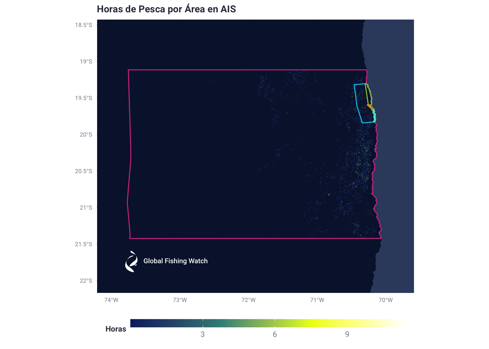
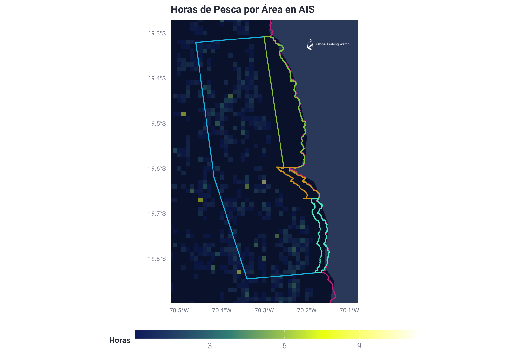
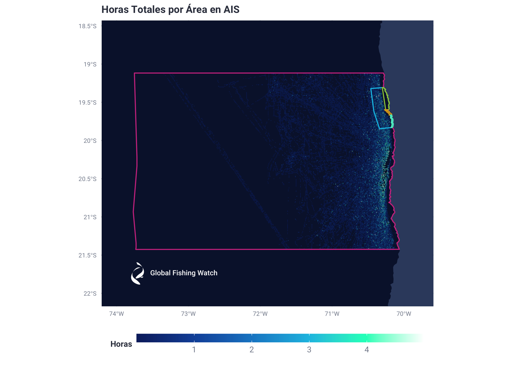
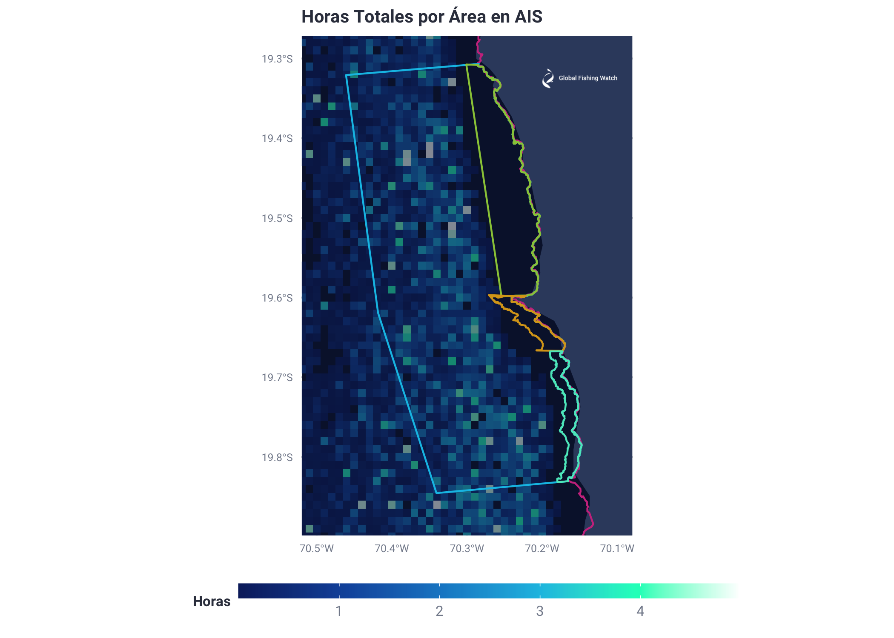

Reporte AIS Preliminar Oceana Chile AMP Pisagua
================
Esteban Arenas
7/2/2020

Nada del código corre dentro de este Rmarkdown pero lo incluyo nada más
para que se pueda evaluar la metodología. Este es un reporte preliminar
que solo muestra el código usado y los resultados obtenidos. Podremos ir
modificándolo para llegar a la versión final.

PDF\_Vessels\_2020 es la base de datos que se generó previamente en el
análisis VMS. Contiene todas las embarcaciones VMS Chile que estén
dentro del PDF que nos dio Oceana Chile

El resto del proceso se explica en los comentarios del código

``` r
UniqueVessNames <- PDF_Vessels_2020 %>% distinct(n_shipname, .keep_all = TRUE)
#Al parecer hay embarcaciones en a tabla de "vessel_information_industry" que no están en la tabla usada para el
#análisis "world-fishing-827.pipe_chile_production_v20200331.messages_scored_*". Quizás porque no estuvieron
#activas en estas fechas (2019-02-01 - 2020-06-13):
#CORPESCA1
#Repetidas en base "vessel_information_industry" por pescar con distinta arte y distinta especie:
#CONYI,EPERVA61,HALCON

#Only keep ssvid and shipname columns
UniqueVessNames <- UniqueVessNames[c('shipname','n_shipname')]

#Resulting table with unique ssvid is exported to be used as a table to use in bigquery and extract
#only ssvid of interest from the complete AIS dataset
write.csv(UniqueVessNames, file = "UniqueVessNames.csv")
```

``` sql
SELECT ssvid,imo,shipname, n_shipname 
FROM `gfw_research.pipe_v20200203_ids`
INNER JOIN `world-fishing-827.scratch_Esteban.UniqueVessNames_`
  ON `gfw_research.pipe_v20200203_ids`.n_shipname = `world-fishing-827.scratch_Esteban.UniqueVessNames_`.string_field_2
```

``` r
#Parece solo haber 22 embarcaciones en AIS de las que originalmente que se usaron en el análisis de VMS y 
#en el cual (VMS) están disponibles 51
AISChileVessels_Name <- Vessel_ssvid %>% distinct(n_shipname, .keep_all = TRUE)
#También varias embarcaciones parecen tener multiples ssvid. Se usaron todos los ssvid asociados con el
#nombre de la embarcación para capturar lo máximo de esfuerzo posible
AISChileVessels_SSVID <- Vessel_ssvid %>% distinct(ssvid, .keep_all = TRUE)

#Resulting table with unique ssvid is exported to be used as a table to use in bigquery and extract
#only ssvid of interest from the complete AIS dataset
names(AISChileVessels_SSVID)[1] <- "MMSI"

write.csv(AISChileVessels_SSVID, file = "AISChileVessels_SSVID.csv")
write.csv(AISChileVessels_Name, file = "AISChileVessels_Name.csv")
```

``` sql
WITH
JOINED AS (
SELECT ssvid,seg_id,timestamp,lat,lon,hours,nnet_score
FROM `gfw_research.pipe_v20200203`
INNER JOIN `world-fishing-827.scratch_Esteban.AISChileVessels_SSVID`
  ON `gfw_research.pipe_v20200203`.ssvid = `world-fishing-827.scratch_Esteban.AISChileVessels_SSVID`.MMSI
)
SELECT *
FROM JOINED
WHERE timestamp BETWEEN TIMESTAMP('2019-02-01')
AND TIMESTAMP('2020-06-13')
AND lat > -22 and lat < -18.6 and lon > -74 and lon < -69.8
```

``` r
AIS_Data_Copy <- copy(AIS_Data)
#Resulting file is exported and clipped in QGIS according to each region.
#This file includes AIS fishing hours and total hours for all VMS available vessels of interest to Oceana Chile.
#Around 6 thousand rows for an estimated 22 vessels between 2019-02-01 and 2020-06-13
write.csv(AIS_Data_Copy, file = "AIS_Data.csv")
```

**“AIS\_Data.csv”** is exported and clipped in QGIS according to each
region. This file includes AIS fishing hours and total hours for all VMS
available vessels of interest to Oceana Chile. This is around 6 thousand
rows for an estimated 22 vessels between 2019-02-01 and 2020-06-13

Clipped versions of the file, according to polygons of interest, are
then imported below: Tarapacá, Pisagua, Ventana 5, 6 y 7

``` r
#And then imported once again as the files below
AISChileVessels_SSVID <- read.csv ("/Users/Esteban/Documents/Jobs/GFW/Proyectos/Chile/Chile_Oceana/Data/AISChileVessels_SSVID.csv", header = TRUE)
##### 1.) TARAPACA
Vessels_Clip_Tarapaca_AIS <- read.csv ("/Users/Esteban/Documents/Jobs/GFW/Proyectos/Chile/Chile_Oceana/Final_Report/Tables/FullData/Vessels_Clip_Tarapaca_AIS.csv", header = TRUE)

#Add associated vessel name
Vessels_Clip_Tarapaca_AIS$n_shipname <- AISChileVessels_SSVID$n_shipname[match(Vessels_Clip_Tarapaca_AIS$ssvid, AISChileVessels_SSVID$MMSI)]
#Subset Data Frame for Fishing and one for not fishing
Tarapaca_Fishing_AIS <- subset(Vessels_Clip_Tarapaca_AIS, nnet_score==1)
Tarapaca_NotFishing_AIS <- subset(Vessels_Clip_Tarapaca_AIS, nnet_score==0 | is.na(nnet_score)==TRUE)

#Aggregate by vessel, adding fishing hours
Tarapaca_FH_AIS <- data.frame(aggregate(hours ~ n_shipname + ssvid, Tarapaca_Fishing_AIS, sum))
Tarapaca_FH_AIS <- Tarapaca_FH_AIS[with(Tarapaca_FH_AIS, order(-hours)),]
#Aggregate by vessel, adding total hours
Tarapaca_TH_AIS <- data.frame(aggregate(hours ~ n_shipname + ssvid, Tarapaca_NotFishing_AIS, sum))
Tarapaca_TH_AIS <- Tarapaca_TH_AIS[with(Tarapaca_TH_AIS, order(-hours)),]

#Export final list of vessels and associated hours within
#Tarapaca region

# write.csv(Tarapaca_FH_AIS, file = "Tarapaca_Horas_de_Pesca_AIS.csv")
# write.csv(Tarapaca_TH_AIS, file = "Tarapaca_Horas_Totales_AIS.csv")
```

Resultados en horas de esfuerzo pesquero de las distintas áreas debajo

**Tarapacá**

Horas de Pesca

|   | n\_shipname |     ssvid |    hours |
| - | :---------- | --------: | -------: |
| 2 | AVENTURERO  | 725000028 | 493.1778 |
| 8 | CORPESCA2   | 725000834 | 483.9828 |
| 1 | AUDAZ       | 725000027 | 483.5261 |
| 7 | HURACAN     | 725000197 | 463.5411 |
| 9 | MERO        | 725010191 | 434.9903 |
| 3 | INTREPIDO   | 725000029 | 434.6211 |
| 6 | BLANQUILLO  | 725000193 | 332.9961 |
| 5 | SALMON      | 725000192 | 198.8072 |
| 4 | RELAMPAGO   | 725000030 | 121.3153 |

Horas Totales

|    | n\_shipname |     ssvid |      hours |
| -- | :---------- | --------: | ---------: |
| 10 | HURACAN     | 725000197 | 8347.62278 |
| 5  | AVENTURERO  | 725000028 | 7317.44389 |
| 8  | SALMON      | 725000192 | 7098.53056 |
| 11 | CORPESCA2   | 725000834 | 6923.44167 |
| 9  | BLANQUILLO  | 725000193 | 6058.03889 |
| 13 | MERO        | 725010191 | 5038.82250 |
| 4  | AUDAZ       | 725000027 | 2714.33611 |
| 7  | RELAMPAGO   | 725000030 | 2585.30417 |
| 6  | INTREPIDO   | 725000029 | 2071.56083 |
| 12 | TORNADO     | 725001850 |  764.58833 |
| 16 | INTREPIDO   | 999999999 |  179.29944 |
| 2  | HALCON      | 548931000 |   64.38639 |
| 1  | MARLIN      | 538006225 |   26.50694 |
| 3  | ALERCE      | 636018877 |   21.99833 |
| 14 | ALBIMER     | 725019300 |   16.00000 |
| 15 | INTREPIDO   | 845409485 |    8.00000 |

``` r
##### 2.) PISAGUA
Vessels_Clip_Pisagua_AIS <- read.csv ("/Users/Esteban/Documents/Jobs/GFW/Proyectos/Chile/Chile_Oceana/Final_Report/Tables/FullData/Vessels_Clip_Pisagua_AIS.csv", header = TRUE)

#Add associated vessel name
Vessels_Clip_Pisagua_AIS$n_shipname <- AISChileVessels_SSVID$n_shipname[match(Vessels_Clip_Pisagua_AIS$ssvid, AISChileVessels_SSVID$MMSI)]
#Subset Data Frame for Fishing and one for not fishing
Pisagua_Fishing_AIS <- subset(Vessels_Clip_Pisagua_AIS, nnet_score==1)
Pisagua_NotFishing_AIS <- subset(Vessels_Clip_Pisagua_AIS, nnet_score==0 | is.na(nnet_score)==TRUE)

#Aggregate by vessel, adding fishing hours
Pisagua_FH_AIS <- data.frame(aggregate(hours ~ n_shipname + ssvid, Pisagua_Fishing_AIS, sum))
Pisagua_FH_AIS <- Pisagua_FH_AIS[with(Pisagua_FH_AIS, order(-hours)),]
#Aggregate by vessel, adding total hours
Pisagua_TH_AIS <- data.frame(aggregate(hours ~ n_shipname + ssvid, Pisagua_NotFishing_AIS, sum))
Pisagua_TH_AIS <- Pisagua_TH_AIS[with(Pisagua_TH_AIS, order(-hours)),]

#Export final list of vessels and associated hours within
#Pisagua region

# write.csv(Pisagua_FH_AIS, file = "Pisagua_Horas_de_Pesca_AIS.csv")
# write.csv(Pisagua_TH_AIS, file = "Pisagua_Horas_Totales_AIS.csv")
```

**Pisagua**

Horas de Pesca

|   | n\_shipname |     ssvid |     hours |
| - | :---------- | --------: | --------: |
| 7 | HURACAN     | 725000197 | 73.155000 |
| 8 | CORPESCA2   | 725000834 | 58.068333 |
| 9 | MERO        | 725010191 | 52.458056 |
| 1 | AUDAZ       | 725000027 | 39.243889 |
| 2 | AVENTURERO  | 725000028 | 39.096667 |
| 3 | INTREPIDO   | 725000029 | 32.569167 |
| 6 | BLANQUILLO  | 725000193 | 24.556111 |
| 5 | SALMON      | 725000192 | 18.667778 |
| 4 | RELAMPAGO   | 725000030 |  3.873333 |

Horas Totales

|    | n\_shipname |     ssvid |    hours |
| -- | :---------- | --------: | -------: |
| 7  | HURACAN     | 725000197 | 175.8556 |
| 2  | AVENTURERO  | 725000028 | 169.4069 |
| 8  | CORPESCA2   | 725000834 | 167.3397 |
| 1  | AUDAZ       | 725000027 | 161.7631 |
| 9  | MERO        | 725010191 | 151.8208 |
| 5  | SALMON      | 725000192 | 145.5164 |
| 3  | INTREPIDO   | 725000029 | 134.8528 |
| 6  | BLANQUILLO  | 725000193 | 130.8317 |
| 4  | RELAMPAGO   | 725000030 |  27.6750 |
| 10 | INTREPIDO   | 999999999 |  16.0000 |

**Ventana 5**

No hay ninguna embarcación dentro de la ventana 5

``` r
##### 4.) Ventana 6
Vessels_Clip_V6_AIS <- read.csv ("/Users/Esteban/Documents/Jobs/GFW/Proyectos/Chile/Chile_Oceana/Final_Report/Tables/FullData/Vessels_Clip_V6_AIS.csv", header = TRUE)

#Add associated vessel name
Vessels_Clip_V6_AIS$n_shipname <- AISChileVessels_SSVID$n_shipname[match(Vessels_Clip_V6_AIS$ssvid, AISChileVessels_SSVID$MMSI)]
#Only three rows and all have a nnet score of 0
#No fishing within window 6

#Aggregate by vessel, adding total hours
V6_TH_AIS <- data.frame(aggregate(hours ~ n_shipname + ssvid, Vessels_Clip_V6_AIS, sum))
V6_TH_AIS <- V6_TH_AIS[with(V6_TH_AIS, order(-hours)),]

#Export final list of vessels and associated hours within
#V6 region

# write.csv(V6_TH_AIS, file = "V6_Horas_Totales_AIS.csv")
```

**Ventana 6**

No Fishing Hours

Total Hours

| n\_shipname |     ssvid |     hours |
| :---------- | --------: | --------: |
| HURACAN     | 725000197 | 0.1177778 |

**Ventana 7**

No hay ninguna embarcación dentro de la ventana 7

Agrupar los datos por décimas de grados Lat y Lon, sumar horas totales
de actividad y horas de pesca También se bajan los archivos JSON con los
polígonos de interes que irán en los mapas

``` r
#Graphing Fishing Effort Hours for the "Tarapaca_Fishing_AIS" and "Tarapaca_NotFishing_AIS" DB
#by grouping hours into lat and lon hundreth bins
Tarapaca_Fishing_AIS$LatBin <- (floor(Tarapaca_Fishing_AIS$lat * 100)/100)
Tarapaca_Fishing_AIS$LonBin <- (floor(Tarapaca_Fishing_AIS$lon * 100)/100)

Tarapaca_NotFishing_AIS$LatBin <- (floor(Tarapaca_NotFishing_AIS$lat * 100)/100)
Tarapaca_NotFishing_AIS$LonBin <- (floor(Tarapaca_NotFishing_AIS$lon * 100)/100)

#Fishing hours Graph
FishingHoursGraph_AIS <- data.frame(aggregate(hours ~ LatBin + LonBin, Tarapaca_Fishing_AIS, sum))
#Total Hours Graph
TotalHoursGraph_AIS <- data.frame(aggregate(hours ~ LatBin + LonBin, Tarapaca_NotFishing_AIS, sum))
#Se quitan 400 lineas (outliers) de valores > 5 (1.9% de los datos) para que el mapa 
#muestre resultados útiles
TotalHoursGraph_AIS <- TotalHoursGraph_AIS[which(TotalHoursGraph_AIS$hours < 5),]

###Mapa
#Bajar los archivos JSON con los polígonos de interés
#Pisagua
Pisagua_ST <- st_read("/Users/Esteban/Documents/Jobs/GFW/Proyectos/Chile/Chile_Oceana/Data/Shapes/Pisagua.geojson")
#Tarapacá
Tarapaca_ST <- st_read("/Users/Esteban/Documents/Jobs/GFW/Proyectos/Chile/Chile_Oceana/Data/Shapes/TarapacaPoly.geojson")
#Ventana 5
Ventana5_ST <- st_read("/Users/Esteban/Documents/Jobs/GFW/Proyectos/Chile/Chile_Oceana/Data/Shapes/VP5gj.geojson")
#Ventana 6
Ventana6_ST <- st_read("/Users/Esteban/Documents/Jobs/GFW/Proyectos/Chile/Chile_Oceana/Data/Shapes/VP6gj.geojson")
#Ventana 7
Ventana7_ST <- st_read("/Users/Esteban/Documents/Jobs/GFW/Proyectos/Chile/Chile_Oceana/Data/Shapes/VP7intersectgj.geojson")
```

Generar el mapa de esfuerzo pesquero por horas de pesca de acuerdo a
décimas de grados Lat y Lon

``` r
# GFW logo
gfw_logo <- png::readPNG("/Users/Esteban/Documents/Jobs/GFW/General/Logo/GFW_logo_primary_White.png")
gfw_logo_rast <- grid::rasterGrob(gfw_logo, interpolate = T)

#Map
land_sf <- rnaturalearth::ne_countries(scale = 10, returnclass = 'sf')
MapTest_AIS <- ggplot() + 
  geom_sf(data = land_sf,
            fill = fishwatchr::gfw_palettes$map_country_dark[1],
            color = fishwatchr::gfw_palettes$map_country_dark[2],
          size=.1) +
    scale_fill_gradientn(colours = fishwatchr::gfw_palettes$map_effort_dark)+
  fishwatchr::theme_gfw_map(theme = 'dark')+
  geom_tile(data = FishingHoursGraph_AIS, aes(x = LonBin, y = LatBin, fill = hours), alpha = 0.5)+
  labs(fill = "Horas", title = "Horas de Pesca por Área en AIS")+
  geom_sf(data=Tarapaca_ST,fill=NA, color="#CC3A8E")+geom_sf(data=Pisagua_ST, fill=NA, color="#00C1E7")+
  geom_sf(data=Ventana5_ST, fill=NA, color="#99C945")+geom_sf(data=Ventana6_ST, fill=NA, color="#DAA51B")+
  geom_sf(data=Ventana7_ST, fill=NA, color="#58E8C6")+
  coord_sf(xlim = c(-74, -69.8), ylim = c(-22, -18.6))+
  #Add GFW logo
  annotation_custom(gfw_logo_rast,
                      ymin = -21.95,
                      ymax = -21.53,
                      xmin = -73.8,
                      xmax = -72.6)
MapTest_AIS
```

<!-- -->

El mismo mapa de arriba pero enfocado en Pisagua y las tres ventanas

``` r
#Zoomed in Pisagua fishing hours map
MapTest2_AIS <- MapTest_AIS + coord_sf(xlim = c(-70.5, -70.1), ylim = c(-19.87, -19.3))+
    #Add GFW logo
  annotation_custom(gfw_logo_rast,
                      ymin = -19.35,
                      ymax = -19.3,
                      xmin = -70.2,
                      xmax = -70.1)
```

    ## Coordinate system already present. Adding new coordinate system, which will replace the existing one.

``` r
MapTest2_AIS
```

<!-- -->

Generar el mapa de actividad total en horas (pesca y no pesca) de
acuerdo a décimas de grados Lat y Lon

``` r
#Map Total Hours
land_sf <- rnaturalearth::ne_countries(scale = 10, returnclass = 'sf')
MapTestHrsTotal_AIS <- ggplot() + 
  geom_sf(data = land_sf,
            fill = fishwatchr::gfw_palettes$map_country_dark[1],
            color = fishwatchr::gfw_palettes$map_country_dark[2],
          size=.1) +
#    scale_fill_gradientn(colours = fishwatchr::gfw_palettes$map_presence_dark)+
    scale_fill_gradientn(colours = c('#0c276c', '#1253a8', '#1588cc', '#14c0e4', '#00ffc3','#ffffff'))+

  fishwatchr::theme_gfw_map(theme = 'dark')+
  geom_tile(data = TotalHoursGraph_AIS, aes(x = LonBin, y = LatBin, fill = hours), alpha = 0.5)+
  labs(fill = "Horas", title = "Horas Totales por Área en AIS")+
  geom_sf(data=Tarapaca_ST,fill=NA, color="#CC3A8E")+geom_sf(data=Pisagua_ST, fill=NA, color="#00C1E7")+
  geom_sf(data=Ventana5_ST, fill=NA, color="#99C945")+geom_sf(data=Ventana6_ST, fill=NA, color="#DAA51B")+
  geom_sf(data=Ventana7_ST, fill=NA, color="#58E8C6")+
  coord_sf(xlim = c(-74, -69.8), ylim = c(-22, -18.6))+
  #Add GFW logo
  annotation_custom(gfw_logo_rast,
                      ymin = -21.95,
                      ymax = -21.53,
                      xmin = -73.8,
                      xmax = -72.6)
MapTestHrsTotal_AIS
```

<!-- -->

El mismo mapa de arriba pero enfocado en Pisagua y las tres ventanas

``` r
#Zoomed in Pisagua total hours map
MapTestHrsTotal2_AIS <- MapTestHrsTotal_AIS + coord_sf(xlim = c(-70.5, -70.1), ylim = c(-19.87, -19.3))+
    #Add GFW logo
  annotation_custom(gfw_logo_rast,
                      ymin = -19.35,
                      ymax = -19.3,
                      xmin = -70.2,
                      xmax = -70.1)
```

    ## Coordinate system already present. Adding new coordinate system, which will replace the existing one.

``` r
MapTestHrsTotal2_AIS
```

<!-- -->
