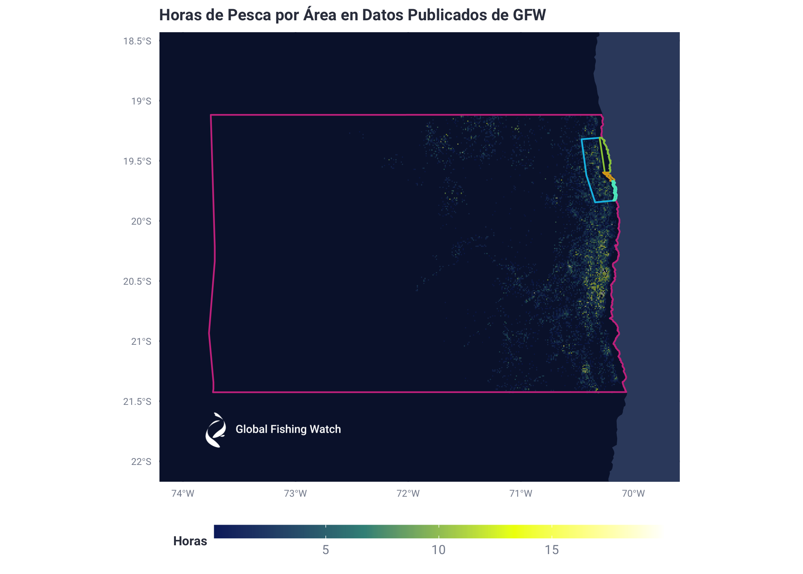
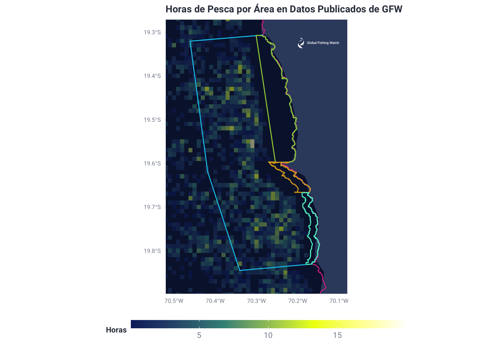

Reporte Published Data Preliminar Oceana Chile AMP Pisagua
================
Esteban Arenas
7/3/2020

Nada del código corre dentro de este Rmarkdown pero lo incluyo nada más
para que se pueda evaluar la metodología. Este es un reporte preliminar
que solo muestra el código usado y los resultados obtenidos. Podremos ir
modificándolo para llegar a la versión final.

UniqueVessNames es la base de datos que se generó previamente en el
análisis AIS. Contiene todas las embarcaciones VMS Chile que estén
dentro del PDF que nos dio Oceana Chile

El resto del proceso se explica en los comentarios del código

``` sql
SELECT vessel_id, n_shipname.value
FROM `world-fishing-827.pipe_chile_production_v20200331.vessel_info`
INNER JOIN `world-fishing-827.scratch_Esteban.UniqueVessNames_`
  ON `world-fishing-827.pipe_chile_production_v20200331.vessel_info`.n_shipname.value = `world-fishing-827.scratch_Esteban.UniqueVessNames_`.string_field_2
```

``` r
#Multiple vessel ids per vessel name
write.csv(Vessel_id, file = "Vessel_id.csv")
```

``` sql
WITH
JOINED AS (
SELECT event_type,vessel_id,event_start,event_end,lat_mean,lon_mean
FROM `world-fishing-827.pipe_chile_production_v20200331.published_events_fishing`
INNER JOIN `world-fishing-827.scratch_Esteban.Vessel_id`
  ON `world-fishing-827.pipe_chile_production_v20200331.published_events_fishing`.vessel_id = `world-fishing-827.scratch_Esteban.Vessel_id`.vessel_id_2
)
SELECT *
FROM JOINED
WHERE event_start BETWEEN TIMESTAMP('2019-02-01')
AND TIMESTAMP('2020-06-13')
AND lat_mean > -22 and lat_mean < -18.6 and lon_mean > -74 and lon_mean < -69.8
```

``` r
Published_Data_Copy <- copy(Published_Data)
#Add associated vessel name
Published_Data_Copy$n_shipname <- AISChileVessels_ID$value[match(Published_Data_Copy$vessel_id, AISChileVessels_ID$vessel_id)]
#Order by n_shipname and then timestamp
Published_Data_Copy <- Published_Data_Copy[with(Published_Data_Copy, order(vessel_id, event_start)),]
#Calculate time in between timestamps
#Convert timestamp to epoch seconds
Published_Data_Copy$EpochSec_Start <- as.integer(as.POSIXct(Published_Data_Copy$event_start))
Published_Data_Copy$EpochSec_End <- as.integer(as.POSIXct(Published_Data_Copy$event_end))
#Converting back to date to make sure epoch is correct
#as_datetime(Published_Data_Copy$EpochSec_Start[1])
#Calculate hours between event_start and event_end
Published_Data_Copy$hours <- (Published_Data_Copy$EpochSec_End - Published_Data_Copy$EpochSec_Start)/3600

#Resulting file is exported and clipped in QGIS according to each region.
#This file includes published fishing hours for all VMS available vessels of interest to Oceana Chile.
#Around 18 thousand rows for vessels between 2019-02-01 and 2020-06-13
write.csv(Published_Data_Copy, file = "Published_Data.csv")
```

**“Published\_Data.csv”** is exported and clipped in QGIS according to
each region. This file includes Published fishing hours for all VMS
available vessels of interest to Oceana Chile. This is around 8 thousand
rows for vessels between 2019-02-01 and 2020-06-13

Clipped versions of the file, according to polygons of interest, are
then imported below: Tarapacá and Pisagua

``` r
##### 1.) TARAPACA
Vessels_Clip_Tarapaca_Published <- read.csv ("/Users/Esteban/Documents/Jobs/GFW/Proyectos/Chile/Chile_Oceana/Final_Report/Tables/FullData/Vessels_Clip_Tarapaca_Published.csv", header = TRUE)

#Aggregate by vessel, adding fishing hours
Tarapaca_FH_Published <- data.frame(aggregate(hours ~ n_shipname + vessel_id, Vessels_Clip_Tarapaca_Published, sum))
Tarapaca_FH_Published <- Tarapaca_FH_Published[with(Tarapaca_FH_Published, order(-hours)),]

#Export final list of vessels and associated hours within
#Tarapaca region

##rite.csv(Tarapaca_FH_Published, file = "Tarapaca_Horas_de_Pesca_Published.csv")
```

Resultados en horas de esfuerzo pesquero de las distintas áreas debajo

**Tarapacá**

Horas de Pesca

|    | n\_shipname           | vessel\_id                            |     hours |
| -- | :-------------------- | :------------------------------------ | --------: |
| 11 | ATACAMAIV             | 1798d174c-c96a-2f84-ccf5-303a09487c07 | 602.13333 |
| 67 | ALBIMER               | cb9fa3ad8-8e5e-f557-698d-229492a91f9b | 576.80000 |
| 8  | HURACAN               | 1454960ef-fe25-5a84-c90f-0c6f7f798073 | 541.93833 |
| 46 | EPERVA65              | 8d3861191-1903-0d1f-8b86-52f9f905b35f | 541.26028 |
| 86 | AUDAZ                 | f8008c825-5bff-6ebd-d292-b4f0c67b13e2 | 539.32861 |
| 10 | COSTAGRANDE1          | 165fe117d-d09e-88ea-875b-d5904bf69b94 | 534.10000 |
| 90 | LOA1                  | fcdb849b5-528b-d327-c799-9acc2cc9ba1b | 529.45000 |
| 21 | EPERVA56              | 402c426fd-d99a-1e0c-79c2-47a8fe1c8e59 | 513.29139 |
| 15 | DONERNESTOAYALAMARFIL | 21847bde9-97e6-8a43-25ad-719230f7dbe7 | 506.95472 |
| 34 | BARRACUDAIV           | 69355e3c2-2e8a-566e-856c-a48754e31664 | 499.78750 |
| 74 | EPERVA66              | dd8ffcc2e-e5c4-5d01-3bd5-b9f74051de2d | 495.63472 |
| 73 | CORPESCA2             | dd224fd6d-de37-5e1c-128c-fb4b27557cfd | 492.64139 |
| 37 | CLAUDIAALEJANDRA      | 6f94f9e12-24c0-8937-553b-55255244a4d4 | 492.55222 |
| 65 | RELAMPAGO             | c9155d0dc-c4e1-aedd-e41b-723965e5c415 | 491.82917 |
| 13 | INTREPIDO             | 1cbb99b89-9a86-d7c3-1127-dd0a1e802b77 | 488.01722 |
| 69 | LOA7                  | d3db1532f-f1c7-1aa5-62a6-3fd5d69b3ac4 | 486.49167 |
| 33 | AVENTURERO            | 667b23170-01b1-06c1-315f-75e055581a63 | 483.92528 |
| 47 | PARINAI               | 920280d0c-c865-851e-d90e-8d40bdc553c8 | 482.77694 |
| 39 | LICANTEN              | 7b917ae9b-bd45-caf6-8159-681f1ec3f1f4 | 468.66667 |
| 68 | DONGINO               | d0b21e5a6-66b3-c5bf-7a90-71a546ea8ef2 | 459.53639 |
| 2  | LOA2                  | 044601752-279c-8c91-98ee-dbd9349a1011 | 457.95000 |
| 44 | MERO                  | 876820c52-2f54-669f-2c58-84694c36e245 | 454.31917 |
| 83 | ATACAMAV              | f0ceac6b6-66db-e3a7-b040-9bcadf65842b | 445.86667 |
| 77 | EPERVA61              | e2ad3463b-bf99-dabd-a2bc-c43361e8d823 | 439.01111 |
| 9  | ANGAMOS3              | 162f613f3-32dc-72ea-d7d3-1d948a1ba59f | 437.34028 |
| 56 | ICALMA                | abff4e636-6379-c867-52b4-de52c6947a5e | 436.27806 |
| 52 | COLLEN                | 9c9ff0fb3-3153-1005-5d13-ee8972ccb4f4 | 431.63333 |
| 49 | TORNADO               | 9594835bc-cc0f-6bd3-1a71-c5fb4070662e | 418.89972 |
| 76 | EPERVA62              | e1cc358aa-a3f1-a7d5-4081-573189d77078 | 405.97639 |
| 40 | ANGAMOS4              | 7d9d0d22d-dc56-328f-c959-8c0247c600f6 | 385.53389 |
| 58 | HALCON                | b22e1e4f9-97c4-8fd8-25e9-f9c6735b3e53 | 379.79694 |
| 70 | BLANQUILLO            | d99d2d18f-fb69-9cf0-a858-9294dccda7a3 | 377.82833 |
| 48 | EPERVA51              | 93dcc8145-5e45-2de2-3202-0ac550215bed | 336.16278 |
| 25 | ANGAMOS2              | 4a1f32f58-8821-1df0-0873-bff99c0b45de | 325.70306 |
| 75 | EPERVA64              | e079929d8-851e-77f8-fc76-b200b7091e2d | 322.74750 |
| 30 | SALMON                | 59ad77c14-40bc-b848-c01d-5657a34ee084 | 321.89694 |
| 72 | ANGAMOS1              | dd03e5793-36e7-26c8-0692-c941be99c2e2 | 319.73528 |
| 7  | ANGAMOS9              | 0e0de65a0-02fe-c441-6516-f71f1ca11226 | 316.99417 |
| 82 | BANDURRIA             | e97e9cb9d-da5e-3614-ad05-ee052977db8d | 315.78139 |
| 51 | EPERVA49              | 9c717f68e-e622-813f-3591-5001441a9574 | 305.80000 |
| 63 | ALERCE                | c22a4a777-7040-4a53-8184-6d23be712466 | 292.33333 |
| 31 | MARLIN                | 5a26861b9-97f3-adf5-9c86-c2f9ee3028ca | 285.87389 |
| 91 | PUCARA                | ffe1273a1-1755-842c-60d3-39eb924ba9ed | 265.33500 |
| 64 | SANJORGEI             | c28610f21-19f2-115b-a452-351023f17026 | 240.95333 |
| 62 | SANJORGEI             | bb20dac71-131f-e089-1ae0-eb6b7a7183ec | 235.53333 |
| 6  | TRUENOI               | 0b75e1060-0fc4-b086-123b-0419bb62df65 | 205.36444 |
| 55 | LOA1                  | a8a2909c4-415a-c953-503b-e048f66283c1 | 168.63333 |
| 18 | COLLEN                | 2656c40a5-50cc-75bd-acf7-dbf4a4307920 | 162.51667 |
| 3  | CAMINA                | 0477f0d9b-b697-abfe-6965-8dd4262d646a | 162.26861 |
| 66 | ATACAMAIV             | c9bab7a6f-fa39-670e-d333-ac3fab6394ef | 133.20000 |
| 60 | LOA7                  | b989aac12-2a47-1dea-7d23-7b0d22e63185 | 132.91667 |
| 42 | LOA2                  | 7f2193453-3f2a-7a79-52c3-ed70e0a910a5 | 131.05000 |
| 61 | BANDURRIA             | bae38ce09-9eaf-40dc-4917-4934871fc5da | 128.53333 |
| 81 | ALBIMER               | e7bebfe03-346f-4d42-c55e-adcb71359635 | 128.26667 |
| 59 | EPERVA49              | b547d6610-0eb6-57dc-1b98-07b29edc4793 | 127.20000 |
| 54 | ATACAMAV              | a297e5608-835c-f424-bbce-4d88d988adce | 126.45000 |
| 22 | LICANTEN              | 4059bfd9b-bdb1-6edf-4314-36d4be68398a | 123.21667 |
| 38 | ALERCE                | 757d301fa-ab43-25aa-8048-3485f5288646 | 115.40000 |
| 80 | CLAUDIAALEJANDRA      | e722ba7b7-77eb-ad9c-aa3b-48d0095d8120 | 115.28000 |
| 1  | ANGAMOS1              | 01728d550-01b2-0622-2af6-c4fd5a91fd7b | 113.57889 |
| 89 | DONGINO               | fcd41fe10-0473-b208-6135-66f1e7e1e974 | 113.14417 |
| 53 | HALCON                | a0cccaaf6-630c-cffe-8af2-e5e24587f8b3 | 111.65667 |
| 88 | EPERVA65              | fc138524b-bf20-c106-8b22-243e529a3d27 | 106.33917 |
| 57 | COSTAGRANDE1          | acb725e1d-d0bb-5a4b-045d-8b5edb207ecf | 105.70000 |
| 19 | ANGAMOS3              | 38fbc2742-2414-72c8-01e3-3a8e71675b39 | 101.38278 |
| 14 | CORPESCA2             | 214890696-683e-978c-fe05-73bb493860e5 | 100.94167 |
| 24 | RELAMPAGO             | 4837d6c12-2ac1-bf90-663b-4c1d90892796 |  92.67083 |
| 4  | AVENTURERO            | 0946129ba-aea8-3f05-e353-573e46f5fbdf |  92.52861 |
| 20 | SANJORGEI             | 3d2bc04f4-4c16-ac9f-e2c3-1ef9ef5bac1e |  90.09167 |
| 29 | EPERVA66              | 56cfeae88-8c58-5ccd-e8dd-4164d74fbfa3 |  86.50250 |
| 78 | HURACAN               | e5d533883-377d-5854-3b94-610fd142b1ac |  85.74139 |
| 71 | DONERNESTOAYALAMARFIL | da4a0e82c-c129-f78a-ed82-330c72d498ab |  85.14694 |
| 43 | ANGAMOS4              | 7fdda6bcf-f256-daec-5445-5b1f2b037236 |  80.37833 |
| 12 | MARLIN                | 185c50254-40d6-4d3e-f51b-2077faee820c |  76.28056 |
| 36 | PUCARA                | 6b709078d-da83-9fb0-16d2-4186433363ad |  75.46750 |
| 16 | PARINAI               | 2223a49aa-ae05-b562-4c89-f81c581599c6 |  61.84528 |
| 79 | BLANQUILLO            | e5f246286-635c-bf1d-d9bf-e157e0692c29 |  61.67389 |
| 84 | EPERVA51              | f2108d424-4179-25bb-5545-65d72f546466 |  60.10389 |
| 28 | AUDAZ                 | 567adcbf2-2398-c6f7-de52-b91bdb10b8bb |  56.92444 |
| 5  | MERO                  | 09fd66765-57bd-847f-5524-435d07ce1560 |  56.35167 |
| 41 | BARRACUDAIV           | 7ef93ee2c-cabd-477c-a027-c5f4e3edf584 |  54.44528 |
| 45 | INTREPIDO             | 8bf99968b-b23e-13a6-c1d9-2255f9cd7f98 |  52.21417 |
| 17 | EPERVA56              | 247b53b3a-a265-f0c5-04e9-16dea4f0caf7 |  50.97917 |
| 23 | TRUENOI               | 46a571a50-0c4e-2d95-cb1e-04b17e1da50c |  50.36028 |
| 27 | EPERVA61              | 514e0ae1f-fccb-b46c-4dfb-fbab1a78f6ca |  40.20000 |
| 87 | EPERVA64              | f88b6d1a8-8dd1-c8d9-40bd-937387627b9a |  39.83778 |
| 35 | ANGAMOS2              | 69a0ed23e-e1b1-a680-65ed-53d180592698 |  39.26917 |
| 26 | ICALMA                | 4cfdfcc13-31ad-b5da-937a-a406c53ffc32 |  36.19861 |
| 50 | TORNADO               | 9b7412c6b-bcb1-fcf7-7fe2-8d59b41b62a7 |  34.21556 |
| 32 | CAMINA                | 5c5891d26-65db-c5bb-bdd2-fdfe1a98ad81 |  25.55056 |
| 85 | EPERVA62              | f29ea23cb-b309-6d90-4f26-048afe4b8530 |  22.57556 |

``` r
##### 2.) PISAGUA
Vessels_Clip_Pisagua_Published <- read.csv ("/Users/Esteban/Documents/Jobs/GFW/Proyectos/Chile/Chile_Oceana/Final_Report/Tables/FullData/Vessels_Clip_Pisagua_Published.csv", header = TRUE)

#Aggregate by vessel, adding fishing hours
Pisagua_FH_Published <- data.frame(aggregate(hours ~ n_shipname + vessel_id, Vessels_Clip_Pisagua_Published, sum))
Pisagua_FH_Published <- Pisagua_FH_Published[with(Pisagua_FH_Published, order(-hours)),]

#Export final list of vessels and associated hours within
#Pisagua region

##write.csv(Pisagua_FH_Published, file = "Pisagua_Horas_de_Pesca_Published.csv")
```

**Pisagua**

Horas de Pesca

|    | n\_shipname           | vessel\_id                            |      hours |
| -- | :-------------------- | :------------------------------------ | ---------: |
| 6  | HURACAN               | 1454960ef-fe25-5a84-c90f-0c6f7f798073 | 85.9561111 |
| 18 | EPERVA56              | 402c426fd-d99a-1e0c-79c2-47a8fe1c8e59 | 85.4858333 |
| 69 | EPERVA66              | dd8ffcc2e-e5c4-5d01-3bd5-b9f74051de2d | 82.4738889 |
| 44 | TORNADO               | 9594835bc-cc0f-6bd3-1a71-c5fb4070662e | 75.3194444 |
| 51 | ICALMA                | abff4e636-6379-c867-52b4-de52c6947a5e | 72.7727778 |
| 41 | EPERVA65              | 8d3861191-1903-0d1f-8b86-52f9f905b35f | 64.5277778 |
| 22 | ANGAMOS2              | 4a1f32f58-8821-1df0-0873-bff99c0b45de | 62.8433333 |
| 71 | EPERVA62              | e1cc358aa-a3f1-a7d5-4081-573189d77078 | 58.9744444 |
| 30 | BARRACUDAIV           | 69355e3c2-2e8a-566e-856c-a48754e31664 | 58.5697222 |
| 9  | ATACAMAIV             | 1798d174c-c96a-2f84-ccf5-303a09487c07 | 58.0000000 |
| 64 | LOA7                  | d3db1532f-f1c7-1aa5-62a6-3fd5d69b3ac4 | 57.1183333 |
| 68 | CORPESCA2             | dd224fd6d-de37-5e1c-128c-fb4b27557cfd | 55.2022222 |
| 7  | ANGAMOS3              | 162f613f3-32dc-72ea-d7d3-1d948a1ba59f | 53.7522222 |
| 78 | ATACAMAV              | f0ceac6b6-66db-e3a7-b040-9bcadf65842b | 53.5833333 |
| 72 | EPERVA61              | e2ad3463b-bf99-dabd-a2bc-c43361e8d823 | 52.7005556 |
| 29 | AVENTURERO            | 667b23170-01b1-06c1-315f-75e055581a63 | 51.5080556 |
| 12 | DONERNESTOAYALAMARFIL | 21847bde9-97e6-8a43-25ad-719230f7dbe7 | 51.1550000 |
| 33 | CLAUDIAALEJANDRA      | 6f94f9e12-24c0-8937-553b-55255244a4d4 | 50.1333333 |
| 62 | ALBIMER               | cb9fa3ad8-8e5e-f557-698d-229492a91f9b | 48.8000000 |
| 67 | ANGAMOS1              | dd03e5793-36e7-26c8-0692-c941be99c2e2 | 48.2933333 |
| 5  | ANGAMOS9              | 0e0de65a0-02fe-c441-6516-f71f1ca11226 | 47.7522222 |
| 10 | INTREPIDO             | 1cbb99b89-9a86-d7c3-1127-dd0a1e802b77 | 46.5516667 |
| 86 | PUCARA                | ffe1273a1-1755-842c-60d3-39eb924ba9ed | 46.2308333 |
| 39 | MERO                  | 876820c52-2f54-669f-2c58-84694c36e245 | 45.8386111 |
| 81 | AUDAZ                 | f8008c825-5bff-6ebd-d292-b4f0c67b13e2 | 44.9827778 |
| 70 | EPERVA64              | e079929d8-851e-77f8-fc76-b200b7091e2d | 43.1775000 |
| 65 | BLANQUILLO            | d99d2d18f-fb69-9cf0-a858-9294dccda7a3 | 42.7336111 |
| 35 | ANGAMOS4              | 7d9d0d22d-dc56-328f-c959-8c0247c600f6 | 42.6897222 |
| 85 | LOA1                  | fcdb849b5-528b-d327-c799-9acc2cc9ba1b | 41.7666667 |
| 42 | PARINAI               | 920280d0c-c865-851e-d90e-8d40bdc553c8 | 41.7438889 |
| 4  | TRUENOI               | 0b75e1060-0fc4-b086-123b-0419bb62df65 | 41.5502778 |
| 8  | COSTAGRANDE1          | 165fe117d-d09e-88ea-875b-d5904bf69b94 | 39.9333333 |
| 27 | SALMON                | 59ad77c14-40bc-b848-c01d-5657a34ee084 | 39.7827778 |
| 34 | LICANTEN              | 7b917ae9b-bd45-caf6-8159-681f1ec3f1f4 | 36.9830556 |
| 47 | COLLEN                | 9c9ff0fb3-3153-1005-5d13-ee8972ccb4f4 | 34.3333333 |
| 60 | RELAMPAGO             | c9155d0dc-c4e1-aedd-e41b-723965e5c415 | 34.3097222 |
| 46 | EPERVA49              | 9c717f68e-e622-813f-3591-5001441a9574 | 33.5333333 |
| 77 | BANDURRIA             | e97e9cb9d-da5e-3614-ad05-ee052977db8d | 32.3388889 |
| 1  | LOA2                  | 044601752-279c-8c91-98ee-dbd9349a1011 | 31.3333333 |
| 63 | DONGINO               | d0b21e5a6-66b3-c5bf-7a90-71a546ea8ef2 | 30.5036111 |
| 50 | LOA1                  | a8a2909c4-415a-c953-503b-e048f66283c1 | 28.9166667 |
| 43 | EPERVA51              | 93dcc8145-5e45-2de2-3202-0ac550215bed | 22.3800000 |
| 57 | SANJORGEI             | bb20dac71-131f-e089-1ae0-eb6b7a7183ec | 21.2666667 |
| 28 | MARLIN                | 5a26861b9-97f3-adf5-9c86-c2f9ee3028ca | 18.5369444 |
| 76 | ALBIMER               | e7bebfe03-346f-4d42-c55e-adcb71359635 | 18.5333333 |
| 14 | EPERVA56              | 247b53b3a-a265-f0c5-04e9-16dea4f0caf7 | 17.5405556 |
| 26 | EPERVA66              | 56cfeae88-8c58-5ccd-e8dd-4164d74fbfa3 | 16.8641667 |
| 58 | ALERCE                | c22a4a777-7040-4a53-8184-6d23be712466 | 16.5333333 |
| 53 | HALCON                | b22e1e4f9-97c4-8fd8-25e9-f9c6735b3e53 | 15.5947222 |
| 61 | ATACAMAIV             | c9bab7a6f-fa39-670e-d333-ac3fab6394ef | 14.2666667 |
| 49 | ATACAMAV              | a297e5608-835c-f424-bbce-4d88d988adce | 12.6000000 |
| 40 | INTREPIDO             | 8bf99968b-b23e-13a6-c1d9-2255f9cd7f98 | 11.8077778 |
| 75 | CLAUDIAALEJANDRA      | e722ba7b7-77eb-ad9c-aa3b-48d0095d8120 | 11.6000000 |
| 21 | RELAMPAGO             | 4837d6c12-2ac1-bf90-663b-4c1d90892796 |  9.9794444 |
| 52 | COSTAGRANDE1          | acb725e1d-d0bb-5a4b-045d-8b5edb207ecf |  8.4666667 |
| 15 | COLLEN                | 2656c40a5-50cc-75bd-acf7-dbf4a4307920 |  7.8333333 |
| 19 | LICANTEN              | 4059bfd9b-bdb1-6edf-4314-36d4be68398a |  7.6500000 |
| 37 | LOA2                  | 7f2193453-3f2a-7a79-52c3-ed70e0a910a5 |  6.8166667 |
| 36 | BARRACUDAIV           | 7ef93ee2c-cabd-477c-a027-c5f4e3edf584 |  6.7863889 |
| 55 | LOA7                  | b989aac12-2a47-1dea-7d23-7b0d22e63185 |  6.7500000 |
| 83 | EPERVA65              | fc138524b-bf20-c106-8b22-243e529a3d27 |  5.9588889 |
| 25 | AUDAZ                 | 567adcbf2-2398-c6f7-de52-b91bdb10b8bb |  5.4438889 |
| 3  | MERO                  | 09fd66765-57bd-847f-5524-435d07ce1560 |  5.2988889 |
| 11 | CORPESCA2             | 214890696-683e-978c-fe05-73bb493860e5 |  5.0908333 |
| 17 | SANJORGEI             | 3d2bc04f4-4c16-ac9f-e2c3-1ef9ef5bac1e |  4.0550000 |
| 45 | TORNADO               | 9b7412c6b-bcb1-fcf7-7fe2-8d59b41b62a7 |  3.2166667 |
| 31 | ANGAMOS2              | 69a0ed23e-e1b1-a680-65ed-53d180592698 |  3.1222222 |
| 66 | DONERNESTOAYALAMARFIL | da4a0e82c-c129-f78a-ed82-330c72d498ab |  2.9930556 |
| 73 | HURACAN               | e5d533883-377d-5854-3b94-610fd142b1ac |  2.5952778 |
| 59 | SANJORGEI             | c28610f21-19f2-115b-a452-351023f17026 |  2.5102778 |
| 23 | ICALMA                | 4cfdfcc13-31ad-b5da-937a-a406c53ffc32 |  2.5000000 |
| 79 | EPERVA51              | f2108d424-4179-25bb-5545-65d72f546466 |  2.4719444 |
| 38 | ANGAMOS4              | 7fdda6bcf-f256-daec-5445-5b1f2b037236 |  2.3877778 |
| 48 | HALCON                | a0cccaaf6-630c-cffe-8af2-e5e24587f8b3 |  2.3283333 |
| 16 | ANGAMOS3              | 38fbc2742-2414-72c8-01e3-3a8e71675b39 |  2.2608333 |
| 80 | EPERVA62              | f29ea23cb-b309-6d90-4f26-048afe4b8530 |  2.2372222 |
| 82 | EPERVA64              | f88b6d1a8-8dd1-c8d9-40bd-937387627b9a |  2.1166667 |
| 74 | BLANQUILLO            | e5f246286-635c-bf1d-d9bf-e157e0692c29 |  2.0327778 |
| 54 | EPERVA49              | b547d6610-0eb6-57dc-1b98-07b29edc4793 |  1.8666667 |
| 13 | PARINAI               | 2223a49aa-ae05-b562-4c89-f81c581599c6 |  1.7500000 |
| 24 | EPERVA61              | 514e0ae1f-fccb-b46c-4dfb-fbab1a78f6ca |  1.7461111 |
| 20 | TRUENOI               | 46a571a50-0c4e-2d95-cb1e-04b17e1da50c |  1.6000000 |
| 32 | PUCARA                | 6b709078d-da83-9fb0-16d2-4186433363ad |  1.2511111 |
| 56 | BANDURRIA             | bae38ce09-9eaf-40dc-4917-4934871fc5da |  0.6666667 |
| 2  | CAMINA                | 0477f0d9b-b697-abfe-6965-8dd4262d646a |  0.5572222 |
| 84 | DONGINO               | fcd41fe10-0473-b208-6135-66f1e7e1e974 |  0.5333333 |

**Ventana 5**

No hay ninguna embarcación dentro de la ventana 5

**Ventana 6**

No hay ninguna embarcación dentro de la ventana 6

**Ventana 7**

No hay ninguna embarcación dentro de la ventana 7

Agrupar los datos por décimas de grados Lat y Lon, sumar horas totales
de actividad y horas de pesca También se bajan los archivos JSON con los
polígonos de interes que irán en los mapas

``` r
#Graphing Fishing Effort Hours for the "Tarapaca_Fishing_Published" DB
#by grouping hours into lat and lon hundreth bins
Vessels_Clip_Tarapaca_Published$LatBin <- (floor(Vessels_Clip_Tarapaca_Published$lat_mean * 100)/100)
Vessels_Clip_Tarapaca_Published$LonBin <- (floor(Vessels_Clip_Tarapaca_Published$lon_mean * 100)/100)

#Fishing hours Graph
FishingHoursGraph_Published <- data.frame(aggregate(hours ~ LatBin + LonBin, Vessels_Clip_Tarapaca_Published, sum))
#Se quitan 37 lineas (outliers) de valores > 20 (.54% de los datos) para que el mapa 
#muestre resultados útiles
FishingHoursGraph_Published <- FishingHoursGraph_Published[which(FishingHoursGraph_Published$hours < 20),]

###Mapa
#Bajar los archivos JSON con los polígonos de interés
#Pisagua
Pisagua_ST <- st_read("/Users/Esteban/Documents/Jobs/GFW/Proyectos/Chile/Chile_Oceana/Data/Shapes/Pisagua.geojson")
#Tarapacá
Tarapaca_ST <- st_read("/Users/Esteban/Documents/Jobs/GFW/Proyectos/Chile/Chile_Oceana/Data/Shapes/TarapacaPoly.geojson")
#Ventana 5
Ventana5_ST <- st_read("/Users/Esteban/Documents/Jobs/GFW/Proyectos/Chile/Chile_Oceana/Data/Shapes/VP5gj.geojson")
#Ventana 6
Ventana6_ST <- st_read("/Users/Esteban/Documents/Jobs/GFW/Proyectos/Chile/Chile_Oceana/Data/Shapes/VP6gj.geojson")
#Ventana 7
Ventana7_ST <- st_read("/Users/Esteban/Documents/Jobs/GFW/Proyectos/Chile/Chile_Oceana/Data/Shapes/VP7intersectgj.geojson")
```

Generar el mapa de esfuerzo pesquero por horas de pesca de acuerdo a
décimas de grados Lat y Lon

``` r
# GFW logo
gfw_logo <- png::readPNG("/Users/Esteban/Documents/Jobs/GFW/General/Logo/GFW_logo_primary_White.png")
gfw_logo_rast <- grid::rasterGrob(gfw_logo, interpolate = T)

#Map
land_sf <- rnaturalearth::ne_countries(scale = 10, returnclass = 'sf')
MapTest_Published <- ggplot() + 
  geom_sf(data = land_sf,
            fill = fishwatchr::gfw_palettes$map_country_dark[1],
            color = fishwatchr::gfw_palettes$map_country_dark[2],
          size=.1) +
    scale_fill_gradientn(colours = fishwatchr::gfw_palettes$map_effort_dark)+
  fishwatchr::theme_gfw_map(theme = 'dark')+
  geom_tile(data = FishingHoursGraph_Published, aes(x = LonBin, y = LatBin, fill = hours), alpha = 0.5)+
  labs(fill = "Horas", title = "Horas de Pesca por Área en Datos Publicados de GFW")+
  geom_sf(data=Tarapaca_ST,fill=NA, color="#CC3A8E")+geom_sf(data=Pisagua_ST, fill=NA, color="#00C1E7")+
  geom_sf(data=Ventana5_ST, fill=NA, color="#99C945")+geom_sf(data=Ventana6_ST, fill=NA, color="#DAA51B")+
  geom_sf(data=Ventana7_ST, fill=NA, color="#58E8C6")+
  coord_sf(xlim = c(-74, -69.8), ylim = c(-22, -18.6))+
  #Add GFW logo
  annotation_custom(gfw_logo_rast,
                      ymin = -21.95,
                      ymax = -21.53,
                      xmin = -73.8,
                      xmax = -72.6)
MapTest_Published
```

<!-- -->

El mismo mapa de arriba pero enfocado en Pisagua

``` r
#Zoomed in Pisagua fishing hours map
MapTest2_Published <- MapTest_Published + coord_sf(xlim = c(-70.5, -70.1), ylim = c(-19.87, -19.3))+
    #Add GFW logo
  annotation_custom(gfw_logo_rast,
                      ymin = -19.35,
                      ymax = -19.3,
                      xmin = -70.2,
                      xmax = -70.1)
```

    ## Coordinate system already present. Adding new coordinate system, which will replace the existing one.

``` r
MapTest2_Published
```

<!-- -->
