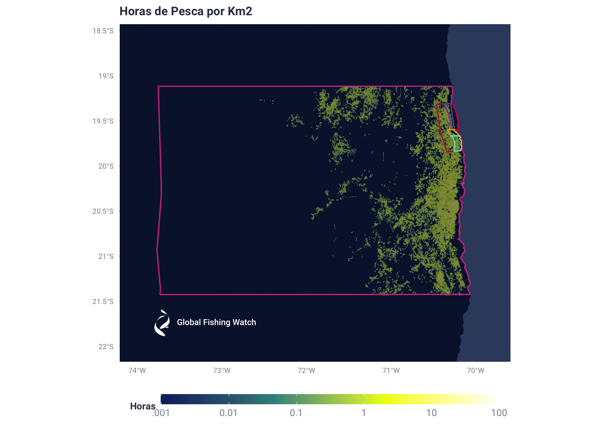
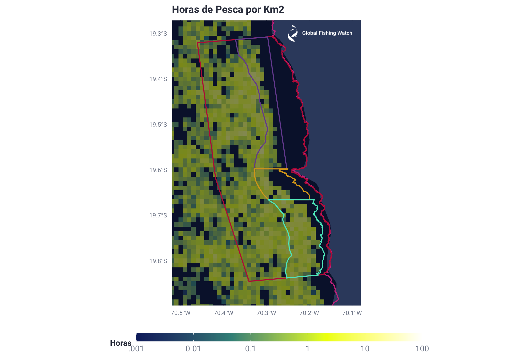
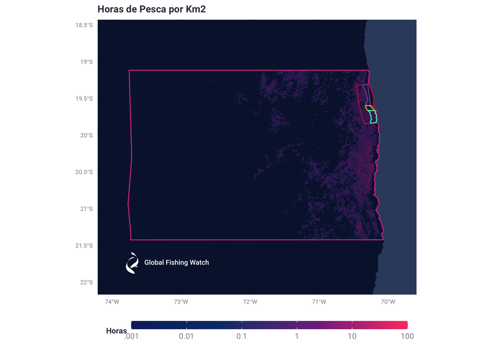
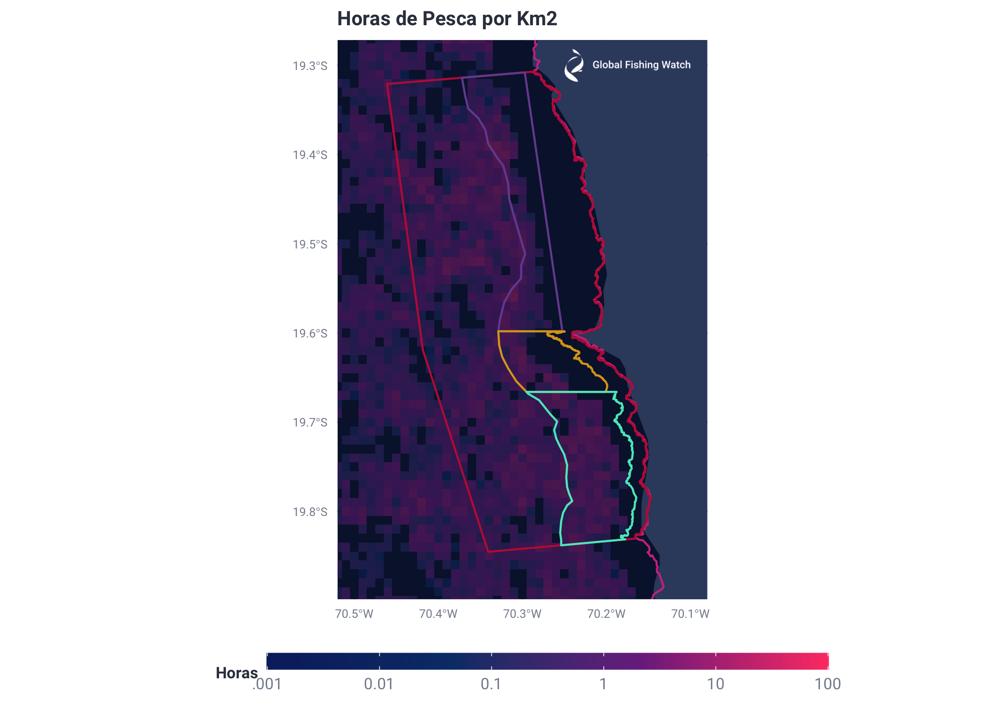
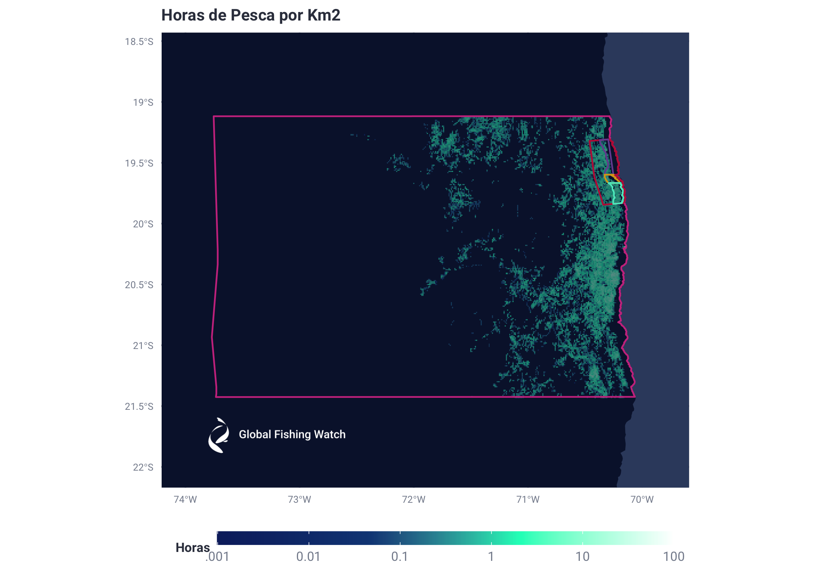
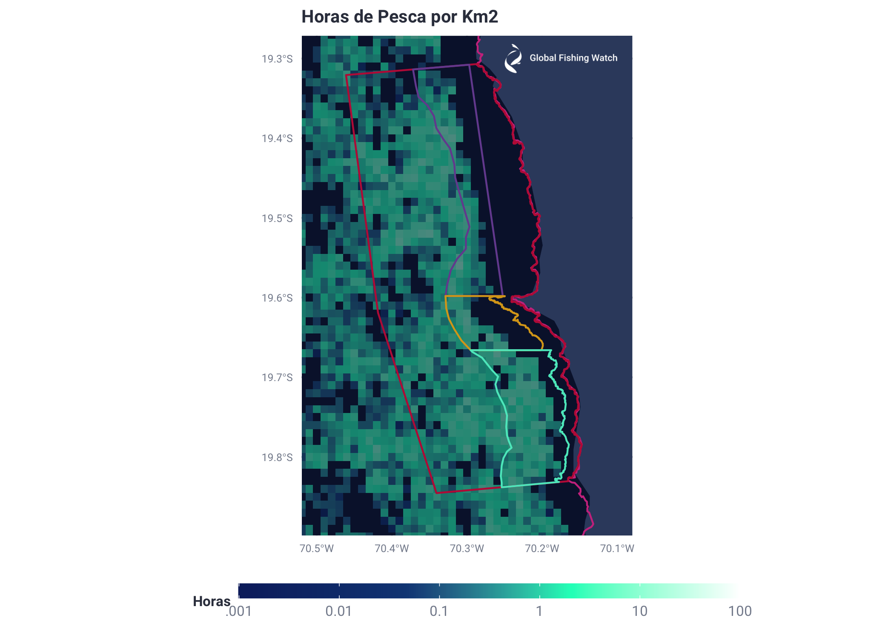

Reporte VMS Preliminar Oceana Chile AMP Pisagua
================
Esteban Arenas
6/15/2020

**“Vessels\_Clip\_Tarapaca”** ontains data that has already been
extracted from the Chile VMS, worked on to calculate time difference
between consecutive points, established which times classify as fishing
and which don’t, and been clipped to the Tarapacá region of Chile. This
process can be found in beginning of the **“Report.Rmd”** file within
this repo.

Group by lat and lon hundreths, add fishing and total hours, and export
tables to then calulate Hrs/Km2 using a User Defined Function (UDF)

``` r
Vessels_Clip_Tarapaca <- read.csv ("/Users/Esteban/Documents/Jobs/GFW/Proyectos/Chile/Chile_Oceana/Final_Report/Tables/FullData/Vessels_Clip_Tarapaca.csv", header = TRUE)
#Graphing Fishing Effort Hours for the "Vessels_Clip_Tarapaca" DB
#by grouping fishing hours into lat and lon hundreth bins
Vessels_Clip_Tarapaca$LatBin <- (floor(Vessels_Clip_Tarapaca$lat * 100)/100)
Vessels_Clip_Tarapaca$LonBin <- (floor(Vessels_Clip_Tarapaca$lon * 100)/100)
#Fishing hours Graph
FishingHoursGraph <- data.frame(aggregate(FishingHours ~ n_shipname + LatBin + LonBin, Vessels_Clip_Tarapaca, sum))
TotalHoursGraph <- data.frame(aggregate(Hrs_Diff ~ n_shipname + LatBin + LonBin, Vessels_Clip_Tarapaca, sum))
#Split into 2 so tables can be uploaded onto BigQuerry
FishingHoursGraph_1 <- FishingHoursGraph[1:150000,]
FishingHoursGraph_2 <- FishingHoursGraph[150001:nrow(FishingHoursGraph),]
TotalHoursGraph_1 <- TotalHoursGraph[1:150000,]
TotalHoursGraph_2 <- TotalHoursGraph[150001:nrow(TotalHoursGraph),]

# write.csv(FishingHoursGraph_1, file = "FishingHoursGraph_1_VMS.csv")
# write.csv(FishingHoursGraph_2, file = "FishingHoursGraph_2_VMS.csv")
# write.csv(TotalHoursGraph_1, file = "TotalHoursGraph_1_VMS.csv")
# write.csv(TotalHoursGraph_2, file = "TotalHoursGraph_2_VMS.csv")
```

Use BigQuery and a UDF to calculate Hrs/Km2 and develop a final database
for creating tables and graphs

``` r
query_string <- glue::glue('
#Transform to hours/km2
SELECT *,
FishingHours/(COS(udfs_v20200701.radians(LatBin)) * (111/100)  * (111/100) ) AS fishing_hours_sq_km,
FROM `world-fishing-827.scratch_Esteban.FishingHoursGraph_1_VMS`')
FishingHoursGraph_1_VMS <- DBI::dbGetQuery(con, query_string)

FishingHoursGraph_1_VMS$Log_fishing_hours_sq_km <- log10(FishingHoursGraph_1_VMS$fishing_hours_sq_km)

query_string2 <- glue::glue('
#Transform to hours/km2
SELECT *, 
FishingHours/(COS(udfs_v20200701.radians(LatBin)) * (111/100)  * (111/100) ) AS fishing_hours_sq_km,
FROM `world-fishing-827.scratch_Esteban.FishingHoursGraph_2_VMS`')
FishingHoursGraph_2_VMS <- DBI::dbGetQuery(con, query_string2)

FishingHoursGraph_2_VMS$Log_fishing_hours_sq_km <- log10(FishingHoursGraph_2_VMS$fishing_hours_sq_km)

query_string3 <- glue::glue('
#Transform to hours/km2
SELECT *,
Hrs_Diff/(COS(udfs_v20200701.radians(LatBin)) * (111/100)  * (111/100) ) AS fishing_hours_sq_km,
FROM `world-fishing-827.scratch_Esteban.TotalHoursGraph_1_VMS`')
TotalHoursGraph_1_VMS <- DBI::dbGetQuery(con, query_string3)

TotalHoursGraph_1_VMS$Log_fishing_hours_sq_km <- log10(TotalHoursGraph_1_VMS$fishing_hours_sq_km)

query_string4 <- glue::glue('
#Transform to hours/km2
SELECT *,
Hrs_Diff/(COS(udfs_v20200701.radians(LatBin)) * (111/100)  * (111/100) ) AS fishing_hours_sq_km,
FROM `world-fishing-827.scratch_Esteban.TotalHoursGraph_2_VMS`')
TotalHoursGraph_2_VMS <- DBI::dbGetQuery(con, query_string4)

TotalHoursGraph_2_VMS$Log_fishing_hours_sq_km <- log10(TotalHoursGraph_2_VMS$fishing_hours_sq_km)

FishingHoursGraph <- rbind(FishingHoursGraph_1_VMS,FishingHoursGraph_2_VMS)
TotalHoursGraph <- rbind(TotalHoursGraph_1_VMS, TotalHoursGraph_2_VMS)
# write.csv(FishingHoursGraph, file = "Tarapaca_FishingHoursGraph_VMS.csv")
# write.csv(TotalHoursGraph, file = "Tarapaca_TotalHoursGraph_VMS.csv")
#Above file will be cropped in QGIS according to areas of interes (Pisagua, Ventana 5, 6 y 7)
```

**FishingHoursGraph and TotalHoursGraph** created above are exported and
clipped in QGIS according to the regions of interest. These csv files
are then imported along with the geojson files used to clip and generate
them.

``` r
#Fishing hours and Total hours for the following regions

#Tarapacá
Tarapaca_FishingHoursGraph_VMS <- read.csv ("/Users/Esteban/Documents/Jobs/GFW/Proyectos/Chile/Chile_Oceana/Final_Report/Tables/FullData/Tarapaca_FishingHoursGraph_VMS.csv", header = TRUE)
#Graphing Fishing Hours DB created by aggregating by LatBin and LonBin and logging Hrs/Km2
FishingHoursGraph <- data.frame(aggregate(fishing_hours_sq_km ~ LatBin + LonBin, Tarapaca_FishingHoursGraph_VMS, sum))
FishingHoursGraph$Log_fishing_hours_sq_km <- log10(FishingHoursGraph$fishing_hours_sq_km)
# write.csv(FishingHoursGraph, file = "FishingHoursGraph.csv")

Tarapaca_TotalHoursGraph_VMS <- read.csv ("/Users/Esteban/Documents/Jobs/GFW/Proyectos/Chile/Chile_Oceana/Final_Report/Tables/FullData/Tarapaca_TotalHoursGraph_VMS.csv", header = TRUE)
#Graphing Total Hours DB created by aggregating by LatBin and LonBin and logging Hrs/Km2
TotalHoursGraph <- data.frame(aggregate(fishing_hours_sq_km ~ LatBin + LonBin, Tarapaca_TotalHoursGraph_VMS, sum))
TotalHoursGraph$Log_fishing_hours_sq_km <- log10(TotalHoursGraph$fishing_hours_sq_km)
# write.csv(TotalHoursGraph, file = "TotalHoursGraph.csv")


#Pisagua
Pisagua_FH <- read.csv ("/Users/Esteban/Documents/Jobs/GFW/Proyectos/Chile/Chile_Oceana/Final_Report/Tables/FullData/Pisagua_FishingHoursGraph_VMS.csv", header = TRUE)
Pisagua_TH <- read.csv ("/Users/Esteban/Documents/Jobs/GFW/Proyectos/Chile/Chile_Oceana/Final_Report/Tables/FullData/Pisagua_TotalHoursGraph_VMS.csv", header = TRUE)

#Ventana 5
V5_FH <- read.csv ("/Users/Esteban/Documents/Jobs/GFW/Proyectos/Chile/Chile_Oceana/Final_Report/Tables/FullData/V5_FishingHoursGraph_VMS.csv", header = TRUE)
V5_TH <- read.csv ("/Users/Esteban/Documents/Jobs/GFW/Proyectos/Chile/Chile_Oceana/Final_Report/Tables/FullData/V5_TotalHoursGraph_VMS.csv", header = TRUE)

#Ventana 6
V6_FH <- read.csv ("/Users/Esteban/Documents/Jobs/GFW/Proyectos/Chile/Chile_Oceana/Final_Report/Tables/FullData/V6_FishingHoursGraph_VMS.csv", header = TRUE)
V6_TH <- read.csv ("/Users/Esteban/Documents/Jobs/GFW/Proyectos/Chile/Chile_Oceana/Final_Report/Tables/FullData/V6_TotalHoursGraph_VMS.csv", header = TRUE)

#Ventana 7
V7_FH <- read.csv ("/Users/Esteban/Documents/Jobs/GFW/Proyectos/Chile/Chile_Oceana/Final_Report/Tables/FullData/V7_FishingHoursGraph_VMS.csv", header = TRUE)
V7_TH <- read.csv ("/Users/Esteban/Documents/Jobs/GFW/Proyectos/Chile/Chile_Oceana/Final_Report/Tables/FullData/V7_TotalHoursGraph_VMS.csv", header = TRUE)

#Unique Vessel names - Used later to match vessel names
UniqueVessNames <- read.csv ("/Users/Esteban/Documents/Jobs/GFW/Proyectos/Chile/Chile_Oceana/Data/UniqueVessNames.csv", header = TRUE)

#Mapa GeoJson Files
#Bajar los archivos JSON con los polígonos de interés
#Pisagua
Pisagua_ST <- st_read("/Users/Esteban/Documents/Jobs/GFW/Proyectos/Chile/Chile_Oceana/Data/Shapes/Pisagua.geojson")
#Tarapacá
Tarapaca_ST <- st_read("/Users/Esteban/Documents/Jobs/GFW/Proyectos/Chile/Chile_Oceana/Data/Shapes/TarapacaPoly.geojson")
#Ventana 5
Ventana5_ST <- st_read("/Users/Esteban/Documents/Jobs/GFW/Proyectos/Chile/Chile_Oceana/Data/Shapes/VP5_F.geojson")
#Ventana 6
Ventana6_ST <- st_read("/Users/Esteban/Documents/Jobs/GFW/Proyectos/Chile/Chile_Oceana/Data/Shapes/VP6_F.geojson")
#Ventana 7
Ventana7_ST <- st_read("/Users/Esteban/Documents/Jobs/GFW/Proyectos/Chile/Chile_Oceana/Data/Shapes/VP7_F.geojson")
```

Generate Fishing Effort Tables by areas of interest

**Tarapacá**

``` r
##### 1.) TARAPACA
#FISHING HOURS
#Aggregate to get fishing hours by vessel
Tarapaca_Horas_de_Pesca_VMS <- data.frame(aggregate(fishing_hours_sq_km ~ n_shipname, Tarapaca_FishingHoursGraph_VMS, sum))
#Change shipname to original name for human reading
Tarapaca_Horas_de_Pesca_VMS$Embarcacion <- UniqueVessNames$shipname[match(Tarapaca_Horas_de_Pesca_VMS$n_shipname, UniqueVessNames$n_shipname)]
#Change Column Names
Tarapaca_Horas_de_Pesca_VMS$Horas <- Tarapaca_Horas_de_Pesca_VMS$fishing_hours_sq_km
#Remove Extra Columns
Tarapaca_Horas_de_Pesca_VMS <- Tarapaca_Horas_de_Pesca_VMS[-c(1,2)]
#Order from highest to lowest hours
Tarapaca_Horas_de_Pesca_VMS <- Tarapaca_Horas_de_Pesca_VMS[with(Tarapaca_Horas_de_Pesca_VMS, order(-Horas)),]

#TOTAL HOURS
#Aggregate to get total hours by vessel
Tarapaca_Horas_Totales_VMS <- data.frame(aggregate(fishing_hours_sq_km ~ n_shipname, Tarapaca_TotalHoursGraph_VMS, sum))
#Change shipname to original name for human reading
Tarapaca_Horas_Totales_VMS$Embarcacion <- UniqueVessNames$shipname[match(Tarapaca_Horas_Totales_VMS$n_shipname, UniqueVessNames$n_shipname)]
#Change Column Names
Tarapaca_Horas_Totales_VMS$Horas <- Tarapaca_Horas_Totales_VMS$fishing_hours_sq_km
#Remove Extra Columns
Tarapaca_Horas_Totales_VMS <- Tarapaca_Horas_Totales_VMS[-c(1,2)]
#Order from highest to lowest hours
Tarapaca_Horas_Totales_VMS <- Tarapaca_Horas_Totales_VMS[with(Tarapaca_Horas_Totales_VMS, order(-Horas)),]

#Export final list of vessels and associated hours within
#Tarapaca region

# write.csv(Tarapaca_Horas_de_Pesca_VMS, file = "Tarapaca_Horas_de_Pesca_VMS.csv")
# write.csv(Tarapaca_Horas_Totales_VMS, file = "Tarapaca_Horas_Totales_VMS.csv")
```

Fishing Hours

|    | Embarcacion                    |    Horas |
| -- | :----------------------------- | -------: |
| 8  | ATACAMA IV (IND)               | 479.9986 |
| 1  | ALBIMER (IND)                  | 460.2080 |
| 31 | HURACAN (IND)                  | 436.8119 |
| 35 | LOA 1 (IND)                    | 422.3760 |
| 42 | RELAMPAGO (IND)                | 416.4470 |
| 19 | COSTA GRANDE 1 (IND)           | 415.9658 |
| 28 | EPERVA 65 (IND)                | 415.4564 |
| 13 | BARRACUDA IV (IND)             | 405.7555 |
| 18 | CORPESCA 2 (IND)               | 403.6484 |
| 10 | AUDAZ (IND)                    | 399.0916 |
| 29 | EPERVA 66 (IND)                | 398.3075 |
| 24 | EPERVA 56 (IND)                | 389.2490 |
| 16 | CLAUDIA ALEJANDRA (IND)        | 389.0361 |
| 21 | DON GINO (IND)                 | 389.0040 |
| 20 | DON ERNESTO AYALA MARFIL (IND) | 381.7765 |
| 40 | PARINA I (IND)                 | 381.7513 |
| 33 | INTREPIDO (IND)                | 369.9014 |
| 11 | AVENTURERO (IND)               | 368.5803 |
| 37 | LOA 7 (IND)                    | 368.1813 |
| 17 | COLLEN (IND)                   | 364.5876 |
| 34 | LICANTEN (IND)                 | 357.5373 |
| 39 | MERO (IND)                     | 351.5248 |
| 9  | ATACAMA V (IND)                | 347.2163 |
| 32 | ICALMA (IND)                   | 346.0797 |
| 36 | LOA 2 (IND)                    | 345.5527 |
| 44 | SAN JORGE I (IND)              | 344.5778 |
| 5  | ANGAMOS 3 (IND)                | 336.5417 |
| 25 | EPERVA 61 (IND)                | 332.6616 |
| 26 | EPERVA 62 (IND)                | 305.3353 |
| 30 | HALCON (IND)                   | 297.7722 |
| 6  | ANGAMOS 4 (IND)                | 292.6518 |
| 14 | BLANQUILLO (IND)               | 291.1318 |
| 45 | TORNADO (IND)                  | 288.2169 |
| 22 | EPERVA 49 (IND)                | 267.7280 |
| 12 | BANDURRIA (IND)                | 265.8932 |
| 3  | ANGAMOS 1 (IND)                | 264.6650 |
| 27 | EPERVA 64 (IND)                | 257.5804 |
| 2  | ALERCE (IND)                   | 247.6130 |
| 23 | EPERVA 51 (IND)                | 246.6173 |
| 38 | MARLIN (IND)                   | 246.3325 |
| 4  | ANGAMOS 2 (IND)                | 245.1198 |
| 7  | ANGAMOS 9 (IND)                | 231.8977 |
| 43 | SALMON (IND)                   | 227.8228 |
| 41 | PUCARA (IND)                   | 217.6786 |
| 46 | TRUENO I (IND)                 | 164.4698 |
| 15 | CAMIÑA (IND)                   | 140.4134 |

Total Hours

|    | Embarcacion                    |    Horas |
| -- | :----------------------------- | -------: |
| 3  | ANGAMOS 1 (IND)                | 8751.657 |
| 31 | HURACAN (IND)                  | 8411.253 |
| 28 | EPERVA 65 (IND)                | 8108.950 |
| 13 | BARRACUDA IV (IND)             | 7997.274 |
| 5  | ANGAMOS 3 (IND)                | 7993.247 |
| 18 | CORPESCA 2 (IND)               | 7845.548 |
| 11 | AVENTURERO (IND)               | 7472.228 |
| 29 | EPERVA 66 (IND)                | 7459.212 |
| 42 | RELAMPAGO (IND)                | 7406.617 |
| 21 | DON GINO (IND)                 | 7357.477 |
| 39 | MERO (IND)                     | 7280.583 |
| 38 | MARLIN (IND)                   | 7246.238 |
| 43 | SALMON (IND)                   | 7210.464 |
| 14 | BLANQUILLO (IND)               | 6911.735 |
| 45 | TORNADO (IND)                  | 6280.448 |
| 35 | LOA 1 (IND)                    | 5205.456 |
| 8  | ATACAMA IV (IND)               | 5112.908 |
| 36 | LOA 2 (IND)                    | 5045.081 |
| 27 | EPERVA 64 (IND)                | 5024.681 |
| 17 | COLLEN (IND)                   | 4996.301 |
| 37 | LOA 7 (IND)                    | 4893.015 |
| 19 | COSTA GRANDE 1 (IND)           | 4732.125 |
| 16 | CLAUDIA ALEJANDRA (IND)        | 4447.121 |
| 34 | LICANTEN (IND)                 | 4192.024 |
| 9  | ATACAMA V (IND)                | 3767.721 |
| 1  | ALBIMER (IND)                  | 3404.702 |
| 40 | PARINA I (IND)                 | 2869.667 |
| 25 | EPERVA 61 (IND)                | 2754.517 |
| 20 | DON ERNESTO AYALA MARFIL (IND) | 2746.706 |
| 10 | AUDAZ (IND)                    | 2706.617 |
| 32 | ICALMA (IND)                   | 2623.526 |
| 24 | EPERVA 56 (IND)                | 2581.067 |
| 26 | EPERVA 62 (IND)                | 2564.212 |
| 41 | PUCARA (IND)                   | 2438.636 |
| 7  | ANGAMOS 9 (IND)                | 2255.814 |
| 30 | HALCON (IND)                   | 2200.109 |
| 4  | ANGAMOS 2 (IND)                | 2128.853 |
| 23 | EPERVA 51 (IND)                | 2121.914 |
| 44 | SAN JORGE I (IND)              | 2107.793 |
| 33 | INTREPIDO (IND)                | 2106.009 |
| 2  | ALERCE (IND)                   | 2045.883 |
| 6  | ANGAMOS 4 (IND)                | 2010.872 |
| 22 | EPERVA 49 (IND)                | 1949.160 |
| 12 | BANDURRIA (IND)                | 1909.593 |
| 46 | TRUENO I (IND)                 | 1704.921 |
| 15 | CAMIÑA (IND)                   | 1241.633 |

**Pisagua**

``` r
##### 2.) PISAGUA
#FISHING HOURS
#Aggregate to get fishing hours by vessel
Pisagua_FH <- data.frame(aggregate(fishing_hours_sq_km ~ n_shipname, Pisagua_FH, sum))
#Change shipname to original name for human reading
Pisagua_FH$Embarcacion <- UniqueVessNames$shipname[match(Pisagua_FH$n_shipname, UniqueVessNames$n_shipname)]
#Change Column Names
Pisagua_FH$Horas <- Pisagua_FH$fishing_hours_sq_km
#Remove Extra Columns
Pisagua_FH <- Pisagua_FH[-c(1,2)]
#Order from highest to lowest hours
Pisagua_FH <- Pisagua_FH[with(Pisagua_FH, order(-Horas)),]

#TOTAL HOURS
#Aggregate to get total hours by vessel
Pisagua_TH <- data.frame(aggregate(fishing_hours_sq_km ~ n_shipname, Pisagua_TH, sum))
#Change shipname to original name for human reading
Pisagua_TH$Embarcacion <- UniqueVessNames$shipname[match(Pisagua_TH$n_shipname, UniqueVessNames$n_shipname)]
#Change Column Names
Pisagua_TH$Horas <- Pisagua_TH$fishing_hours_sq_km
#Remove Extra Columns
Pisagua_TH <- Pisagua_TH[-c(1,2)]
#Order from highest to lowest hours
Pisagua_TH <- Pisagua_TH[with(Pisagua_TH, order(-Horas)),]

#Export final list of vessels and associated hours within
#Pisagua region

# write.csv(Pisagua_FH, file = "Pisagua_Horas_de_Pesca_VMS.csv")
# write.csv(Pisagua_TH, file = "Pisagua_Horas_Totales_VMS.csv")
```

Horas de Pesca

|    | Embarcacion                    |      Horas |
| -- | :----------------------------- | ---------: |
| 29 | EPERVA 66 (IND)                | 71.3768190 |
| 24 | EPERVA 56 (IND)                | 68.3138477 |
| 31 | HURACAN (IND)                  | 67.2478191 |
| 32 | ICALMA (IND)                   | 57.2473117 |
| 45 | TORNADO (IND)                  | 56.4384169 |
| 28 | EPERVA 65 (IND)                | 49.4327976 |
| 13 | BARRACUDA IV (IND)             | 49.3163102 |
| 18 | CORPESCA 2 (IND)               | 45.1434524 |
| 4  | ANGAMOS 2 (IND)                | 44.9947705 |
| 26 | EPERVA 62 (IND)                | 44.9548704 |
| 8  | ATACAMA IV (IND)               | 44.9126819 |
| 1  | ALBIMER (IND)                  | 44.7007745 |
| 9  | ATACAMA V (IND)                | 43.0436629 |
| 37 | LOA 7 (IND)                    | 41.8872027 |
| 35 | LOA 1 (IND)                    | 39.6110737 |
| 25 | EPERVA 61 (IND)                | 38.5541510 |
| 5  | ANGAMOS 3 (IND)                | 38.0096267 |
| 20 | DON ERNESTO AYALA MARFIL (IND) | 37.6991691 |
| 33 | INTREPIDO (IND)                | 37.5681512 |
| 19 | COSTA GRANDE 1 (IND)           | 36.5494899 |
| 16 | CLAUDIA ALEJANDRA (IND)        | 36.4283842 |
| 39 | MERO (IND)                     | 36.3148831 |
| 11 | AVENTURERO (IND)               | 35.1193576 |
| 27 | EPERVA 64 (IND)                | 34.7603838 |
| 7  | ANGAMOS 9 (IND)                | 34.6028589 |
| 41 | PUCARA (IND)                   | 33.5417908 |
| 6  | ANGAMOS 4 (IND)                | 32.9834362 |
| 10 | AUDAZ (IND)                    | 32.2297370 |
| 3  | ANGAMOS 1 (IND)                | 32.1674291 |
| 14 | BLANQUILLO (IND)               | 31.2183140 |
| 46 | TRUENO I (IND)                 | 30.4062746 |
| 43 | SALMON (IND)                   | 29.7831526 |
| 42 | RELAMPAGO (IND)                | 28.7293879 |
| 17 | COLLEN (IND)                   | 28.6848726 |
| 34 | LICANTEN (IND)                 | 28.1770817 |
| 40 | PARINA I (IND)                 | 27.6091110 |
| 36 | LOA 2 (IND)                    | 25.9069906 |
| 22 | EPERVA 49 (IND)                | 25.5731370 |
| 21 | DON GINO (IND)                 | 24.3045216 |
| 12 | BANDURRIA (IND)                | 19.9294056 |
| 44 | SAN JORGE I (IND)              | 17.6635759 |
| 23 | EPERVA 51 (IND)                | 16.1077566 |
| 38 | MARLIN (IND)                   | 12.8833743 |
| 30 | HALCON (IND)                   | 11.7564369 |
| 2  | ALERCE (IND)                   | 10.2869211 |
| 15 | CAMIÑA (IND)                   |  0.1300466 |

Horas Totales

|    | Embarcacion                    |     Horas |
| -- | :----------------------------- | --------: |
| 24 | EPERVA 56 (IND)                | 243.16863 |
| 32 | ICALMA (IND)                   | 238.75373 |
| 29 | EPERVA 66 (IND)                | 235.14000 |
| 31 | HURACAN (IND)                  | 212.01047 |
| 4  | ANGAMOS 2 (IND)                | 209.33069 |
| 26 | EPERVA 62 (IND)                | 209.06160 |
| 45 | TORNADO (IND)                  | 197.33086 |
| 16 | CLAUDIA ALEJANDRA (IND)        | 191.74741 |
| 13 | BARRACUDA IV (IND)             | 189.30995 |
| 7  | ANGAMOS 9 (IND)                | 184.92699 |
| 1  | ALBIMER (IND)                  | 184.07460 |
| 18 | CORPESCA 2 (IND)               | 183.18987 |
| 20 | DON ERNESTO AYALA MARFIL (IND) | 177.90405 |
| 5  | ANGAMOS 3 (IND)                | 177.66427 |
| 8  | ATACAMA IV (IND)               | 170.70436 |
| 39 | MERO (IND)                     | 164.95280 |
| 11 | AVENTURERO (IND)               | 162.80488 |
| 37 | LOA 7 (IND)                    | 160.85396 |
| 28 | EPERVA 65 (IND)                | 160.80715 |
| 41 | PUCARA (IND)                   | 158.63061 |
| 10 | AUDAZ (IND)                    | 154.38505 |
| 6  | ANGAMOS 4 (IND)                | 153.62311 |
| 25 | EPERVA 61 (IND)                | 153.49745 |
| 19 | COSTA GRANDE 1 (IND)           | 152.79766 |
| 40 | PARINA I (IND)                 | 150.15213 |
| 35 | LOA 1 (IND)                    | 146.39942 |
| 43 | SALMON (IND)                   | 146.00493 |
| 33 | INTREPIDO (IND)                | 145.26018 |
| 17 | COLLEN (IND)                   | 144.41902 |
| 14 | BLANQUILLO (IND)               | 143.65567 |
| 27 | EPERVA 64 (IND)                | 142.86939 |
| 42 | RELAMPAGO (IND)                | 142.55850 |
| 23 | EPERVA 51 (IND)                | 142.21091 |
| 9  | ATACAMA V (IND)                | 138.73783 |
| 46 | TRUENO I (IND)                 | 137.44848 |
| 34 | LICANTEN (IND)                 | 131.84642 |
| 36 | LOA 2 (IND)                    | 131.08346 |
| 38 | MARLIN (IND)                   | 128.23713 |
| 3  | ANGAMOS 1 (IND)                | 120.15636 |
| 22 | EPERVA 49 (IND)                | 116.33776 |
| 12 | BANDURRIA (IND)                | 101.60633 |
| 21 | DON GINO (IND)                 |  94.05894 |
| 2  | ALERCE (IND)                   |  83.35662 |
| 44 | SAN JORGE I (IND)              |  79.31769 |
| 30 | HALCON (IND)                   |  68.55674 |
| 15 | CAMIÑA (IND)                   |  31.93661 |

**Ventana 5**

``` r
##### 3.) Ventana 5
#FISHING HOURS
#Aggregate to get fishing hours by vessel
V5_FH <- data.frame(aggregate(fishing_hours_sq_km ~ n_shipname, V5_FH, sum))
#Change shipname to original name for human reading
V5_FH$Embarcacion <- UniqueVessNames$shipname[match(V5_FH$n_shipname, UniqueVessNames$n_shipname)]
#Change Column Names
V5_FH$Horas <- V5_FH$fishing_hours_sq_km
#Remove Extra Columns
V5_FH <- V5_FH[-c(1,2)]
#Order from highest to lowest hours
V5_FH <- V5_FH[with(V5_FH, order(-Horas)),]

#TOTAL HOURS
#Aggregate to get total hours by vessel
V5_TH <- data.frame(aggregate(fishing_hours_sq_km ~ n_shipname, V5_TH, sum))
#Change shipname to original name for human reading
V5_TH$Embarcacion <- UniqueVessNames$shipname[match(V5_TH$n_shipname, UniqueVessNames$n_shipname)]
#Change Column Names
V5_TH$Horas <- V5_TH$fishing_hours_sq_km
#Remove Extra Columns
V5_TH <- V5_TH[-c(1,2)]
#Order from highest to lowest hours
V5_TH <- V5_TH[with(V5_TH, order(-Horas)),]

#Export final list of vessels and associated hours within
#Pisagua region

# write.csv(V5_FH, file = "V5_Horas_de_Pesca_VMS.csv")
# write.csv(V5_TH, file = "V5_Horas_Totales_VMS.csv")
```

Horas de Pesca

|    | Embarcacion                    |      Horas |
| -- | :----------------------------- | ---------: |
| 32 | ICALMA (IND)                   | 13.7685214 |
| 24 | EPERVA 56 (IND)                | 11.0846366 |
| 29 | EPERVA 66 (IND)                |  9.7357971 |
| 46 | TRUENO I (IND)                 |  8.6959434 |
| 4  | ANGAMOS 2 (IND)                |  8.0703938 |
| 8  | ATACAMA IV (IND)               |  7.5790211 |
| 23 | EPERVA 51 (IND)                |  6.7948387 |
| 1  | ALBIMER (IND)                  |  6.7742734 |
| 35 | LOA 1 (IND)                    |  6.7314722 |
| 7  | ANGAMOS 9 (IND)                |  6.5333652 |
| 26 | EPERVA 62 (IND)                |  6.4665569 |
| 5  | ANGAMOS 3 (IND)                |  5.8677957 |
| 41 | PUCARA (IND)                   |  5.7524346 |
| 13 | BARRACUDA IV (IND)             |  5.6288638 |
| 19 | COSTA GRANDE 1 (IND)           |  5.5552634 |
| 16 | CLAUDIA ALEJANDRA (IND)        |  5.2827510 |
| 18 | CORPESCA 2 (IND)               |  4.9438967 |
| 6  | ANGAMOS 4 (IND)                |  4.6896354 |
| 9  | ATACAMA V (IND)                |  3.9335447 |
| 10 | AUDAZ (IND)                    |  3.8425940 |
| 20 | DON ERNESTO AYALA MARFIL (IND) |  3.5245383 |
| 33 | INTREPIDO (IND)                |  3.4565996 |
| 28 | EPERVA 65 (IND)                |  3.4215872 |
| 45 | TORNADO (IND)                  |  3.3831950 |
| 42 | RELAMPAGO (IND)                |  3.3015747 |
| 38 | MARLIN (IND)                   |  3.1708361 |
| 31 | HURACAN (IND)                  |  3.1264095 |
| 43 | SALMON (IND)                   |  2.7596582 |
| 25 | EPERVA 61 (IND)                |  2.7336211 |
| 17 | COLLEN (IND)                   |  2.7275847 |
| 39 | MERO (IND)                     |  2.3855513 |
| 36 | LOA 2 (IND)                    |  2.2109595 |
| 3  | ANGAMOS 1 (IND)                |  1.7999061 |
| 37 | LOA 7 (IND)                    |  1.7370053 |
| 22 | EPERVA 49 (IND)                |  1.6655309 |
| 2  | ALERCE (IND)                   |  1.3197245 |
| 11 | AVENTURERO (IND)               |  1.3193997 |
| 21 | DON GINO (IND)                 |  0.8879412 |
| 12 | BANDURRIA (IND)                |  0.7455927 |
| 14 | BLANQUILLO (IND)               |  0.4312482 |
| 40 | PARINA I (IND)                 |  0.2251401 |
| 15 | CAMIÑA (IND)                   |  0.0000000 |
| 27 | EPERVA 64 (IND)                |  0.0000000 |
| 30 | HALCON (IND)                   |  0.0000000 |
| 34 | LICANTEN (IND)                 |  0.0000000 |
| 44 | SAN JORGE I (IND)              |  0.0000000 |

Horas Totales

|    | Embarcacion                    |     Horas |
| -- | :----------------------------- | --------: |
| 29 | EPERVA 66 (IND)                | 38.780129 |
| 1  | ALBIMER (IND)                  | 38.341603 |
| 16 | CLAUDIA ALEJANDRA (IND)        | 37.079823 |
| 32 | ICALMA (IND)                   | 36.248907 |
| 24 | EPERVA 56 (IND)                | 35.705417 |
| 8  | ATACAMA IV (IND)               | 32.486216 |
| 26 | EPERVA 62 (IND)                | 30.093655 |
| 4  | ANGAMOS 2 (IND)                | 29.957543 |
| 38 | MARLIN (IND)                   | 25.329452 |
| 35 | LOA 1 (IND)                    | 24.868883 |
| 23 | EPERVA 51 (IND)                | 22.999657 |
| 13 | BARRACUDA IV (IND)             | 22.706046 |
| 19 | COSTA GRANDE 1 (IND)           | 22.042073 |
| 9  | ATACAMA V (IND)                | 21.784175 |
| 7  | ANGAMOS 9 (IND)                | 21.701708 |
| 36 | LOA 2 (IND)                    | 21.394702 |
| 31 | HURACAN (IND)                  | 21.294383 |
| 46 | TRUENO I (IND)                 | 19.757243 |
| 17 | COLLEN (IND)                   | 19.587890 |
| 5  | ANGAMOS 3 (IND)                | 18.824381 |
| 42 | RELAMPAGO (IND)                | 18.601387 |
| 43 | SALMON (IND)                   | 18.340959 |
| 6  | ANGAMOS 4 (IND)                | 18.238474 |
| 41 | PUCARA (IND)                   | 17.800548 |
| 37 | LOA 7 (IND)                    | 17.605520 |
| 28 | EPERVA 65 (IND)                | 17.533483 |
| 45 | TORNADO (IND)                  | 17.361874 |
| 34 | LICANTEN (IND)                 | 15.925811 |
| 39 | MERO (IND)                     | 15.224404 |
| 25 | EPERVA 61 (IND)                | 15.142824 |
| 18 | CORPESCA 2 (IND)               | 13.922377 |
| 11 | AVENTURERO (IND)               | 13.921565 |
| 3  | ANGAMOS 1 (IND)                | 13.222258 |
| 20 | DON ERNESTO AYALA MARFIL (IND) | 12.785282 |
| 33 | INTREPIDO (IND)                | 12.615566 |
| 10 | AUDAZ (IND)                    | 11.717606 |
| 40 | PARINA I (IND)                 |  9.317718 |
| 14 | BLANQUILLO (IND)               |  8.909765 |
| 12 | BANDURRIA (IND)                |  7.460371 |
| 22 | EPERVA 49 (IND)                |  7.002600 |
| 27 | EPERVA 64 (IND)                |  6.527440 |
| 30 | HALCON (IND)                   |  6.170848 |
| 21 | DON GINO (IND)                 |  5.579270 |
| 15 | CAMIÑA (IND)                   |  5.352824 |
| 2  | ALERCE (IND)                   |  3.616297 |
| 44 | SAN JORGE I (IND)              |  2.239473 |

**Ventana 6**

``` r
##### 4.) Ventana 6
#FISHING HOURS
#Aggregate to get fishing hours by vessel
V6_FH <- data.frame(aggregate(fishing_hours_sq_km ~ n_shipname, V6_FH, sum))
#Change shipname to original name for human reading
V6_FH$Embarcacion <- UniqueVessNames$shipname[match(V6_FH$n_shipname, UniqueVessNames$n_shipname)]
#Change Column Names
V6_FH$Horas <- V6_FH$fishing_hours_sq_km
#Remove Extra Columns
V6_FH <- V6_FH[-c(1,2)]
#Order from highest to lowest hours
V6_FH <- V6_FH[with(V6_FH, order(-Horas)),]

#TOTAL HOURS
#Aggregate to get total hours by vessel
V6_TH <- data.frame(aggregate(fishing_hours_sq_km ~ n_shipname, V6_TH, sum))
#Change shipname to original name for human reading
V6_TH$Embarcacion <- UniqueVessNames$shipname[match(V6_TH$n_shipname, UniqueVessNames$n_shipname)]
#Change Column Names
V6_TH$Horas <- V6_TH$fishing_hours_sq_km
#Remove Extra Columns
V6_TH <- V6_TH[-c(1,2)]
#Order from highest to lowest hours
V6_TH <- V6_TH[with(V6_TH, order(-Horas)),]

#Export final list of vessels and associated hours within
#Pisagua region

# write.csv(V6_FH, file = "V6_Horas_de_Pesca_VMS.csv")
# write.csv(V6_TH, file = "V6_Horas_Totales_VMS.csv")
```

Horas de Pesca

|    | Embarcacion                    |     Horas |
| -- | :----------------------------- | --------: |
| 25 | EPERVA 61 (IND)                | 8.9445565 |
| 8  | ATACAMA IV (IND)               | 7.3538017 |
| 5  | ANGAMOS 3 (IND)                | 5.7554668 |
| 27 | EPERVA 64 (IND)                | 4.8251032 |
| 3  | ANGAMOS 1 (IND)                | 4.7836674 |
| 21 | DON GINO (IND)                 | 4.6207244 |
| 16 | CLAUDIA ALEJANDRA (IND)        | 4.3664567 |
| 1  | ALBIMER (IND)                  | 3.4471920 |
| 31 | HURACAN (IND)                  | 3.4332150 |
| 4  | ANGAMOS 2 (IND)                | 3.3404514 |
| 30 | HALCON (IND)                   | 2.9721127 |
| 46 | TRUENO I (IND)                 | 2.5807189 |
| 24 | EPERVA 56 (IND)                | 2.5332118 |
| 37 | LOA 7 (IND)                    | 2.3124086 |
| 43 | SALMON (IND)                   | 2.2036582 |
| 34 | LICANTEN (IND)                 | 2.1972501 |
| 18 | CORPESCA 2 (IND)               | 2.0721755 |
| 39 | MERO (IND)                     | 2.0649075 |
| 41 | PUCARA (IND)                   | 1.9530116 |
| 7  | ANGAMOS 9 (IND)                | 1.8564411 |
| 20 | DON ERNESTO AYALA MARFIL (IND) | 1.7949881 |
| 14 | BLANQUILLO (IND)               | 1.7439844 |
| 28 | EPERVA 65 (IND)                | 1.7412956 |
| 36 | LOA 2 (IND)                    | 1.7235495 |
| 38 | MARLIN (IND)                   | 1.2640676 |
| 44 | SAN JORGE I (IND)              | 1.2066099 |
| 13 | BARRACUDA IV (IND)             | 1.1888442 |
| 9  | ATACAMA V (IND)                | 1.1632993 |
| 26 | EPERVA 62 (IND)                | 1.0857827 |
| 11 | AVENTURERO (IND)               | 1.0386857 |
| 33 | INTREPIDO (IND)                | 0.8967981 |
| 35 | LOA 1 (IND)                    | 0.6894413 |
| 17 | COLLEN (IND)                   | 0.6750849 |
| 29 | EPERVA 66 (IND)                | 0.5643103 |
| 32 | ICALMA (IND)                   | 0.1204216 |
| 6  | ANGAMOS 4 (IND)                | 0.1067355 |
| 2  | ALERCE (IND)                   | 0.0000000 |
| 10 | AUDAZ (IND)                    | 0.0000000 |
| 12 | BANDURRIA (IND)                | 0.0000000 |
| 15 | CAMIÑA (IND)                   | 0.0000000 |
| 19 | COSTA GRANDE 1 (IND)           | 0.0000000 |
| 22 | EPERVA 49 (IND)                | 0.0000000 |
| 23 | EPERVA 51 (IND)                | 0.0000000 |
| 40 | PARINA I (IND)                 | 0.0000000 |
| 42 | RELAMPAGO (IND)                | 0.0000000 |
| 45 | TORNADO (IND)                  | 0.0000000 |

Horas Totales

|    | Embarcacion                    |     Horas |
| -- | :----------------------------- | --------: |
| 25 | EPERVA 61 (IND)                | 20.770862 |
| 16 | CLAUDIA ALEJANDRA (IND)        | 19.762386 |
| 8  | ATACAMA IV (IND)               | 18.843192 |
| 5  | ANGAMOS 3 (IND)                | 17.854878 |
| 4  | ANGAMOS 2 (IND)                | 16.674584 |
| 1  | ALBIMER (IND)                  | 14.017754 |
| 31 | HURACAN (IND)                  | 13.049422 |
| 37 | LOA 7 (IND)                    | 12.739147 |
| 29 | EPERVA 66 (IND)                | 12.680212 |
| 43 | SALMON (IND)                   | 12.378205 |
| 24 | EPERVA 56 (IND)                | 12.373818 |
| 26 | EPERVA 62 (IND)                | 12.289762 |
| 36 | LOA 2 (IND)                    | 12.035337 |
| 32 | ICALMA (IND)                   | 11.692756 |
| 7  | ANGAMOS 9 (IND)                | 11.290361 |
| 34 | LICANTEN (IND)                 | 11.044021 |
| 3  | ANGAMOS 1 (IND)                | 10.771839 |
| 38 | MARLIN (IND)                   | 10.515903 |
| 19 | COSTA GRANDE 1 (IND)           | 10.512791 |
| 27 | EPERVA 64 (IND)                | 10.481684 |
| 35 | LOA 1 (IND)                    | 10.326309 |
| 21 | DON GINO (IND)                 | 10.138125 |
| 14 | BLANQUILLO (IND)               |  9.920319 |
| 9  | ATACAMA V (IND)                |  9.837904 |
| 46 | TRUENO I (IND)                 |  9.808519 |
| 28 | EPERVA 65 (IND)                |  9.713165 |
| 13 | BARRACUDA IV (IND)             |  9.698425 |
| 11 | AVENTURERO (IND)               |  9.687920 |
| 18 | CORPESCA 2 (IND)               |  9.219187 |
| 17 | COLLEN (IND)                   |  9.134384 |
| 20 | DON ERNESTO AYALA MARFIL (IND) |  9.011332 |
| 23 | EPERVA 51 (IND)                |  8.561016 |
| 30 | HALCON (IND)                   |  7.862392 |
| 39 | MERO (IND)                     |  7.855017 |
| 45 | TORNADO (IND)                  |  7.633902 |
| 42 | RELAMPAGO (IND)                |  7.484145 |
| 40 | PARINA I (IND)                 |  7.054502 |
| 6  | ANGAMOS 4 (IND)                |  6.985919 |
| 41 | PUCARA (IND)                   |  6.772223 |
| 22 | EPERVA 49 (IND)                |  4.653351 |
| 10 | AUDAZ (IND)                    |  4.073503 |
| 33 | INTREPIDO (IND)                |  3.524535 |
| 12 | BANDURRIA (IND)                |  3.446738 |
| 15 | CAMIÑA (IND)                   |  2.794282 |
| 2  | ALERCE (IND)                   |  2.355376 |
| 44 | SAN JORGE I (IND)              |  2.303894 |

**Ventana 7**

``` r
##### 5.) Ventana 7
#FISHING HOURS
#Aggregate to get fishing hours by vessel
V7_FH <- data.frame(aggregate(fishing_hours_sq_km ~ n_shipname, V7_FH, sum))
#Change shipname to original name for human reading
V7_FH$Embarcacion <- UniqueVessNames$shipname[match(V7_FH$n_shipname, UniqueVessNames$n_shipname)]
#Change Column Names
V7_FH$Horas <- V7_FH$fishing_hours_sq_km
#Remove Extra Columns
V7_FH <- V7_FH[-c(1,2)]
#Order from highest to lowest hours
V7_FH <- V7_FH[with(V7_FH, order(-Horas)),]

#TOTAL HOURS
#Aggregate to get total hours by vessel
V7_TH <- data.frame(aggregate(fishing_hours_sq_km ~ n_shipname, V7_TH, sum))
#Change shipname to original name for human reading
V7_TH$Embarcacion <- UniqueVessNames$shipname[match(V7_TH$n_shipname, UniqueVessNames$n_shipname)]
#Change Column Names
V7_TH$Horas <- V7_TH$fishing_hours_sq_km
#Remove Extra Columns
V7_TH <- V7_TH[-c(1,2)]
#Order from highest to lowest hours
V7_TH <- V7_TH[with(V7_TH, order(-Horas)),]

#Export final list of vessels and associated hours within
#Pisagua region

# write.csv(V7_FH, file = "V7_Horas_de_Pesca_VMS.csv")
# write.csv(V7_TH, file = "V7_Horas_Totales_VMS.csv")
```

Horas de Pesca

|    | Embarcacion                    |      Horas |
| -- | :----------------------------- | ---------: |
| 31 | HURACAN (IND)                  | 16.9708852 |
| 36 | LOA 2 (IND)                    | 12.7494002 |
| 19 | COSTA GRANDE 1 (IND)           | 11.5826006 |
| 45 | TORNADO (IND)                  | 11.4809755 |
| 1  | ALBIMER (IND)                  | 11.1543381 |
| 29 | EPERVA 66 (IND)                | 10.9211917 |
| 24 | EPERVA 56 (IND)                | 10.8093845 |
| 17 | COLLEN (IND)                   | 10.7631501 |
| 28 | EPERVA 65 (IND)                |  9.9888033 |
| 3  | ANGAMOS 1 (IND)                |  9.3060752 |
| 11 | AVENTURERO (IND)               |  9.0844269 |
| 32 | ICALMA (IND)                   |  9.0567284 |
| 37 | LOA 7 (IND)                    |  8.5421419 |
| 40 | PARINA I (IND)                 |  8.4359639 |
| 26 | EPERVA 62 (IND)                |  7.9503469 |
| 43 | SALMON (IND)                   |  7.6886335 |
| 21 | DON GINO (IND)                 |  7.1223793 |
| 22 | EPERVA 49 (IND)                |  7.0695033 |
| 34 | LICANTEN (IND)                 |  7.0145454 |
| 18 | CORPESCA 2 (IND)               |  7.0070940 |
| 4  | ANGAMOS 2 (IND)                |  6.8856837 |
| 27 | EPERVA 64 (IND)                |  6.1746882 |
| 12 | BANDURRIA (IND)                |  6.0353397 |
| 14 | BLANQUILLO (IND)               |  5.9860612 |
| 39 | MERO (IND)                     |  5.6895226 |
| 6  | ANGAMOS 4 (IND)                |  5.4829484 |
| 46 | TRUENO I (IND)                 |  5.3558319 |
| 8  | ATACAMA IV (IND)               |  5.2875227 |
| 44 | SAN JORGE I (IND)              |  5.0798547 |
| 41 | PUCARA (IND)                   |  4.7729205 |
| 25 | EPERVA 61 (IND)                |  4.6079003 |
| 33 | INTREPIDO (IND)                |  4.5412461 |
| 20 | DON ERNESTO AYALA MARFIL (IND) |  4.5229266 |
| 10 | AUDAZ (IND)                    |  4.2178789 |
| 16 | CLAUDIA ALEJANDRA (IND)        |  4.0245716 |
| 5  | ANGAMOS 3 (IND)                |  4.0046922 |
| 7  | ANGAMOS 9 (IND)                |  3.9905812 |
| 42 | RELAMPAGO (IND)                |  3.5510729 |
| 35 | LOA 1 (IND)                    |  3.4635655 |
| 23 | EPERVA 51 (IND)                |  3.2794067 |
| 2  | ALERCE (IND)                   |  3.2199348 |
| 38 | MARLIN (IND)                   |  2.9913622 |
| 9  | ATACAMA V (IND)                |  2.6447035 |
| 30 | HALCON (IND)                   |  2.6388278 |
| 13 | BARRACUDA IV (IND)             |  2.2541006 |
| 15 | CAMIÑA (IND)                   |  0.1300466 |

Horas Totales

|    | Embarcacion                    |     Horas |
| -- | :----------------------------- | --------: |
| 17 | COLLEN (IND)                   | 56.339915 |
| 19 | COSTA GRANDE 1 (IND)           | 53.652124 |
| 36 | LOA 2 (IND)                    | 48.393843 |
| 1  | ALBIMER (IND)                  | 46.343115 |
| 37 | LOA 7 (IND)                    | 45.854048 |
| 16 | CLAUDIA ALEJANDRA (IND)        | 44.832399 |
| 29 | EPERVA 66 (IND)                | 42.898046 |
| 34 | LICANTEN (IND)                 | 39.656481 |
| 31 | HURACAN (IND)                  | 38.962214 |
| 35 | LOA 1 (IND)                    | 35.557993 |
| 8  | ATACAMA IV (IND)               | 33.227924 |
| 28 | EPERVA 65 (IND)                | 32.411866 |
| 45 | TORNADO (IND)                  | 31.840704 |
| 24 | EPERVA 56 (IND)                | 31.369719 |
| 43 | SALMON (IND)                   | 30.726095 |
| 32 | ICALMA (IND)                   | 29.775391 |
| 3  | ANGAMOS 1 (IND)                | 29.073704 |
| 4  | ANGAMOS 2 (IND)                | 28.838425 |
| 38 | MARLIN (IND)                   | 28.431778 |
| 11 | AVENTURERO (IND)               | 27.213631 |
| 26 | EPERVA 62 (IND)                | 26.430112 |
| 18 | CORPESCA 2 (IND)               | 23.777033 |
| 5  | ANGAMOS 3 (IND)                | 22.359071 |
| 42 | RELAMPAGO (IND)                | 20.171606 |
| 14 | BLANQUILLO (IND)               | 19.193938 |
| 27 | EPERVA 64 (IND)                | 19.159849 |
| 22 | EPERVA 49 (IND)                | 18.912782 |
| 23 | EPERVA 51 (IND)                | 18.712066 |
| 39 | MERO (IND)                     | 18.533194 |
| 21 | DON GINO (IND)                 | 18.495698 |
| 13 | BARRACUDA IV (IND)             | 18.258795 |
| 9  | ATACAMA V (IND)                | 17.175578 |
| 40 | PARINA I (IND)                 | 17.154408 |
| 12 | BANDURRIA (IND)                | 17.028388 |
| 46 | TRUENO I (IND)                 | 15.433970 |
| 44 | SAN JORGE I (IND)              | 15.411398 |
| 6  | ANGAMOS 4 (IND)                | 14.782128 |
| 33 | INTREPIDO (IND)                | 14.103308 |
| 7  | ANGAMOS 9 (IND)                | 13.979979 |
| 41 | PUCARA (IND)                   | 11.708193 |
| 30 | HALCON (IND)                   | 11.535388 |
| 25 | EPERVA 61 (IND)                | 11.202407 |
| 2  | ALERCE (IND)                   | 10.982053 |
| 10 | AUDAZ (IND)                    | 10.371274 |
| 20 | DON ERNESTO AYALA MARFIL (IND) | 10.022961 |
| 15 | CAMIÑA (IND)                   |  8.736329 |

Mapping Fishing Effort and Total Hours by hundreth Lat and Lon bins from
previously created **FishingHoursGraph**

Using the **Yellow** palette

``` r
Tmp <- copy(FishingHoursGraph[FishingHoursGraph$fishing_hours_sq_km > 0,])

# GFW logo
gfw_logo <- png::readPNG("/Users/Esteban/Documents/Jobs/GFW/General/Logo/GFW_logo_primary_White.png")
gfw_logo_rast <- grid::rasterGrob(gfw_logo, interpolate = T)

#Map
land_sf <- rnaturalearth::ne_countries(scale = 10, returnclass = 'sf')
MapTest <- ggplot() + 
  geom_sf(data = land_sf,
            fill = fishwatchr::gfw_palettes$map_country_dark[1],
            color = fishwatchr::gfw_palettes$map_country_dark[2],
          size=.1) +
    scale_fill_gradientn(colours = fishwatchr::gfw_palettes$map_effort_dark,
                        breaks = c(-3,-2,-1,0,1,2), labels = c('.001','0.01', '0.1', '1', '10', '100'),
                        limits = c(-3,2), oob=scales::squish)+
  fishwatchr::theme_gfw_map(theme = 'dark')+
  geom_tile(data = Tmp, aes(x = LonBin, y = LatBin, fill = Log_fishing_hours_sq_km), alpha = 0.5)+
  labs(fill = "Horas", title = "Horas de Pesca por Km2")+
  geom_sf(data=Tarapaca_ST,fill=NA, color="#CC3A8E")+geom_sf(data=Pisagua_ST, fill=NA, color="#BE2045")+
  geom_sf(data=Ventana5_ST, fill=NA, color="#764E9F")+geom_sf(data=Ventana6_ST, fill=NA, color="#DAA51B")+
  geom_sf(data=Ventana7_ST, fill=NA, color="#58E8C6")+
  coord_sf(xlim = c(-74, -69.8), ylim = c(-22, -18.6))+
  #Add GFW logo
  annotation_custom(gfw_logo_rast,
                       ymin = -21.95,
                      ymax = -21.53,
                      xmin = -73.8,
                      xmax = -72.6)
MapTest
```

<!-- -->

Same map as above, but focused on the Pisagua and Ventanas regions

``` r
#Zoomed in Pisagua fishing hours map
MapTest2 <- MapTest + coord_sf(xlim = c(-70.5, -70.1), ylim = c(-19.87, -19.3))+
    #Add GFW logo
  annotation_custom(gfw_logo_rast,
                      ymin = -19.33,
                      ymax = -19.27,
                      xmin = -70.25,
                      xmax = -70.1)
```

    ## Coordinate system already present. Adding new coordinate system, which will replace the existing one.

``` r
MapTest2
```

<!-- -->

Generate Maps in different colors in order for Oceana Chile to choose
favorite

**Pink**

``` r
#Map
MapTestPink <- ggplot() + 
  geom_sf(data = land_sf,
            fill = fishwatchr::gfw_palettes$map_country_dark[1],
            color = fishwatchr::gfw_palettes$map_country_dark[2],
          size=.1) +
    scale_fill_gradientn(colours = c('#0c276c', '#093b76', '#7b2e8d', '#ff4573'),
                        breaks = c(-3,-2,-1,0,1,2), labels = c('.001','0.01', '0.1', '1', '10', '100'),
                        limits = c(-3,2), oob=scales::squish)+
  fishwatchr::theme_gfw_map(theme = 'dark')+
  geom_tile(data = Tmp, aes(x = LonBin, y = LatBin, fill = Log_fishing_hours_sq_km), alpha = 0.5)+
  labs(fill = "Horas", title = "Horas de Pesca por Km2")+
  geom_sf(data=Tarapaca_ST,fill=NA, color="#CC3A8E")+geom_sf(data=Pisagua_ST, fill=NA, color="#BE2045")+
  geom_sf(data=Ventana5_ST, fill=NA, color="#764E9F")+geom_sf(data=Ventana6_ST, fill=NA, color="#DAA51B")+
  geom_sf(data=Ventana7_ST, fill=NA, color="#58E8C6")+
  coord_sf(xlim = c(-74, -69.8), ylim = c(-22, -18.6))+
  #Add GFW logo
  annotation_custom(gfw_logo_rast,
                       ymin = -21.95,
                      ymax = -21.53,
                      xmin = -73.8,
                      xmax = -72.6)
MapTestPink
```

<!-- -->

``` r
#Zoomed in Pisagua fishing hours map
MapTestPink2 <- MapTestPink + coord_sf(xlim = c(-70.5, -70.1), ylim = c(-19.87, -19.3))+
    #Add GFW logo
  annotation_custom(gfw_logo_rast,
                      ymin = -19.33,
                      ymax = -19.27,
                      xmin = -70.25,
                      xmax = -70.1)
```

    ## Coordinate system already present. Adding new coordinate system, which will replace the existing one.

``` r
MapTestPink2
```

<!-- -->

**Blue**

``` r
#Map
MapTestBlue <- ggplot() + 
  geom_sf(data = land_sf,
            fill = fishwatchr::gfw_palettes$map_country_dark[1],
            color = fishwatchr::gfw_palettes$map_country_dark[2],
          size=.1) +
    scale_fill_gradientn(colours = fishwatchr::gfw_palettes$map_presence_dark,
                        breaks = c(-3,-2,-1,0,1,2), labels = c('.001','0.01', '0.1', '1', '10', '100'),
                        limits = c(-3,2), oob=scales::squish)+
  fishwatchr::theme_gfw_map(theme = 'dark')+
  geom_tile(data = Tmp, aes(x = LonBin, y = LatBin, fill = Log_fishing_hours_sq_km), alpha = 0.5)+
  labs(fill = "Horas", title = "Horas de Pesca por Km2")+
  geom_sf(data=Tarapaca_ST,fill=NA, color="#CC3A8E")+geom_sf(data=Pisagua_ST, fill=NA, color="#BE2045")+
  geom_sf(data=Ventana5_ST, fill=NA, color="#764E9F")+geom_sf(data=Ventana6_ST, fill=NA, color="#DAA51B")+
  geom_sf(data=Ventana7_ST, fill=NA, color="#58E8C6")+
  coord_sf(xlim = c(-74, -69.8), ylim = c(-22, -18.6))+
  #Add GFW logo
  annotation_custom(gfw_logo_rast,
                       ymin = -21.95,
                      ymax = -21.53,
                      xmin = -73.8,
                      xmax = -72.6)
MapTestBlue
```

<!-- -->

``` r
#Zoomed in Pisagua fishing hours map
MapTestBlue2 <- MapTestBlue + coord_sf(xlim = c(-70.5, -70.1), ylim = c(-19.87, -19.3))+
    #Add GFW logo
  annotation_custom(gfw_logo_rast,
                      ymin = -19.33,
                      ymax = -19.27,
                      xmin = -70.25,
                      xmax = -70.1)
```

    ## Coordinate system already present. Adding new coordinate system, which will replace the existing one.

``` r
MapTestBlue2
```

<!-- -->
