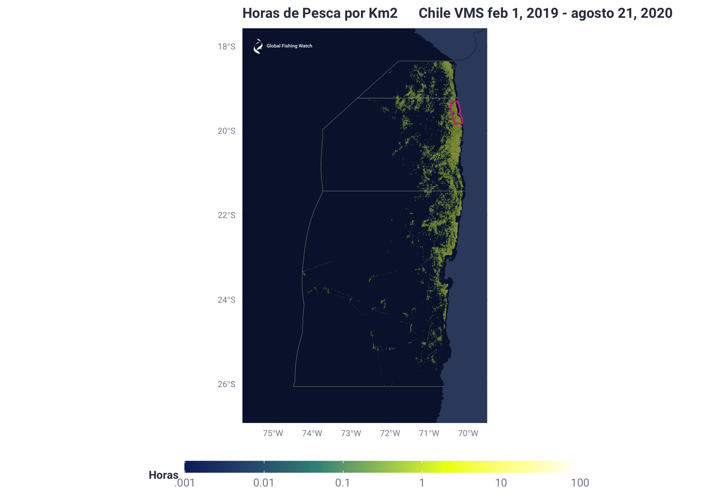
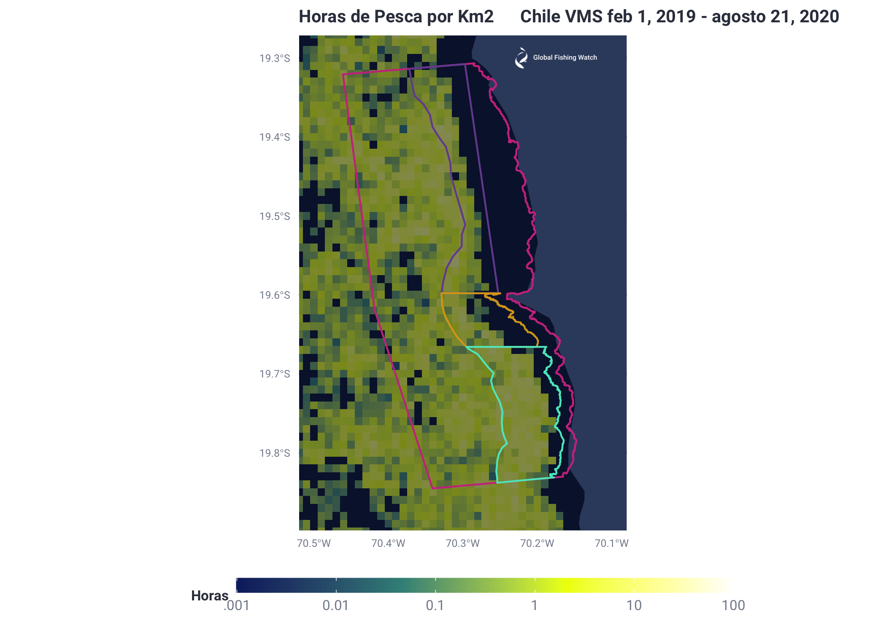

Reporte VMS Preliminar Oceana Chile AMP Pisagua
================
Esteban Arenas
8/24/2020

Chile VMS data is extracted for the first three northern regions of the
Chilean EEZ: Arica, Tarapacá and Antofagasta. Through the query, the
extracted data is displayed as fishing hours/km2 per 100th latitude and
longitude bins. Furthermore, the data is filtered to only extract
industrial vessels of interest to Oceana Chile. The final objective is
to determine the number of fishing hours within the proposed MPA
(Pisagua) and the industrial fishing permitted windows within Pisagua
(Window \# 5, 6 and 7), as compared to the total fishing hours within
the three northern most regions of the Chilean EEZ: Arica, Tarapacá and
Antofagasta. This will allow Oceana Chile to estimate the economic
impact on fisheries that would result if the proposed MPA were to be
instated.

Notice the file
“Final\_Report/Version\_3/Vessels/Chile\_Desired\_Ind\_Vessels\_Final.csv”
lists all the vessels that Oceana Chile shared, wanting the analysis to
focus on the fishing activity of these vessels exclusively. This list
encompasses 53 vessels. All 53 vessels were found to be present in the
Chile VMS data, ranging from February 2019 to August 2020. However, when
analyzing data exclusively from the three northern most regions (Arica,
Tarapacá and Antofagasta), we only notice **49 vessels to have been
present** (look at “Horas\_Arica\_Tarapaca\_Antofagasta”). This would
indicate that the remaining 4 vessels were not present in these three
northern most regions for the duration of which we have VMS data (since
February of 2019). After filtering by these three regions and by the
Oceana Chile vessels of interest, the data remaining is dated from
**February 1st, 2019 to August 21st, 2020**. The 4 vessels not present
in the three northern most regions are: **Emilia (RPI: 32036), Foche
(RPI: 32025), Gringo (RPI: 745) and Polux (RPI: 764)**.

``` r
query_string <- glue::glue('
CREATE TEMP FUNCTION hours_diff_abs(timestamp1 TIMESTAMP,
timestamp2 TIMESTAMP) AS (
#
# Return the absolute value of the diff between the two timestamps in hours with microsecond precision
# If either parameter is null, return null
#
ABS(TIMESTAMP_DIFF(timestamp1,
    timestamp2,
    microsecond) / 3600000000.0) );

WITH 
  aoi AS (
  SELECT
    ST_GEOGFROMTEXT("MultiPolygon (((-70.09561913446090387 -17.8324045321353033, -69.62480250878914489 -26.28736256017434414, -113.36366703369475317 -27.00274410391335067, -113.50491202139629365 -23.72759536774769629, -70.09561913446090387 -17.8324045321353033)))") AS polygon),


#Extract only lat lon within a polygon encompassing the Northern Arica, Tarapacá and Antofagasta regions of the Chilean EEZ
ChileEEZ_123 AS (
select seg_id,n_shipname,timestamp,lat,lon,nnet_score,
FROM `world-fishing-827.pipe_chile_production_v20200331.messages_scored_*`
WHERE
IF (ST_CONTAINS((
SELECT
  polygon
FROM aoi),
ST_GEOGPOINT(lon,lat)),TRUE,FALSE)
),

# Extracted VMS data that exclusively matches Industrial vessels of interest to Oceana Chile
IndVessOfInterest AS (
SELECT *
FROM ChileEEZ_123
INNER JOIN `world-fishing-827.scratch_Esteban.Chile_Desired_Ind_Vessels_Final`
  ON ChileEEZ_123.n_shipname = `world-fishing-827.scratch_Esteban.Chile_Desired_Ind_Vessels_Final`.Nave
),

# Calculating hours for VMS data, based on previous timestamps sharing the same seg_id
pos AS (
SELECT *,
  LAG(timestamp, 1) OVER (PARTITION BY seg_id  ORDER BY timestamp) prev_timestamp,
FROM IndVessOfInterest
),

IndVessOfInterestFinal AS (
SELECT *
EXCEPT (prev_timestamp),
floor(lat * 100) as lat_bin,
floor(lon * 100) as lon_bin,
IFNULL (hours_diff_abs (timestamp, prev_timestamp), 0) hours
FROM pos
),

# Summing fishing hours and total hours, grouped
# by ship name, lat bin, and lon bin

FishEffortTmp2 AS (
SELECT n_shipname,
lat_bin / 100 as lat_bin,
lon_bin / 100 as lon_bin,
SUM(IF(nnet_score > 0.5, hours, 0)) as fishing_hours,
SUM(hours) as total_hours
FROM IndVessOfInterestFinal
GROUP BY n_shipname, lat_bin, lon_bin
),

#Transform hours/degrees to hours/km2

FishEffortFinal AS (
SELECT *, 
fishing_hours/(COS(udfs_v20200701.radians(lat_bin)) * (111/100)  * (111/100) ) AS fishing_hours_sq_km,
total_hours/(COS(udfs_v20200701.radians(lat_bin)) * (111/100)  * (111/100) ) AS total_hours_sq_km
FROM FishEffortTmp2
)

SELECT *
FROM FishEffortFinal
')
IndVessOfInterestFinal <- DBI::dbGetQuery(con, query_string)
# write.csv(IndVessOfInterestFinal, file = "IndVessOfInterestFinal.csv")
```

**IndVessOfInterestFinal** created above is exported and clipped in QGIS
according to the Arica, Tarapacá, Antofagasta, Pisagua, window \#5,
window \#6 and window \#7 regions of interest. Furthermore, the first
nautical mile from the coast of data is removed due to potential errors
in the GFW algorithm classifying fishing effort within the first
nautical mile, when it might in fact be transit. These csv files are
then imported along with the geojson files used to clip and generate
them.

``` r
#Fishing hours and Total hours for the following regions
#Arica, Tarapacá and Antofagasta
IndVessOfInterestFinal <- read.csv ("/Users/Esteban/Documents/Jobs/GFW/Proyectos/Chile/Chile_Oceana/Data/Version_3/IndVessOfInterestFinal.csv", header = TRUE)
#Pisagua
Pisagua <- read.csv ("/Users/Esteban/Documents/Jobs/GFW/Proyectos/Chile/Chile_Oceana/Data/Version_3/Pisagua.csv", header = TRUE)
#V5
V5 <- read.csv ("/Users/Esteban/Documents/Jobs/GFW/Proyectos/Chile/Chile_Oceana/Data/Version_3/V5.csv", header = TRUE)
#V6
V6 <- read.csv ("/Users/Esteban/Documents/Jobs/GFW/Proyectos/Chile/Chile_Oceana/Data/Version_3/V6.csv", header = TRUE)
#V7
V7 <- read.csv ("/Users/Esteban/Documents/Jobs/GFW/Proyectos/Chile/Chile_Oceana/Data/Version_3/V7.csv", header = TRUE)


#Arica, Tarapacá and Antofagasta Polygon Lines for Maps
Arica_Tara_Anto_Line <- st_read("/Users/Esteban/Documents/Jobs/GFW/Proyectos/Chile/Chile_Oceana/Data/Version_3/Arica_Tara_Anto_Line.geojson")
#Pisagua polygon
Pisagua_ST <- st_read("/Users/Esteban/Documents/Jobs/GFW/Proyectos/Chile/Chile_Oceana/Data/Shapes/Pisagua.geojson")
#Window #5, 6 and 7 polygons
Ventana5_ST <- st_read("/Users/Esteban/Documents/Jobs/GFW/Proyectos/Chile/Chile_Oceana/Data/Shapes/VP5_F.geojson")
Ventana6_ST <- st_read("/Users/Esteban/Documents/Jobs/GFW/Proyectos/Chile/Chile_Oceana/Data/Shapes/VP6_F.geojson")
Ventana7_ST <- st_read("/Users/Esteban/Documents/Jobs/GFW/Proyectos/Chile/Chile_Oceana/Data/Shapes/VP7_F.geojson")

#Unique Vessel Names in order to match and change vessel names in final tables latter on
UniqueVMSNamesChile <- read.csv ("/Users/Esteban/Documents/Jobs/GFW/Proyectos/Chile/SERNAPESCA/Data/Maps_Tables/Tmp/UniqueVMSNamesChile.csv", header = TRUE)
```

Generate Fishing Effort Tables of interest for the given areas

**Total Area: Arica, Tarapacá and Antofagasta**

``` r
# Aggregate by vessels in order to extract tables with fishing and total hours per area
Tmp2 <- data.frame(aggregate(fishing_hours_sq_km ~ n_shipname, IndVessOfInterestFinal, sum))
Tmp3 <- data.frame(aggregate(total_hours_sq_km ~ n_shipname, IndVessOfInterestFinal, sum))
Horas_Arica_Tarapaca_Antofagasta <- Tmp2
Horas_Arica_Tarapaca_Antofagasta$total_hours_sq_km <- Tmp3$total_hours_sq_km
#Change column names and number months to name months
colnames(Horas_Arica_Tarapaca_Antofagasta)[1] <- "Embarcacion"
colnames(Horas_Arica_Tarapaca_Antofagasta)[2] <- "Horas_De_Pesca_Km2"
colnames(Horas_Arica_Tarapaca_Antofagasta)[3] <- "Horas_Transito_y_Pesca_Km2"
#Rounding
Horas_Arica_Tarapaca_Antofagasta$Horas_De_Pesca_Km2 <- round(Horas_Arica_Tarapaca_Antofagasta$Horas_De_Pesca_Km2,0)
Horas_Arica_Tarapaca_Antofagasta$Horas_Transito_y_Pesca_Km2 <- round(Horas_Arica_Tarapaca_Antofagasta$Horas_Transito_y_Pesca_Km2,0)
#Change shipname to original name for human reading
Horas_Arica_Tarapaca_Antofagasta$Embarcacion <- UniqueVMSNamesChile$shipname[match(Horas_Arica_Tarapaca_Antofagasta$Embarcacion, UniqueVMSNamesChile$n_shipname)]

# write.csv(Horas_Arica_Tarapaca_Antofagasta, file = "Horas_Arica_Tarapaca_Antofagasta.csv")
```

**Pisagua**

``` r
# Aggregate by vessels in order to extract tables with fishing and total hours per area
Tmp2 <- data.frame(aggregate(fishing_hours_sq_km ~ n_shipname, Pisagua, sum))
Tmp3 <- data.frame(aggregate(total_hours_sq_km ~ n_shipname, Pisagua, sum))
Horas_Pisagua <- Tmp2
Horas_Pisagua$total_hours_sq_km <- Tmp3$total_hours_sq_km
#Change column names and number months to name months
colnames(Horas_Pisagua)[1] <- "Embarcacion"
colnames(Horas_Pisagua)[2] <- "Horas_De_Pesca_Km2"
colnames(Horas_Pisagua)[3] <- "Horas_Transito_y_Pesca_Km2"
#Rounding
Horas_Pisagua$Horas_De_Pesca_Km2 <- round(Horas_Pisagua$Horas_De_Pesca_Km2,0)
Horas_Pisagua$Horas_Transito_y_Pesca_Km2 <- round(Horas_Pisagua$Horas_Transito_y_Pesca_Km2,0)
#Change shipname to original name for human reading
Horas_Pisagua$Embarcacion <- UniqueVMSNamesChile$shipname[match(Horas_Pisagua$Embarcacion, UniqueVMSNamesChile$n_shipname)]

# write.csv(Horas_Pisagua, file = "Horas_Pisagua.csv")
```

**Window \#5**

``` r
# Aggregate by vessels in order to extract tables with fishing and total hours per area
Tmp2 <- data.frame(aggregate(fishing_hours_sq_km ~ n_shipname, V5, sum))
Tmp3 <- data.frame(aggregate(total_hours_sq_km ~ n_shipname, V5, sum))
Horas_V5 <- Tmp2
Horas_V5$total_hours_sq_km <- Tmp3$total_hours_sq_km
#Change column names and number months to name months
colnames(Horas_V5)[1] <- "Embarcacion"
colnames(Horas_V5)[2] <- "Horas_De_Pesca_Km2"
colnames(Horas_V5)[3] <- "Horas_Transito_y_Pesca_Km2"
#Rounding
Horas_V5$Horas_De_Pesca_Km2 <- round(Horas_V5$Horas_De_Pesca_Km2,0)
Horas_V5$Horas_Transito_y_Pesca_Km2 <- round(Horas_V5$Horas_Transito_y_Pesca_Km2,0)
#Change shipname to original name for human reading
Horas_V5$Embarcacion <- UniqueVMSNamesChile$shipname[match(Horas_V5$Embarcacion, UniqueVMSNamesChile$n_shipname)]

# write.csv(Horas_V5, file = "Horas_V5.csv")
```

**Window \#6**

``` r
# Aggregate by vessels in order to extract tables with fishing and total hours per area
Tmp2 <- data.frame(aggregate(fishing_hours_sq_km ~ n_shipname, V6, sum))
Tmp3 <- data.frame(aggregate(total_hours_sq_km ~ n_shipname, V6, sum))
Horas_V6 <- Tmp2
Horas_V6$total_hours_sq_km <- Tmp3$total_hours_sq_km
#Change column names and number months to name months
colnames(Horas_V6)[1] <- "Embarcacion"
colnames(Horas_V6)[2] <- "Horas_De_Pesca_Km2"
colnames(Horas_V6)[3] <- "Horas_Transito_y_Pesca_Km2"
#Rounding
Horas_V6$Horas_De_Pesca_Km2 <- round(Horas_V6$Horas_De_Pesca_Km2,0)
Horas_V6$Horas_Transito_y_Pesca_Km2 <- round(Horas_V6$Horas_Transito_y_Pesca_Km2,0)
#Change shipname to original name for human reading
Horas_V6$Embarcacion <- UniqueVMSNamesChile$shipname[match(Horas_V6$Embarcacion, UniqueVMSNamesChile$n_shipname)]

# write.csv(Horas_V6, file = "Horas_V6.csv")
```

**Window \#7**

``` r
# Aggregate by vessels in order to extract tables with fishing and total hours per area
Tmp2 <- data.frame(aggregate(fishing_hours_sq_km ~ n_shipname, V7, sum))
Tmp3 <- data.frame(aggregate(total_hours_sq_km ~ n_shipname, V7, sum))
Horas_V7 <- Tmp2
Horas_V7$total_hours_sq_km <- Tmp3$total_hours_sq_km
#Change column names and number months to name months
colnames(Horas_V7)[1] <- "Embarcacion"
colnames(Horas_V7)[2] <- "Horas_De_Pesca_Km2"
colnames(Horas_V7)[3] <- "Horas_Transito_y_Pesca_Km2"
#Rounding
Horas_V7$Horas_De_Pesca_Km2 <- round(Horas_V7$Horas_De_Pesca_Km2,0)
Horas_V7$Horas_Transito_y_Pesca_Km2 <- round(Horas_V7$Horas_Transito_y_Pesca_Km2,0)
#Change shipname to original name for human reading
Horas_V7$Embarcacion <- UniqueVMSNamesChile$shipname[match(Horas_V7$Embarcacion, UniqueVMSNamesChile$n_shipname)]

# write.csv(Horas_V7, file = "Horas_V7.csv")
```

An example table for the Arica, Tarapacá and Antofagasta region is
provided below (Horas\_Arica\_Tarapaca\_Antofagasta). Only first ten
lines are shown. The same tables were generated for the regions of
Pisagua, window \#5, window \#6 and window \#7

| Embarcacion      | Horas\_De\_Pesca\_Km2 | Horas\_Transito\_y\_Pesca\_Km2 |
| :--------------- | --------------------: | -----------------------------: |
| ALBIMER (IND)    |                   967 |                           3764 |
| ALERCE (IND)     |                   786 |                           3694 |
| ANGAMOS 1 (IND)  |                   448 |                           1788 |
| ANGAMOS 2 (IND)  |                   667 |                           3365 |
| ANGAMOS 3 (IND)  |                   736 |                           3782 |
| ANGAMOS 4 (IND)  |                   560 |                           2555 |
| ANGAMOS 9 (IND)  |                   607 |                           3481 |
| ATACAMA IV (IND) |                   983 |                           3452 |
| ATACAMA V (IND)  |                   672 |                           3098 |
| AUDAZ (IND)      |                   913 |                           3897 |

Mapping Fishing Effort and Total Hours by hundreth Lat and Lon bins

``` r
Tmp <- data.frame(aggregate(fishing_hours_sq_km ~ lat_bin + lon_bin, IndVessOfInterestFinal, sum))
Tmp2 <- data.frame(aggregate(total_hours_sq_km ~ lat_bin + lon_bin, IndVessOfInterestFinal, sum))
Map <- Tmp
Map$total_hours_sq_km <- Tmp2$total_hours_sq_km
Map$Log_fishing_hours_sq_km <- log10(Map$fishing_hours_sq_km)
Map$Log_total_hours_sq_km <- log10(Map$total_hours_sq_km)
# write.csv(Map, file = "Tabla_Mapa.csv")

Tmp <- copy(Map[Map$fishing_hours_sq_km > 0,])

# GFW logo
gfw_logo <- png::readPNG("/Users/Esteban/Documents/Jobs/GFW/General/Logo/GFW_logo_primary_White.png")
gfw_logo_rast <- grid::rasterGrob(gfw_logo, interpolate = T)

#Map
land_sf <- rnaturalearth::ne_countries(scale = 10, returnclass = 'sf')
MapTest <- ggplot() + 
  geom_sf(data = land_sf,
            fill = fishwatchr::gfw_palettes$map_country_dark[1],
            color = fishwatchr::gfw_palettes$map_country_dark[2],
          size=.1) +
    scale_fill_gradientn(colours = fishwatchr::gfw_palettes$map_effort_dark,
                        breaks = c(-3,-2,-1,0,1,2), labels = c('.001','0.01', '0.1', '1', '10', '100'),
                        limits = c(-3,2), oob=scales::squish)+
  fishwatchr::theme_gfw_map(theme = 'dark')+
  geom_tile(data = Tmp, aes(x = lon_bin, y = lat_bin, fill = Log_fishing_hours_sq_km), alpha = 0.5)+
  labs(fill = "Horas", title = "Horas de Pesca por Km2      Chile VMS feb 1, 2019 - agosto 21, 2020")+
  geom_sf(data=Arica_Tara_Anto_Line,fill=NA, color="#A5AA99", size=.1)+
  geom_sf(data=Pisagua_ST, fill=NA, color="#CC3A8E")+
  coord_sf(xlim = c(-75.5, -69.8), ylim = c(-26.5, -18))+
  
  #Add GFW logo
  annotation_custom(gfw_logo_rast,
                       ymin = -18.5,
                      ymax = -17.5,
                      xmin = -75.5,
                      xmax = -74)
MapTest
```

<!-- -->

``` r
# ggsave("Horas_Pesca_Ar_Tar_Anto.png", dpi=300)
```

Same map as above, but focused on the Pisagua and Ventanas regions

``` r
#Zoomed in Pisagua fishing hours map
MapTest2 <- ggplot() + 
  geom_sf(data = land_sf,
            fill = fishwatchr::gfw_palettes$map_country_dark[1],
            color = fishwatchr::gfw_palettes$map_country_dark[2],
          size=.1) +
    scale_fill_gradientn(colours = fishwatchr::gfw_palettes$map_effort_dark,
                        breaks = c(-3,-2,-1,0,1,2), labels = c('.001','0.01', '0.1', '1', '10', '100'),
                        limits = c(-3,2), oob=scales::squish)+
  fishwatchr::theme_gfw_map(theme = 'dark')+
  geom_tile(data = Tmp, aes(x = lon_bin, y = lat_bin, fill = Log_fishing_hours_sq_km), alpha = 0.5)+
  labs(fill = "Horas", title = "Horas de Pesca por Km2      Chile VMS feb 1, 2019 - agosto 21, 2020")+
  geom_sf(data=Pisagua_ST, fill=NA, color="#CC3A8E")+
  geom_sf(data=Ventana5_ST, fill=NA, color="#764E9F")+
  geom_sf(data=Ventana6_ST, fill=NA, color="#DAA51B")+
  geom_sf(data=Ventana7_ST, fill=NA, color="#58E8C6")+
  
  coord_sf(xlim = c(-70.5, -70.1), ylim = c(-19.87, -19.3))+
  
  #Add GFW logo
  annotation_custom(gfw_logo_rast,
                      ymin = -19.33,
                      ymax = -19.27,
                      xmin = -70.23,
                      xmax = -70.12)
MapTest2
```

<!-- -->

``` r
# ggsave("Horas_Pesca_Pisagua.png", dpi=300)
```

**Fishing hours percentage within Pisagua, Window \#5, 6 and 7, compared
to the entire area encompassing the regions of Arica, Tarapacá and
Antofagasta**

``` r
# Aggregate total hours by area and then merge them all in one table
#Horas_Arica_Tarapaca_Antofagasta
Tmp_Horas_Arica_Tarapaca_Antofagasta <- copy(Horas_Arica_Tarapaca_Antofagasta)
Tmp_Horas_Arica_Tarapaca_Antofagasta$Zona <- "Arica + Tarapaca + Antofagasta"
Tmp_Horas_Arica_Tarapaca_Antofagasta <- data.frame(aggregate(Horas_De_Pesca_Km2 ~ Zona, Tmp_Horas_Arica_Tarapaca_Antofagasta, sum))
#Pisagua
Tmp_Pisagua <- copy(Horas_Pisagua)
Tmp_Pisagua$Zona <- "Pisagua"
Tmp_Pisagua <- data.frame(aggregate(Horas_De_Pesca_Km2 ~ Zona, Tmp_Pisagua, sum))
#Windows #5, 6 and 7
Tmp_V5 <- copy(Horas_V5)
Tmp_V5$Zona <- "Ventana 5"
Tmp_V5 <- data.frame(aggregate(Horas_De_Pesca_Km2 ~ Zona, Tmp_V5, sum))

Tmp_V6 <- copy(Horas_V6)
Tmp_V6$Zona <- "Ventana 6"
Tmp_V6 <- data.frame(aggregate(Horas_De_Pesca_Km2 ~ Zona, Tmp_V6, sum))

Tmp_V7 <- copy(Horas_V7)
Tmp_V7$Zona <- "Ventana 7"
Tmp_V7 <- data.frame(aggregate(Horas_De_Pesca_Km2 ~ Zona, Tmp_V7, sum))

Porcentajes <- rbind(Tmp_V5,Tmp_V6,Tmp_V7,Tmp_Pisagua,Tmp_Horas_Arica_Tarapaca_Antofagasta)
Porcentajes$Porcentaje <- round(Porcentajes$Horas_De_Pesca_Km2/(Porcentajes$Horas_De_Pesca_Km2[5])*100,2)
Porcentajes$Horas_De_Pesca_Km2 <- format(Porcentajes$Horas_De_Pesca_Km2,big.mark=",",scientific=FALSE)

# write.csv(Porcentajes, file = "Porcentajes.csv")
```

| Zona                           | Horas\_De\_Pesca\_Km2 | Porcentaje |
| :----------------------------- | :-------------------- | ---------: |
| Ventana 5                      | 226                   |       0.63 |
| Ventana 6                      | 104                   |       0.29 |
| Ventana 7                      | 460                   |       1.28 |
| Pisagua                        | 2,066                 |       5.73 |
| Arica + Tarapaca + Antofagasta | 36,033                |     100.00 |
